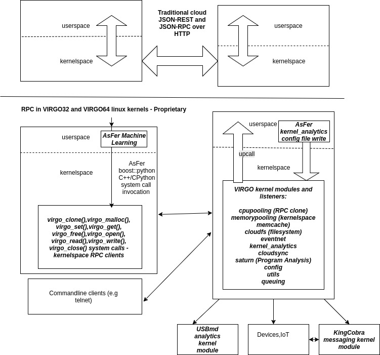
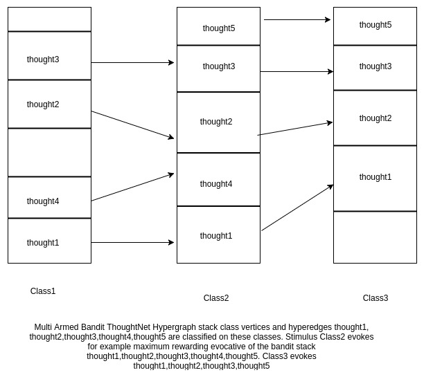
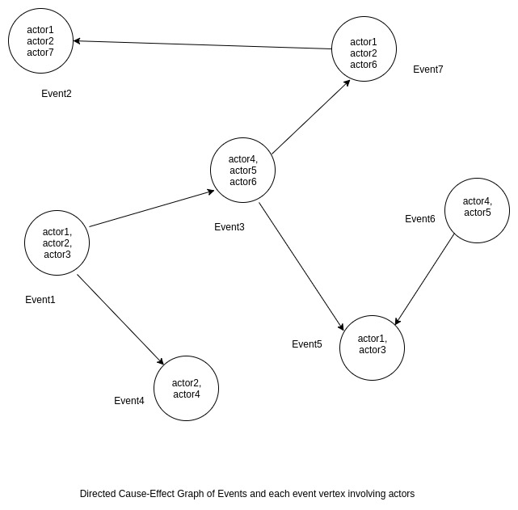

--------------------------------------------------------------------------------------------------------------------------------------------
							NEURONRAIN
							நஂயூரானஂரெயஂனஂ

--------------------------------------------------------------------------------------------------------------------------------------------
NeuronRain is a new linux kernel fork-off from mainline kernel (presently overlayed on kernel 4.1.5 32 bit and kernel 4.13.3 64 bit) augmented with Machine Learning, Analytics, New system call primitives and Kernel Modules for cloud RPC, Memory and Filesystem. It differs from usual CloudOSes like OpenStack, VMs and containers in following ways:
    (*) Mostly available CloudOSes are application layer deployment/provisioning (YAML etc.,) focussed while NeuronRain is not about deploying applications but to bring the cloud functionality into Linux kernel itself.
    (*) There are application layer memcache softwares available for bigdata processing.
    (*) There have been some opensource projects for linux kernel on GitHub to provide memcache functionality for kernelspace memory.
    (*) NeuronRain VIRGO32 and VIRGO64 kernels have new system calls and kernel drivers for remote cloning a process, memcache kernel memory and remote file I/O with added advantage of reading analytics variables in kernel.
    (*) Cloud RPCs, Cloud Kernel Memcache and Filesystems are implemented in Linux kernel with kernelspace sockets
    (*) Linux kernel has access to Machine Learnt Analytics(in AsFer) with VIRGO linux kernel_analytics driver
    (*) Assumes already encrypted data for traffic between kernels on different machines.
    (*) Advantages of kernelspace Cloud implementation are: Remote Device Invocation (recently known as Internet of Things), Mobile device clouds, High performance etc.,.
    (*) NeuronRain is not about VM/Containerization but VMs, CloudOSes and Containers can be optionally rewritten by invoking NeuronRain VIRGO systemcalls and drivers - thus NeuronRain Linux kernel is the bottommost layer beneath VMs, Containers, CloudOSes.
    (*) Partially inspired by old Linux Kernel components - Remote Device Invocation and SunRPC
    (*) VIRGO64 kernel based on 4.13.3 mainline kernel, which is 64 bit version of VIRGO32, has lot of stability/panic issues resolved which were random and frequent in VIRGO32 and has Kernel Transport Layer Security (KTLS) integrated into kernel tree.

NeuronRain - Repositories:
--------------------------
NeuronRain repositories are in:

	(*) NeuronRain Research - http://sourceforge.net/users/ka_shrinivaasan - astronomy datasets

	(*) NeuronRain Green - https://github.com/shrinivaasanka - generic datasets

        (*) NeuronRain Antariksh -  https://gitlab.com/shrinivaasanka - Drone development

NeuronRain Documentation Repositories:
--------------------------------------
        (*) https://github.com/shrinivaasanka/Krishna_iResearch_DoxygenDocs

        (*) https://gitlab.com/shrinivaasanka/Krishna_iResearch_DoxygenDocs

        (*) https://sourceforge.net/u/userid-769929/Krishna_iResearch_DoxygenDocs/ci/master/tree/

NeuronRain Version:
-------------------
Previously, each NeuronRain repository source in SourceForge, GitHub and GitLab was snapshotted periodically by a version number convention <year>.<month>.<day>. Because total number of repositories in NeuronRain spread across SourceForge, GitHub and GitLab is huge, release tagging each repository is arduous and therefore individual repository source tagging is hereinafter discontinued. Every NeuronRain source code release for SourceForge,GitHub and GitLab repositories henceforth would be notified in this documentation page and latest commit on the date of release (inferred from <year>#<month>#<day>) has to be construed as the latest source release. Latest NeuronRain Research, Green and Antariksh version is 2022#07#29.

NeuronRain - Features:
----------------------
**VIRGO system calls from include/linux/syscalls.h**

asmlinkage long sys_virgo_clone(char* func, void *child_stack, int flags, void *arg);

asmlinkage long sys_virgo_malloc(int size,unsigned long long __user *vuid);

asmlinkage long sys_virgo_set(unsigned long long vuid, const char __user *data_in);

asmlinkage long sys_virgo_get(unsigned long long vuid, char __user *data_out);

asmlinkage long sys_virgo_free(unsigned long long vuid);

asmlinkage long sys_virgo_open(char* filepath);

asmlinkage long sys_virgo_read(long vfsdesc, char __user *data_out, int size, int pos);

asmlinkage long sys_virgo_write(long vfsdesc, const char __user *data_in, int size, int pos);

asmlinkage long sys_virgo_close(long vfsdesc);

**VIRGO Kernel Modules in drivers/virgo**

1. cpupooling virtualization - VIRGO_clone() system call and VIRGO cpupooling driver by which a remote procedure can be invoked in kernelspace.(port: 10000)

2. memorypooling virtualization - VIRGO_malloc(), VIRGO_get(), VIRGO_set(), VIRGO_free() system calls and VIRGO memorypooling driver by which kernel memory can be allocated in remote node, written to, read and freed - A kernelspace memcache-ing.(port: 30000)

3. filesystem virtualization - VIRGO_open(), VIRGO_read(), VIRGO_write(), VIRGO_close() system calls and VIRGO cloud filesystem driver by which file IO in remote node can be done in kernelspace.(port: 50000)

4. config - VIRGO config driver for configuration symbols export.

5. queueing - VIRGO Queuing driver kernel service for queuing incoming requests, handle them with workqueue and invoke KingCobra service routines in kernelspace. (port: 60000)

6. cloudsync - kernel module for synchronization primitives (Bakery algorithm etc.,) with exported symbols that can be used in other VIRGO cloud modules for critical section lock() and unlock()

7. utils - utility driver that exports miscellaneous kernel functions that can be used across VIRGO Linux kernel

8. EventNet - eventnet kernel driver to vfs_read()/vfs_write() text files for EventNet vertex and edge messages (port: 20000)

9. Kernel_Analytics - kernel module that reads machine-learnt config key-value pairs set in /etc/virgo_kernel_analytics.conf (and from a remote cloud as stream of key-value pairs in VIRGO64). Any machine learning software can be used to get the key-value pairs for the config. This merges three facets - Machine Learning, Cloud Modules in VIRGO Linux-KingCobra-USBmd , Mainline Linux Kernel

10. SATURN program analysis wrapper driver.

11. KTLS config driver - for Kernel Transport Layer Security - only in VIRGO_KTLS branch of VIRGO64 repositories

Apart from aforementioned drivers, PXRC flight controller and UVC video drivers from kernel 5.1.4 have been changed to import kernel_analytics exported analytics variables and committed to VIRGO64.

Complete list of Features of NeuronRain (Research and Enterprise) are detailed in:
https://sites.google.com/site/kuja27/CV_of_SrinivasanKannan_alias_KaShrinivaasan_alias_ShrinivasKannan.pdf (Deleted and Mirrored at https://github.com/shrinivaasanka/Krishna_iResearch_DoxygenDocs/blob/master/kuja27_website_mirrored/site/kuja27/CV_of_SrinivasanKannan_alias_KaShrinivaasan_alias_ShrinivasKannan.pdf)

Previous system calls and drivers do not have internal mutexes and synchronization is left to the userspace. Quoting Commit Notes from hash https://github.com/shrinivaasanka/virgo64-linux-github-code/commit/ad59cbb0bec23ced72109f8c5a63338d1fd84beb :
"... Note on concurrency: Presently mutexing within system calls have been commented because in past linux versions mutexing within kernel was causing strange panic issues. As a design choice and feature-stability tradeoff (stability is more important than introducing additional code) mutexing has been lifted up to userspace. It is upto the user applications invoking the system calls to synchronize multiple user threads invoking VIRGO64 system calls i.e VIRGO64 system calls are not re-entrant. This would allow just one kernel thread (mapped 1:1 to a user thread) to execute in kernel space. Mostly this is relevant only to kmemcache system calls which have global in-kernel-memory address translation tables and next_id variable. VIRGO clone/filesystem calls do not have global in-kernel-memory datastructures. ...". An example pthread mutex code doing VIRGO64 system calls invocation in 2 parallel concurrent processes within a critical section lock/unlock is at https://github.com/shrinivaasanka/virgo64-linux-github-code/blob/master/linux-kernel-extensions/virgo_malloc/test/test_virgo_malloc.c. Synchronization in userspace for system calls-drivers RPC is easier to analyze and modify user application code if there are concurrency issues than locking within kernelspace in system calls and drivers. This would also remove redundant double locking in userspace and kernelspace. Another advantage of doing synchronization in userspace is the flexibility in granularity of the critical section - User can decide when to lock and unlock access to a resource e.g permutations of malloc/set/get/free kmemcache primitive sequences can be synchronized as desired by an application.

NeuronRain - Architecture Diagrams:
-----------------------------------

https://github.com/shrinivaasanka/Krishna_iResearch_DoxygenDocs/blob/master/Krishna_iResearch_opensourceproducts_archdiagram.pdf
https://github.com/shrinivaasanka/Krishna_iResearch_DoxygenDocs/blob/master/NeuronRain_Architecture_Diagrams_29September2016.pdf

Products in NeuronRain Suite (Research,Green,Antariksh):
------------------------------------------------------
AsFer - AstroInfer was initially intended, as the name suggests, for pattern mining of Astronomical Datasets to predict natural weather disasters. It is focussed on mining patterns in texts and strings. It also has implementations of algorithms for analyzing merit of text, PAC learning, Polynomial reconstruction, List decoding, Factorization etc., which are later expansions of publications by the author (K.Srinivasan - http://dblp.dagstuhl.de/pers/hd/s/Shrinivaasan:Ka=) after 2012. Presently AsFer in SourceForge, GitHub and GitLab has implementations for prominently used machine learning algorithms.

USBmd - Wireless data traffic and USB analytics - analyzes internet traffic and USB URB data packets for patterns by AsFer machine learning (e.g FTrace, USBmon, Wireshark/Tcpdump PCAP, USBWWAN and kern.log Spark MapReduce) implementations and Graph theoretic algorithms on kernel function call graphs. It is also a module in VIRGO linux kernel.

VIRGO Linux Kernel - Linux kernel fork-off based on 4.1.5 (32 bit) and 4.13.3 (64 bit) has new system calls and drivers which abstract cloud RPC, kernel memcache and Filesystem. These system calls are kernelspace socket clients to kernelspace listeners modules for RPC,Kernelspace Memory Cacheing and Cloud Filesystems. These new system calls can be invoked by user applications written in languages other than C and C++ also (e.g. Python). Simply put VIRGO is a kernelspace cloud while present cloud OSes concentrate on userspace applications. Applications on VIRGO kernel are transparent to how cloud RPC works in kernel. This pushes down the application layer socket transport to the kernelspace and applications need not invoke any userspace cloud libraries e.g make REST http GET/POST requests by explicitly specifying hosts in URL. Most of the cloud webservice applications use REST for invoking a remote service and response is returned as JSON. This is no longer required in VIRGO linux kernel. Application code is just needed to invoke VIRGO system calls, and kernel internally loadbalances the requests to cloud nodes based on config files. VIRGO system call clients and driver listeners converse in TCP kernelspace sockets. Responses from remote nodes are presently plain texts and can be made as JSON responses optionally. Secure kernel socket families like AF_KTLS are available as separate linux forks. If AF_KTLS is in mainline, all socket families used in VIRGO kernel code can be changed to AF_KTLS from AF_INET and thus security is implicit. VIRGO cloud is defined by config files (virgo_client.conf and virgo_cloud.conf) containing comma separated list of IP addresses in constituent machines of the cloud abstracted from userspace. It also has a kernel_analytics module that reads periodically computed key-value pairs from AsFer and publishes as global symbols within kernel. Any kernel driver including network, I/O, display, paging, scheduler etc., can read these analytics variables and dynamically change kernel behaviour. Good example of userspace cloud library and RPC is gRPC - https://developers.googleblog.com/2015/02/introducing-grpc-new-open-source-http2.html which is a recent cloud RPC standard from Google. There have been debates on RPC versus REST in cloud community. REST is stateless protocol and on a request the server copies its "state" to the remote client. RPC is a remote procedure invocation protocol relying on serialization of objects. Both REST and RPC are implemented on HTTP by industry standard products with some variations in syntaxes of the resource URL endpoints. VIRGO linux kernel does not care about how requests are done i.e REST or RPC but where the requests are done i.e in userspace or kernelspace and prefers kernelspace TCP request-response transport. In this context it differs from traditional REST and RPC based cloud - REST or RPC are userspace wrappers and both internally have to go through TCP, and VIRGO kernel optimizes this TCP bottleneck. Pushing down cloud transport primitives to kernel away from userspace should theoretically be faster because
	(*) cloud transport is initiated lazy deep into kernel and not in userspace which saves serialization slowdown
	(*) lot of wrapper application layer overheads like HTTP, HTTPS SSL handshakes are replaced by TCP transport layer security (assuming AF_KTLS sockets)
	(*) disk I/O in VIRGO file system system-calls and driver is done in kernelspace closer to disk than userspace - userspace clouds often require file persistence
	(*) repetitive system call invocations in userspace cloud libraries which cause frequent userspace-kernerspace switches are removed.
	(*) best suited for interacting with remote devices than remote servers because direct kernelspace-kernelspace remote device communication is possible with no interleaved switches to userspace. This makes it ideal for IoT.
	(*) VIRGO kernel memcache system-calls and driver facilitate abstraction of kernelspaces of all cloud nodes into single VIRGO kernel addresspace.
	(*) VIRGO clone system-call and driver enable execution of a remote binary or a function in kernelspace i.e kernelspace RPC
An up-to-date description of how RPC ruled the roost, fell out of favour and reincarnated in latest cloud standards like Finagle/Thrift/gRPC is in http://dist-prog-book.com/chapter/1/rpc.html - RPC is Not Dead: Rise, Fall and the Rise of Remote Procedure Calls. All these recent RPC advances are in userspace while VIRGO linux kernel abstracts RPC and loadbalancing within system calls itself requiring no user intervention (it is more than mere Remote Procedure Call - a lightweight Remote Resource System Call - a new paradigm in itself).

KingCobra - This is a VIRGO module and implements message queueing and pub-sub model in kernelspace. This also has a userspace facet for computational economics (Pricing, Electronic money protocol buffer implementation etc.,)

Following are frequently updated design documents and theoretical commentaries for NeuronRain code commits which have been organized into
numbered non-linear section vertices and edges amongst them are mentioned by "related to <section>" phrase. NeuronRain Design is a unification of following repository specific documents (sections are numbered uniquely and spread out in multiple repository specific documents):

NeuronRain Green - GitHub - Repositories and Design Documents which include course material (repositories suffixed 64 are for 64-bit and others are 32-bit on different linux versions)
------------------------------------------------------------------------------------------

AsFer - https://github.com/shrinivaasanka/asfer-github-code/blob/master/asfer-docs/AstroInferDesign.txt

USBmd - https://github.com/shrinivaasanka/usb-md-github-code/blob/master/USBmd_notes.txt

USBmd64 - https://github.com/shrinivaasanka/usb-md64-github-code/blob/master/USBmd_notes.txt

VIRGO Linux - https://github.com/shrinivaasanka/virgo-linux-github-code/blob/master/virgo-docs/VirgoDesign.txt

VIRGO64 Linux - https://github.com/shrinivaasanka/virgo64-linux-github-code/blob/master/virgo-docs/VirgoDesign.txt

KingCobra - https://github.com/shrinivaasanka/kingcobra-github-code/blob/master/KingCobraDesignNotes.txt

KingCobra64 - https://github.com/shrinivaasanka/kingcobra64-github-code/blob/master/KingCobraDesignNotes.txt

GRAFIT - https://github.com/shrinivaasanka/Grafit/blob/master/README.md

Acadpdrafts - https://github.com/shrinivaasanka/acadpdrafts-github-code/blob/master/index.rst

Krishna_iResearch_DoxygenDocs - https://github.com/shrinivaasanka/Krishna_iResearch_DoxygenDocs/blob/master/index.rst

NeuronRain Antariksh - GitLab - Repositories and Design Documents which include course material (repositories suffixed 64 are for 64-bit and others are 32-bit on different linux versions)
------------------------------------------------------------------------------------------

AsFer - https://gitlab.com/shrinivaasanka/asfer-github-code/blob/master/asfer-docs/AstroInferDesign.txt

USBmd - https://gitlab.com/shrinivaasanka/usb-md-github-code/blob/master/USBmd_notes.txt

USBmd64 - https://gitlab.com/shrinivaasanka/usb-md64-github-code/blob/master/USBmd_notes.txt

VIRGO Linux - https://gitlab.com/shrinivaasanka/virgo-linux-github-code/blob/master/virgo-docs/VirgoDesign.txt

VIRGO64 Linux - https://gitlab.com/shrinivaasanka/virgo64-linux-github-code/blob/master/virgo-docs/VirgoDesign.txt

KingCobra - https://gitlab.com/shrinivaasanka/kingcobra-github-code/blob/master/KingCobraDesignNotes.txt

KingCobra64 - https://gitlab.com/shrinivaasanka/kingcobra64-github-code/blob/master/KingCobraDesignNotes.txt

GRAFIT - https://gitlab.com/shrinivaasanka/Grafit/-/blob/master/README.md

Acadpdrafts - https://gitlab.com/shrinivaasanka/acadpdrafts-github-code

Krishna_iResearch_DoxygenDocs - https://gitlab.com/shrinivaasanka/Krishna_iResearch_DoxygenDocs/-/blob/master/index.rst

NeuronRain Research - Repositories and Design Documents which include course material (repositories suffixed 64 are for 64-bit and others are 32-bit on different linux versions)
---------------------------------------------------------------------------------------

AsFer - https://sourceforge.net/p/asfer/code/HEAD/tree/asfer-docs/AstroInferDesign.txt

USBmd - https://sourceforge.net/p/usb-md/code-0/HEAD/tree/USBmd_notes.txt

USBmd64 - https://sourceforge.net/p/usb-md64/code/ci/master/tree/USBmd_notes.txt

VIRGO Linux - https://sourceforge.net/p/virgo-linux/code-0/HEAD/tree/trunk/virgo-docs/VirgoDesign.txt

VIRGO64 Linux - https://sourceforge.net/p/virgo64-linux/code/ci/master/tree/virgo-docs/VirgoDesign.txt

KingCobra - https://sourceforge.net/p/kcobra/code-svn/HEAD/tree/KingCobraDesignNotes.txt

KingCobra64 - https://sourceforge.net/p/kcobra64/code/ci/master/tree/KingCobraDesignNotes.txt

GRAFIT - https://sourceforge.net/u/ka_shrinivaasan/Grafit/ci/master/tree/README.md

Acadpdrafts - https://sourceforge.net/projects/acadpdrafts/

Krishna_iResearch_DoxygenDocs - https://sourceforge.net/u/ka_shrinivaasan/Krishna_iResearch_DoxygenDocs/ci/master/tree/index.rst

NeuronRain Acadpdrafts - Drafts and Publications:
-------------------------------------------------

Academic Publications,Preprints and Draft publications of the Author are at portal https://acadpdrafts.readthedocs.io (which replaces erstwhile https://sites.google.com/site/kuja27) unifying :
	(*) publications in https://scholar.google.co.in/citations?hl=en&user=eLZY7CIAAAAJ
	(*) publication drafts in https://sites.google.com/site/kuja27/ (Deleted and Mirrored at https://github.com/shrinivaasanka/Krishna_iResearch_DoxygenDocs/blob/master/kuja27_website_mirrored/site/kuja27/) and
	(*) publication drafts in https://sourceforge.net/projects/acadpdrafts/files/
        (*) Research Profiles - https://sites.google.com/site/kuja27/CV.pdf (Deleted and Mirrored at https://github.com/shrinivaasanka/Krishna_iResearch_DoxygenDocs/blob/master/kuja27_website_mirrored/site/kuja27/CV.pdf)
Some Implementations in AsFer in GitLab, GitHub and Sourceforge are related to aforementioned publications and drafts

Free GRAFIT (portmanteau of Graph-Merit) course material:
---------------------------------------------------------

Online free course material in:
	(*) GitHub - https://github.com/shrinivaasanka/Grafit
	(*) Sourceforge - https://sourceforge.net/u/userid-769929/Grafit/ci/master/tree/
	(*) GitLab - https://gitlab.com/shrinivaasanka/Grafit
also refer to implementations in previous NeuronRain GitHub, GitLab and Sourceforge repositories and implement some additional example analytics - Advertisement Analytics by PageRank and Collaborative Filtering, PrefixSpan Astronomical Analytics of Celestial bodies, FPGrowth frequent itemset analytics, Set Partition Rank  etc.,. Some of NeuronRain Sourceforge, GitHub and GitLab code commits and course material link to https://kuja27.blogspot.in which is meant for additional NeuronRain theory, expository graphics and large MP4 audio-visuals related to NeuronRain code commits in GitHub-GitLab-SourceForge repositories.
        (*) GitHub Virtual Classroom for GRAFIT - https://classroom.github.com/classrooms/8086998-https-github-com-shrinivaasanka-grafit
        (*) GRAFIT course material in Moodle - https://moodle.org/pluginfile.php/4765687/user/private/Grafit-master.zip?forcedownload=1

BRIHASPATHI - Private Virtual Classrooms and JAIMINI Closed Source Private Repositories:
----------------------------------------------------------------------------------------
GitHub - Private repositories of virtual classrooms for various commercial online courses (BigData, Machine Learning, Topics in Mathematics and Computer Science,…) and JAIMINI Closed Source Derivative of NeuronRain - https://github.com/Brihaspathi - requires GitHub student logins

SourceForge - https://sourceforge.net/projects/jaimini/

GitLab - https://gitlab.com/shrinivaasanka/jaimini

FAQ
---
**What is the meaning of name "NeuronRain"?**

Earlier the repositories in GitHub and SourceForge were named "iCloud" but it was in conflict with an already existing mobile cloud platform. Hence different name had to be chosen. All these codebases are targeted at a machine learning powered cloud. AsFer implements almost all prominent machine learning and deep learning neural network algorithms among others. It was intended to be named "NeuronCloud" but because of astronomical weather forecasting origins (both have clouds - weather and linux), and rain realises cloud, it has been named "NeuronRain".

**How does machine learning help in predicting weather vagaries? How does NeuronRain research version approach this?**

----------------------------------------------------------------------------------------------------------------------------------
794. Computational Astrophysics - Astronomical Datasets Analytics - this section is an extended unifying draft of theory and feature in AstroInfer,USBmd,VIRGO,KingCobra,GRAFIT,Acadpdrafts,Krishna_iResearch_DoxygenDocs
----------------------------------------------------------------------------------------------------------------------------------
It is an unusual application of machine learning to predict weather from astronomical data. Disclaimer here is this is not astrology but astronomy. It is long known that earth is influenced by gravitational forces of nearby ethereal bodies (e.g high tides associated with lunar activity, ElNino-LaNina pairs correlated to Sun spot cycles and Solar maxima etc.,). NeuronRain research version in SourceForge uses Swiss Ephemeris (based on NASA JPL Ephemeris - http://ssd.jpl.nasa.gov/horizons.cgi) implementation in a third-party opensource code (Maitreya's Dreams) to compute celestial degree locations of planets in Solar system. It mines historic data of weather disasters (Typhoons, Hurricanes, Earthquakes) for patterns in astronomical positions of celestial bodies and their connections to heightened weather disturbances on earth. Prominent algorithm used is sequence mining which finds common patterns in string encoded celestial information. This sequence mining along with other bioinformatics tools extracts class association rules for weather patterns. Preliminary analysis shows this kind of pattern mining of astronomical data coincides reasonably with actual observations. There is a python script in asfer codebase which iterates through sequence mined rules and searches a celestial configuration matching it. Most weather models are fluid dynamics based while this is a non-conventional astronomy based analysis. Most accurate Medium Range Numeric Weather Prediction model in use at present is ECMWF - OpenIFS - https://confluence.ecmwf.int/display/OIFS/OpenIFS+Home . High correlation between low sunspot activity and high number of hurricanes has been studied - Sunspot-hurricane link - https://www.nature.com/articles/news.2008.1136 . Gravitational influences amongst celestial bodies and their resultant orbital vicissitudes are formulated by set of differential equations and solutions to them known as N-Body Problem (http://en.wikipedia.org/wiki/N-body_problem - 2-body problem and restricted 3-body problems have already been solved by Sundman,Poincare,Kepler - n >= 4 is chaotic). Hierarchical N-Body Symplectic Integration Package - HNBody - https://janus.astro.umd.edu/HNBody/ - is an approximate N-Body differential equations solver and a sample orbital integration computation of few solar system planets for 50000 years is in https://janus.astro.umd.edu/HNBody/examples/index.html. N-Body solver benchmarks for various programming languages and multicores are at https://benchmarksgame-team.pages.debian.net/benchmarksgame/description/nbody.html#nbody. Solar system is a set of celestial bodies with mutual gravitational influences. Sequence mining of string encoded celestial configurations, mines patterns in planetary conjunctions (http://en.wikipedia.org/wiki/Conjunction_(astronomy)) vis-a-vis weather/geological vagaries on earth. Each such pattern is an instance of N-Body problem and its solutions pertain to gravitational influences for such a celestial configuration. Solving N-Body problem for N > 3 is non-trivial and no easy solutions are known. Solar system in this respect is 9-Body problem of 9 known planets and their mutual gravitational influences affecting Earth, ignoring asteroids/comets/KuiperBeltObjects. N-body problem has set of special solutions which are equally spaced-out configurations of celestial bodies on single orbit which need not be ellipsoid, known as n-body choreography e.g planets on vertices of equilateral triangles (https://en.wikipedia.org/wiki/N-body_choreography). Finding such periodic celestial arrangement of planets aligned on an orbit is a pattern mining problem. Celestial arrangment is also a set partition (string encoded) problem - house divisions are bins/buckets and 9 planets are partitioned into some of the 12 houses. Number of possible celestial ordered partitions are lowerbounded by 9-th ordered Bell number (7087261) which is a binomial series summation of Stirling numbers of second kind - it is a lowerbound because set of all possible ordered partitions of 9 planets have to be permuted amongst 12 houses. Thus machine learning helps in solving N-Body problem indirectly by mining 9-body choreography patterns in planetary positions and how they correlate to gravity induced events on Earth obviating N-Body differential equations. Disclaimer is this kind of forecast drastically differs from conventions and it does not prove but only correlates astronomical gravity influences and events on Earth. Proof requires solving the differential equations for N-Body and match them with mined celestial patterns which is daunting. As mentioned earlier, preliminary mined correlation analysis shows emergence of similar celestial conjunction patterns for similar genre of terrestrial events. Meaning of celestial bodies named Rahu and Ketu is the imaginary Lunar nodes (http://en.wikipedia.org/wiki/Lunar_node) which are points on zodiac where Ecliptic of the Sun (path of Sun observed from earth) crosses the Path of Moon which happens approximately 2*(12 or 13) times per year. Chandler Wobble (https://image.gsfc.nasa.gov/poetry/ask/a11435.html) which is periodic movement of earth's pole by 0.7 arcseconds every 14 months influenced by Sun, Moon tidal forces causing earth crust rearrangments and seismic events. Phases of Moon affect rainfall patterns on earth (New York Times Archive 1962 - https://www.nytimes.com/1962/09/07/archives/moon-phases-found-to-affect-rainfall.html). More details on correlations between celestial n-body configurations and terrestrial weather vagaries can be found in Chapters 9 and 10 of "Planetary Influences on Human Affairs" by B.V.Raman (Chandler Wobble,Sun spots and Solar maxima,Orbit of moon in relation to earthquake epicentres,Uranus causing earthquakes - [Tomaschek] - https://www.nature.com/articles/184177a0 , MIT study of rainfall correlated to lunar phases among other factors). Stresses induced on earth by an extraterrestrial mass are proportional to Gravitational Field Gradient -2GMm/r^3 - USGS - https://www.usgs.gov/faqs/can-position-moon-or-planets-affect-seismicity-are-there-more-earthquakes-morningin-eveningat-a?qt-news_science_products=0#qt-news_science_products .

**Is it possible to do accurate long term weather forecasting? Are there theoretical limitations? How does NeuronRain weather forecast overcome it?**

----------------------------------------------------------------------------------------------------------------------------------
795. Computational Astrophysics - Astronomical Datasets Analytics - (this section is an extended unifying draft of theory and feature in AstroInfer,USBmd,VIRGO,KingCobra,GRAFIT,Acadpdrafts,Krishna_iResearch_DoxygenDocs)
----------------------------------------------------------------------------------------------------------------------------------
No and Yes. Both N-Body problem of solar system and failure of long term weather forecast have their basis in Chaos theory e.g Poincare Maps for 3-body problems define chaos in the orbits in system of 3 bodies while Lorenz attractors depict sensitive dependence on initial conditions specifically in weather forecast (Butterfly effect). This presents a natural limitation. All existing weather models suffer due to Chaos. But NeuronRain does not have any Chaos theoretic limitation. It just mines patterns in sky and tries to correlate them with weather events on earth accuracy of which depends on how the pattern-event correlations match solutions to N-Body problem. N-Body problem rests on Newtons's Law of Gravitation. It is not just gravity but electromagnetic fields of other celestial objects also influence earth. So it is not exact astrophysics but computational learning model for astrophysics with failure probability.

**Can you cite an example machine learnt celestial pattern correlated to a terrestrial event?**

----------------------------------------------------------------------------------------------------------------------------------
796. Computational Astrophysics - Astronomical Datasets Analytics - Correlation of Celestial N-body choreographies and Extreme
Weather Events on Earth (this section is an extended unifying draft of theory and feature in AstroInfer,USBmd,VIRGO,KingCobra,GRAFIT,Acadpdrafts,Krishna_iResearch_DoxygenDocs)
----------------------------------------------------------------------------------------------------------------------------------
Sequence Mined Class Association Rules in http://sourceforge.net/p/asfer/code/HEAD/tree/python-src/MinedClassAssociationRules.txt and http://github.com/shrinivaasanka/asfer-github-code/blob/master/python-src/MinedClassAssociationRules.txt created by SequenceMining of string encoded celestial configuration show prominent celestial conjunctions when large magnitude Earthquakes or Hurricanes occur. One of the mined rule is Sun + Moon also known as New Moon. High probability of earthquakes due to Moon's gravitational effects during New Moon days (especially eclipses when Earth-Sun-Moon are aligned in line) is known (http://www.scientificamerican.com/article/moon-s-gravity-linked-to-big-earthquakes/). Other prominent mined rule is juxtaposition of Mercury-Sun-Venus (intercuspal and intracuspal) which highly correlates to heightened hurricane-typhoon-tropical cyclone events. Sun-Moon factor influencing ocean currents and causing earthquakes is plausible and known but Mercury-Venus, which are distant celestial systems having negligible gravitational effects, affecting tropical monsoons is an intriguing coincidental pattern. Likely explanation is: Mercury-Sun-Venus-Earth is a 4 body system. Mercury is always +/-15 degrees approximately from Sun and Venus is always +/- 60 degrees approximately from Sun on the zodiac. This 4 body system which is close to earth is quite periodic almost annually exerting gravitational influence. Astrological explanation for effects of planetary conjunctions on earth is debunked excluding hightides - https://image.gsfc.nasa.gov/poetry/venus/q189.html - nevertheless miniscule influence on tides might snowball to chaos by sensitive dependence on initial conditions which doomed long term weather forecasts e.g storm surge or tidal surge associated with low pressure areas. Meteorological variables have a similar recurrence format of Aforecast =  Ainitial + F(A)∆t which resembles Chaotic Verhulste logistic X(n+1) = Lambda*Xn*(1-Xn). References: (*) Numeric Weather Prediction - https://rams.atmos.colostate.edu/at540/fall03/fall03Pt7.pdf (*) Equation 1 and Section 3.1 on exceptional ocean waves - "Fluid mechanics and thermodynamics of tropical cyclones" - https://www.math.nyu.edu/caos_teaching/hurricanes/LighthillFMTC98.pdf. Similar explanation holds for Mars-Earth et al system too. There is an empirical evidence of Jupiter-Venus 2-body system affecting climate on Earth in a cycle of 405000 years - Empirical evidence for stability of the 405-kiloyear Jupiter–Venus eccentricity cycle over hundreds of millions of years - https://www.pnas.org/content/pnas/115/24/6153.full.pdf.

**What is the historic timeline evolution of NeuronRain repositories?**

Initial design of a cognitive inference model (uncommitted) was during 2003 though original conceptualization occurred during 1998-99 to design a distributed linux. Coincidentally, an engineering team project done by the author was aligned in this direction - a distributed cloud-like execution system - though based on application layer CORBA (https://sourceforge.net/projects/acadpdrafts/files/Excerpts_Of_PSG_BE_FinalProject_COBRA_done_in_1999.pdf/download). Since 1999, author has worked in various IT companies (https://sourceforge.net/projects/acadpdrafts/files/AllRelievingLetters.pdf/download) and studied further (MSc and an incomplete PhD at CMI/IMSc/IIT,Chennai,India - 2008-2011). It was a later thought to merge machine learning analytics and a distributed linux kernel into a new linux fork-off driven by BigData analytics. Commits into Sourceforge and GitHub repositories are chequered with fulltime Work and Study tenures. Thus it is pretty much parallel charity effort from 2003 alongside mainstream official work. Presently author does not work for any and works fulltime on NeuronRain code commits and related independent academic research only with no monetary benefit accrued. Significant commits have been done from 2013 onwards and include implementations for author's publications done till 2011 and significant expansion of them done after 2012 till present. Initially AstroInfer was intended for pattern mining Astronomical Datasets for weather prediction. In 2015, NeuronRain was replicated in SourceForge and GitHub after a SourceForge outage and since then SourceForge NeuronRain repos have been made specialized for academic research and astronomy while GitHub NeuronRain repos are for production cloud deployments.

**Why is NeuronRain code separated into multiple repositories?**

Reason is NeuronRain integrates multiple worlds into one and it was difficult to manage them in single repository - AsFer implements only userspace machine learning, USBmd is only for USB and WLAN debugging, VIRGO kernel is specially for new systemcalls and drivers, KingCobra is for kernelspace messaging/pubsub. Intent was to enable end-user to use any of the repositories independent of the other. But the boundaries among them have vanished as below:
	(*) AsFer invokes VIRGO systemcalls
	(*) AsFer implements publications and drafts in acadpdrafts
	(*) USBmd invokes AsFer machine learning
	(*) VIRGO Queueing forwards to KingCobra
	(*) VIRGO is dependent on AsFer for kernel analytics
	(*) KingCobra is dependent on AsFer Neuro MAC Protocol Buffer currency implementation
	(*) Grafit course materials refer to all these repositories
and all NeuronRain repositories are strongly interdependent now. Each repository of NeuronRain can be deployed independent of the other - for example, VIRGO linux kernel and kernel_analytics module in it can learn analytic variables from any other third-party Machine Learning framework not necessarily from AstroInfer - TensorFlow, Weka, RapidMiner etc., Only prerequisite is /etc/kernel_analytics.conf should be periodically updated by set of key-value pairs of machine-learnt analytic variables written to it. But flipside of using third-party machine-learning software in lieu of AsFer is lack of implementations specialized and optimized for NeuronRain. NeuronRain Research repos in SourceForge is astronomy specific while NeuronRain Green repos in GitHub and GitLab are for generic datasets (GitHub and GitLab repos of NeuronRain might diversify and be specialized for cloud and drones/IoTs)

**NeuronRain repositories have implementations for your publications and drafts. Are they reviewed? Could you explain about them?**

Only arXiv articles and TAC 2010 publications below are reviewed and guided by faculty - Profs.Balaraman Ravindran(IIT,Chennai), Madhavan Mukund(CMI) and Meena Mahajan (IMSc) [Co-Authors in https://scholar.google.co.in/citations?hl=en&user=eLZY7CIAAAAJ] while the author was doing PhD till 2011 in CMI/IMSc/IIT,Chennai:
• 2011 - Decidability of Complementation - http://arxiv.org/abs/1106.4102
• 2010 - Algorithms for Intrinsic Merit - http://arxiv.org/abs/1006.4458
• 2010 - NIST TAC 2010 version of Algorithms for Intrinsic Merit - http://www.nist.gov/tac/publications/2010/participant.papers/CMI_IIT.proceedings.pdf

Important Cautionary Legal Disclaimer: All other theory drafts (excluding earlier publications) in NeuronRain design documents and http://sites.google.com/site/kuja27 (Deleted and Mirrored at https://github.com/shrinivaasanka/Krishna_iResearch_DoxygenDocs/blob/master/kuja27_website_mirrored/site/kuja27/ - Linked by new expanded portal https://acadpdrafts.readthedocs.io) including theorem-proofs thereof are non-peer-reviewed, private, unvetted and unaffiliated research of the author (K.Srinivasan - https://sites.google.com/site/kuja27/ - Deleted and Mirrored at https://github.com/shrinivaasanka/Krishna_iResearch_DoxygenDocs/blob/master/kuja27_website_mirrored/site/kuja27/ - Linked by new expanded portal https://acadpdrafts.readthedocs.io) aligned to features of NeuronRain codebases and as well significant expansions of previous publications (Refer to "NeuronRain Licensing" section of FAQ). Author is an independent professional and because of certain speculations and confusions about its monetization-commercialization by an anonymous entity and conflicts-violations brought to notice, it is hereby clarified that NeuronRain codebases, architecture and development are private, independent, non-commercial, academic research and charity initiatives of author subject to NeuronRain licensing terms (GPL 3.0 and CC 4.0) and have nothing to do with any of the organizations and academic institutions (government or private) author may or may not have worked/affiliated with in the past including but not limited to any commercial derived clones of NeuronRain that might be in circulation by aforementioned entity with which author has no relationship (business and otherwise) - author contributes to NeuronRain codebases as a noble charity gesture motivated towards academic enlightenment without monetary or royalty benefit from any external funding source. Cloning NeuronRain for production-commercial deployments is cautioned against because of certain known technical issues (mostly with respect to fragile low level linux kernelspace RPC - Refer BestPractices.txt in NeuronRain AstroInfer source code - VIRGO32 and VIRGO64 linux kernel system calls and drivers are sensitive to hardware-architectural idiosyncracies and mainline linux kernel versions - what works in previous mainline kernel version may not work in next because of subtle system call interface changes in kernelspace sockets causing regressions. Because of earlier technicality, mainline version of VIRGO32 and VIRGO64 hasn't been QAed and updated since 4.13.3 (for system calls and drivers excluding PXRC) and 5.1.4 (for PXRC) and mainline kernel upgrade underneath and build is left to enduser) though academic usage is encouraged. Author has no involvement in any alleged commercialization of NeuronRain fork-off by aforementioned anonymous entity and bears no responsibility for misgivings caused - NeuronRain is not for sale and would remain as academic charity forever, safeguarding sanctity and spirit of FOSS though design and code of NeuronRain is being derived, cloned or extended by author within BRIHASPATHI organization (JAIMINI closedsource repositories in GitHub,GitLab and SourceForge) and used as textbook reference for BRIHASPATHI commercial online classrooms and repositories (reference: BRIHASPATHI print media advertisements - THE HINDU - 20 March 2022 and 26 June 2022 - https://github.com/shrinivaasanka/Krishna_iResearch_DoxygenDocs/blob/master/TheHinduAdvt_TrichyEdition_2022-03-20.jpg , https://github.com/shrinivaasanka/Krishna_iResearch_DoxygenDocs/blob/master/TheHinduAdvt_AllIndiaEdition_2022-06-26.jpg ). Neuro Protocol Buffer Perfect Forward (Cloud Object Move) Cryptocurrency implemented in NeuronRain is only an academic research effort for modelling money changing problem and optimal denomination, economic networks, transaction hyperledgering and money trail. Neuro is a fictitious cryptocurrency and not a legal tender and cannot be used as a commercial denomination. Academic use of Neuro is subject to government regulations and statute.

**Is there a central theme connecting the publications, drafts and their implementations mentioned previously?**

----------------------------------------------------------------------------------------------------------
781. (THEORY and FEATURE) Social Choice, Complexity and Learning theoretic motivations for Intrinsic Merit -  this section is an extended unifying draft of theory and feature in AstroInfer,USBmd,VIRGO,KingCobra,GRAFIT,Acadpdrafts,Krishna_iResearch_DoxygenDocs
----------------------------------------------------------------------------------------------------------

Yes. All these drafts revolve around the fundamental philosophical/mathematical question - Which choice is better? Group Social Choice by Majority or Any Choice function other than Majority? Is it possible to determine merit intrinsically unpolluted by mass opinions? This problem has been studied for centuries e.g Condorcet Jury Theorem. Drafts and publications above are efforts in this direction translating this question to problems requiring measurement of merit and ranking of text etc., in World Wide Web and Human Social Networks. These drafts bridge the usual chasm between Theoretical Computer Science and Engineering side of it like Machine Learning by concepts drawn from Boolean social choice, Pseudorandomness, Boolean Satisfiability, Learning theory etc.,. Notion of Complementing a Function has origins in computability theory (Hilbert's tenth problem, Solutions to Diophantine Equations, MRDP theorem etc.,) and closely relates to Ramsey Theory of Coloring sequences of real/integer lines. Complementation of a function is also another facet of social choice e.g Complement of a social choice function - "Who voted in favour" is a complement of a social choice function - "Who did not vote in favour". In complexity parlance, complementation is reminiscent of the definition of C and Co-C complexity classes for some class C. Integer partition and Locality Sensitive Hashing are theoretical gadgets for a multipartisan voting - votes are partitioned among candidates and each candidate has similar voters chained in an LSH bucket together. LSH Hash function of 2 buckets is nothing but the boolean majority function in tabulation and each bucket has a generating function which are mutually complement functions. Complement Functions are special subsets of Diophantine Equations in which two complementary sets (or sets in an exact cover) are defined by Diophantine Equations. Integer Factorization is also a diophantine problem e.g. Brahmagupta's Chakravala and Solutions to Pell Equation etc., Integer Factorization is a peripheral requirement for integer partitioning - each number can be partitioned in as many ways as sum of products of frequencies of partition and size of partition - defined by coefficients in partition generating function. Space filling/Circle filling algorithms are packing constraint satisfaction problems which can be social choice functions too (each packing problem is an objective function of a voter maximized by a candidate). Complement Functions can be generalized to Diophantine Equations for sets in exact cover and are thus special subproblems of Space filling/Packing/Tiling problems (e.g Pentominoes tiling exact cover of plane). These drafts describe a parallel PRG cellular automaton algorithm for space filling. Last but not the least, Complement Function generalizes the well-known patterns in primes problem (which is related to real part of non-trivial zeros of Riemann Zeta Function) - a function complementing integer factorization implies pattern in primes. Prime-Composite complementation is also related to Jones-Sato-Wada-Wiens Theorem - http://www.math.ualberta.ca/~wiens/home%20page/pubs/diophantine.pdf - set of primes is exactly the set of values of a polynomial in 25 degree - 26 variables - because primes are recursively enumerable Diophantine set. Pattern in primes is also a problem related to energy levels of Erbium nuclei - Freeman Dyson and Montgomery statistics - http://seedmagazine.com/content/article/prime_numbers_get_hitched/ . Intrinsic merit versus perceived merit dichotomy has immense complexity theoretic ramifications which are analyzed in the drafts which have to be read with the caveat: equating majority and non-majority social choices subsume all classes of complexity zoo under equal goodness (in the context of Condorcet Jury Theorem Group Decision vis-a-vis a non-conventional social choice) and completeness assumptions. Intrinsic merit is about objectively determining value of an entity (text, academic papers, audio-visuals and humans too) whereas Condorcet Jury Theorem and its later enhancements are about correctness of subjective Majority Voting Decision. Notion of Intrinsic Merit already has been widely studied in the name of Intrinsic Fitness of a vertex in Social Networks (ability to attract links) - e.g Bianconi-Barabasi Network Bose-Einstein Fitness and its later derivative papers. Previous publications till 2010 devote only to intrinsic merit of text documents and later draft expansions after 2011 generalize it to merit of any(text, audio, visuals, people). Most of the literature assumes a probability distribution of fitness/merit and not finding it. These drafts are efforts in this direction to pinpoint how to quantize intrinsic fitness/merit. Obviously defining intrinsic merit is a difficult problem, but there are precedents to solving it e.g individual social merit is measured by examinations/question-answering/contests etc., not much by voting. Both these problems reduce to satisfying a boolean formula (e.g 3SAT) of arbitrary complexity class because "judging" implies extent of constraints satisfied e.g Voters have varied 3CNFs to rank a candidate making it subjective while Intrinsic merit requires an absolute 3CNF. Finding an absolute CNF is the leitmotif of all Intrinsic Merit algorithms implemented in NeuronRain - this is computational learning theory problem viz.,PAC Learning, MB Learning etc., All Deep Learning algorithms including BackPropagation, Convolution, Recurrent Neural Networks etc., learn from errors and iteratively minimize. Neural networks are theoretically equivalent to threshold AC=NC=TC circuits. Learning theory goes beyond just constructing formulas and places limits on what is efficiently learnable. Merit computed by these can be translated to variables in a CNF. NeuronRain implements a Least Square Approximate MaxSAT solver to rank the targets by the percentage of clauses satisfied.

------------------------------------------------------------------------------------------------------
864. (THEORY and FEATURE) Conceptual Graph of Theory aligned to Features of NeuronRain
------------------------------------------------------------------------------------------------------
	1. Intrinsic Merit is a Non-majority Social Choice Function and quantifies merit of text, audio/music, visuals, people and economies. Intrinsic merit is omnipresent - wherever rankings are required intrinsic merit finds place vis-a-vis perceptive/fame rankings. Intrinsic merit is defined as any good, incorruptible, error-resilient mathematical function for quantifying merit of an entity which does not depend on popular perception and majority voting where goodness has wider interpretations - sensitivity, block sensitivity, noise sensiivity/stability, randomized decision tree evaluation being one of them but not limited to in boolean setting and BKS conjecture implies there is a stabler function than majority (example: examinations,interviews and contests are objective threshold functions for evaluating people which do not involve subjective voting; counterexample: stock market indices though mathematically derived are not intrinsic since they are computed from perceptive human valuations of market, but high frequency algorithmic trading platforms and quantitative finance algorithms might find equilibrium pricing solutions between perception and absolute). An alternative measure of merit is "Originality" of an entity which distinguishes from rest. Following classes of merit have been defined in the drafts and most of them are implemented(excluding dependencies):
           1.1 Alphanumeric Text(WordNet, ConceptNet, compressed sensing and vowelless string complexity, text restoration, Numeric compression by unique integer factorization, syllabification and TeX hyphenation, language independent phonetic syllable vector embedding of strings - String tensors, recursive gloss overlap,recursive lambda function growth, Question-Answering[Interview algorithm,LTFs,PTFs,Cognitive automata-Switching circuits with background intelligence], Reduction between Question-Answering and Boolean and Non-Boolean Query complexity measures (certifcate complexity, decision trees, polynomial degree, block sensitivity - classical and quantum), Coh-Metrix, Berlekamp-Welch error correction, Polynomial text encoding, Named Entity Recognition, Sentiment Analysis, Graph Mining, Graph Edit Distance between Text graphs, Locality Sensitive Hashing, Unsorted search, Set Partition Analytics, FP Growth frequent itemset mining, Machine translation, Originality by Word2Vec embedding,Bibliometrics-merit of academic publications by Meaning Representation in first order logic and Beta reduction of Lambda calculus,Novelty detection and Patent search,Multilingual strings-code switching),
           1.2 Alphanumeric Text(String Analytics - Longest Repeated Substring-SuffixArray-LongestCommonPrefix, BioPython/ClustalOmega Multiple Sequence Alignment, Sequence Mining, Minimum Description Length, Entropy, Support Vector Machines, Knuth-Morris-Pratt string match, Needleman-Wunsch alignment, Longest common substring, KNN clustering, KMeans clustering, Decision Tree, Bayes, Edit Distance, Earth Mover Distance, Linear Complexity Relaxed Word Mover Distance, PrefixSpan - astronomical,binary,numeric and generic encoded string datasets - astronomical datasets and algorithmic usecases include (*) USGS Earthquakes and NOAA HURDAT2 datasets (*) Cosmology - Deep Field Space Telescope Visuals - Hubble and WMAP imagery - AstroPy-AstroQuery interface of JPL Horizon Ephemeris service and AstroML astronomical machine learning algorithms integration (*) SkyField-AstroPy JPL Ephemeris queries for positions of celestial bodies (*) Maitreya 8t - encoded strings of celestial bodies obtained from ephemeris corresponding to various extreme weather events (*) Ephemeris Search for astronomical events in SkyField-AstroPy (*) correlation of terrestrial climate events and gravitational influence of solar system N-body orbit choreographies-Syzygies,Conjunctions,Quadratures - implementation of N-Body equation solver to gauge gravitational accelerations of solar system bodies on Earth-Moon barycenter on days of extreme weather events (*) correlation of extreme weather events and celestial bodies by Sequence mining of astronomical datasets to get Class Association Rules,
           1.3 Audio-speech(Speech-to-Text and recursive lambda function growth,Graph Edit Distance),
           1.4 Audio-music(Music Information Retrieval-MIR, mel frequency cepstral coefficients, Learning weighted automata from music notes waveform, Graph Edit Distance between weighted automata, Equivalence of Weighted automata by Table filling, Kullback-Leibler and Jensen-Shannon divergence, Novelty detection and Originality of a score by waveform distance, AI music synthesis by functions-automata-fractals, Dynamic Time Warping distance similarity between music timeseries, Music synthesis from sum of damped sinusoids, Weierstrass Function - Fractal Fourier summation, Music evoked autobiographical memories, Normalized Compression Distance-Kolmogorov Complexity, Contours of Functional MRI medical imageing for music stimuli - https://openneuro.org/datasets/ds000171/versions/00001) - AI Music Synthesizer from mathematical functions is the converse of Learning weighted automata from music notes wherein innate fractal self-similar structure of music is exploited by machine learning to churn out music - JS Bach + Fractals = New Music - https://www.nytimes.com/1991/04/16/science/j-s-bach-fractals-new-music.html, https://link.springer.com/chapter/10.1007/978-3-642-78097-4_3. Learning a polynomial from music waveform as against weighted automaton learning (graph structure of music) could extract algebraic structure of music - NeuronRain implements a Degree 5 (Quintic) polynomial learner for music waveforms - Unsolvability of Quintic polynomial (Degree >= 5) by Abel-Ruffini Theorem intuitively means roots of polynomial learnt from music waveform could not be expressed as formulae on radicals - tough nut to crack and could be irreducible. Earth Mover Distance Triple Sequence from moves of Towers of Hanoi Single Bin Sorted LIFO histogram exhibits a Collatz-like Chaotic structure suitable for Music and Financial Timeseries modelling ending always in (0,0,0) for 3 buckets.
           1.5 Visuals-images(Compressed Sensing,ImageNet ImageGraph algorithm, Graph Edit Distance between FaceGraphs of segmented images, GIS Remote Sensing Analytics, Weather analytics, Climate analytics, Clustering Analytics of celestial bodies in sky imagery from planetarium software and their correlation to extreme weather events - visual analogue of textual astronomical datasets, Modularity-Community Detection, Urban planning analytics (3D UGM - Digital Elevation Models - Mapping and 3D modelling using quadrotor drone and GIS software - https://journalofbigdata.springeropen.com/articles/10.1186/s40537-021-00436-8, 2D UGM - Dynamic Facegraph, Cellular Automata and Polya Urn Urban Growth Models), Automatic Delineation of Urban Growth Boundaries, Gini Coefficient of Inequality, Moran's I measure of Urban Sprawl Dispersion-Diffusion Factor, Canny Edge Detection-Transportation Network Lattice Grid, Ocean Floor Bathymetry GIS, Machine Learning models of Urban Extent-NASA SEDAC GPW,Facebook HRSL,European Union GHSL R2019A-R2022A and NASA VIIRS NightLights, USGS LandSat9 TIRS-2/OLI-2 imagery, Voronoi Tessellation, Delaunay Triangulation, GMSH Trimesh-Quadmesh, Preferential attachment, Face and Handwriting Recognition, Neural network clustering, DBSCAN Clustering, DICOM-Medical imageing-ECG-MRI-fMRI-EEG-CTSCAN-PET-Doppler-XRay, Convex Hull, Patches Extraction-RGB and 2-D, Segmentation, Random forests, Autonomous Driving-LIDAR point cloud data, Drone Aerial Imagery Analytics, Astronomy-Cosmology Datasets-Deep Field Visuals from Space Telescopes) - GDP and other socioeconomic indicators can be estimated from GIS Imagery analytics,
           1.6 Visuals-videos(ImageNet VideoGraph EventNet Tensor products algorithm for measuring Tensor Rank connectivity merits of movies,youtube videos and Large Scale Visuals, Graph Edit Distance between Video EventNet, Sentiment analysis of predictions textgraphs for youtube and movie videos by Empath-MarkovRandomFields Recursive Gloss Overlap Belief Propagation-SentiWordNet, Topological Sort for video summary, Digital watermarking, Drone Aerial Video Streaming Analytics, GIS Imagery Contour graphs for A-Star motion planning and Road Geometry Airspace Drone obstacle avoidance),
           1.7 People(Social and Professional Networks) - experiential and intrinsic(recursive mistake correction tree, Question-Answering in Interviews/Examinations/Contests),
           1.8 People(Social and Professional Networks) - lognormal least energy(inverse lognormal sum of education-wealth-valour,Sports Analytics-Intrinsic Performance Ratings-IPR e.g Elo ratings,Real Plus Minus, Non-perceptive Rankings in Sports, Wealth, Research and Academics),
           1.9 People(Professional Networks)-analytics(attritions, tenure histogram set partitions - correlations, set partition analytics, analytics driven automatic recruitment of talent - an alternative to manual Interviews, Career transition score, Career Polynomials and Inner Product Spaces, Chaotic Hidden Markov Model and Weighted automata model of Tenures, Originality of a profile measured by tenure choices-equivalence of state transition automata, Novelty detection-Innovation-Patents, Fibonaccian Search of sorted unique id(s)),
           1.10 People-election analytics(Boyer-Moore Streaming majority, set partition EVMs, drone electronic voting machine by autonomous delivery, voting analytics, efficient population count, pre-poll and post-poll forecast analytics, Bertrand ballot theorem, Arrow and Gibbard-Satterthwaite No-Go Theorems on Impossibilty of Fair Voting satisfying criteria for 3 or more candidates),
           1.11 People(Social and Professional Networks)-unique person search (similar name clustering by phonetic syllable vectorspace embedding of names - String Tensors, People profiles as Tensors, Graph Edit Distance, contextual name parsing, unique person identification from multiple datasources viz.,LinkedIn,Twitter,Facebook,PIPL.com,Emails)
           1.12 People(Social and Professional Networks,Archaeology-Civilizations)-face and handwriting recognition (textual,topological and graph theoretic handwriting and face recognition-physique recognition by dynamic time warping on physical mobility timeseries-gender recognition, fingerprint recognition for unique identification, Feasibility of Non Fungible Tokens as non-biometric unique id alternatives e.g Neuro fictitious Cryptocurrency Boost UUIDs, Decipherment of ancient scripts by Rebus principle topological script recognition - Chain Approximation Contour polynomials clustering/Homeomorphism/Product Homotopy/Pasting Lemma/Graph Edit Distance and Earth mover distance/Gromov-Hausdorff distance/Multiple Netrd Graph distances/Graph matching/Exact-Approximate Graph and Subgraph Isomorphisms/Trimesh-Quadmesh/Bezier-animated Mesh Deformations/Dynamic Time Warping/Common Subgraph Problem/Approximate Topological Matching between Dlib face landmark detected and segmented Image Voronoi tessellation FaceGraphs,Delaunay Triangulation graphs and Quadrilateral Mesh Graphs/Euler Characteristic of 2D and 3D Voronoi tessellations),Sentiment Analysis based Reciprocal Recommender Systems for Bipartite Social Network Graphs - Matrimonial and other Match making Services,Gale-Shapley Stable Marriage Problem,Hall's Marriage Theorem, Physique recognition by Dynamic Time Warping Timeseries similarity of trimesh-quadmesh sequences of full body video footages - claimed to be more accurate than face recognition. Decipherment of ancient writing systems is a harder problem of handwriting recognition where no prior training data are available for an AI model to decipher an unknown inscription on potsherds-painted_gray_ware into natural language and Rebus principle is often resorted to e.g Asko Parpola's Rebus decipherment of Indus script - four conditions for Rebus principle -  https://www.harappa.com/content/indus-script-6 - [Iravatam Mahadevan] - The Indus Script: Texts, Concordance and Tables - https://www.harappa.com/content/indus-script-texts-concordance-and-tables. Rebus principle topological script recognition from textgraph of ImageNet predictions of inscription imagery could extract deeplearnt meanings of individual script pictograms graph theoretically and serve as a validation of a decipherment - For example following fictitious undeciphered inscriptions:
		Inscription1 - ABCD - ImageNet prediction Textgraph1
		Inscription2 - BFGH - ImageNet prediction Textgraph2
		Inscription3 - KBPQ - ImageNet prediction Textgraph3
isolate the meanings of common pictogram B in three ways by 1) Set intersection between Textgraph1-Textgraph2 (extracts textgraphX for B) 2) Set intersection between Textgraph2-Textgraph3 (extracts textgraphY for B) or 3) Frequent subgraphs mined (GSpan) in Textgraph1, Textgraph2 and Textgraph3 - For a valid Rebus decipherment textgraphX and textgraphY for pictogram B must concur or be highly isomorphic and a non-trivial Frequent subgraph is found by GSpan between 3 Textgraphs (based on natural language assumption that any word,syllable or letter is used recurrently with almost same meaning throughout - for instance, multiple occurrences of word "Elephant" in an English text have same meaning) - any high deviation could be a false decipherment in natural language logosyllabic terms.
           1.13 Economic merit(Financial Fraud Analytics, Quantitative Finance, Stock Market Tickers ARMA-ARIMA timeseries analysis, Economic Networks, Dynamic Time Warping similarity of financial timeseries - similarity of timeseries implies an indirect causality, Graph Edit Distance between economic networks, Poverty alleviation Linear Program, Neuro Cryptocurrency Proof-of-Work Hardness, Colored Money as Flow Conservation Problem, Production Networks-Supply Chain, Human Development Index, Gross Domestic Product, Purchasing Manager Index, Social Progress Index,Intrinsic Pricing Vs Demand-Supply Market Equilibrium, Quantitative Majority circuit, Bargaining problem, Product Recommendations-Collaborative Filtering-ALS, Brand loyalty switch graph, media analytics, Granger causality, Graphical Event Models-Graphical Causal Models - advertisement analytics, business analytics, logistic regression and Gravity model in economic networks for predicting trade between nations based on GDP as fitness measure, Software Valuations) - Demand-Supply pricing and Auction Design for commodity are majority driven while Theory of Value (Labor Theory of Value by Adam Smith and Ricardo and Scarcity Theory of Value - https://www.researchgate.net/publication/302454600_Samuelson_and_the_93_Scarcity_Theory_of_Value/link/5cbb1e2c92851c8d22f822d2/download) is an example of intrinsic economic merit. Spectrum Auction widely used for pricing wireless spectrum allocations to highest bidder is a multiround voting mechanism (vote for a commodity is proportional to its bidding price per round - Section 790 of NeuronRain Design formalizes this notion by Quantitative Majority Circuit gadget in which number of leaves of majority circuit changes simulating increase or dearth in demand depending on supply of commodity) on band of frequencies - https://www.cramton.umd.edu/papers2005-2009/cramton-spectrum-auction-design.pdf - two types of spectrum auctions are followed by governments: 1) traditional - Simultaneous ascending auction 2) recent - Combinatorial clock auctions. Cryptocurrency mining rigs award currencies by Proof of Work proportional to hardness (which could be a function of labour necessary to produce a commodity from scratch) of computation performed and hence reinstate the glory of Labour Theory of Value in new avatar. An example derivation of intrinsic pricing for two factors labour and land from Samuelson-Stolper theorem - https://en.wikipedia.org/wiki/Stolper%E2%80%93Samuelson_theorem - Price of Cloth and Wheat in two-good economy. GDP can be estimated by linear or logistic regression on various independent variables sourced from GIS imagery analytics (e.g Electricity consumption from NASA VIIRS NightLights)
	   1.14 Streaming Analytics for different types of streaming datasources - Spark streaming, many NoSQL DBs and other backends - text, audio, video, people, numeric, frequent subgraphs, A-star graph best first search for Drone motion planning, histograms for music spectrograms-set partitions-business intelligence, OS scheduler runqueue etc., - by standard streaming algorithms (LogLog counter, HyperLogLog counter, Bloom Filter, CountMinSketch, Boyer-Moore majority, CountMeanMinSketch, Approximate counting, Distinct Elements)
	   1.15 Deep Learning Analytics for different types of datasources - text, PSUtils OS Scheduler analytics - ThoughtNet Reinforcement Learning, Recommender Systems, LSTM/GRU Recurrent Neural Networks, Convolution Networks, BackPropagation
	   1.16 Computational Learning Theory Analytics - Complement Diophantines Learning, PAC Learning from numeric and binary encoded datasets
	   1.17 Time Series Analysis for different types of datasources - Leaky Bucket, ARMA and ARIMA, miscellaneous statistics functions based on R and PythonR (Economic merit - Poverty alleviation example by timeseries correlation of poverty and financial deepening - https://www.researchgate.net/publication/287580802_Financial_development_and_poverty_alleviation_Time_series_evidence_from_Pakistan, Granger causality)
	   1.18 Fame-Merit Equilibrium(any Semantic Network) - applies to all previous merit measures and how they relate to perceptions. In the absence of 100% good intrinsic merit function, it is often infeasible to ascertain merit exactly. But Market Equilibrium Pricing in algorithmic economics solves this problem approximately by finding an equilibrium point between intrinsic and perceived price of a commodity. Similar Intrinsic(Merit) Versus Perceived(Fame) equilibria can be defined for every class of merit above and solution is only approximate. [Conjecture: Fame-Merit equilibrium and Converging Markov Random Walk (PageRank) rankings should coincide - Both are two facets of mistake-minimizing Nash equilibrium per Condorcet Jury Theorem for infinite jury though algorithmically different - former is a convex program and latter is a markov chain. Convex Optimization has been shown to be solved by Random Walks - https://www.mit.edu/~dbertsim/papers/Optimization/Solving%20Convex%20Programs%20by%20Random%20Walks.pdf]
	2. Complement Functions are subset of Diophantine Equations (e.g Beatty functions). Polynomial Reconstruction Problem/List decoding/Interpolation which retrieve a polynomial (exact or approximate) for set of message points is indeed a Diophantine Representation/Diophantine Approximation problem for the complementary sets (e.g. approximating Real Pi by Rational Continued Fractions). Undecidability of Complement Diophantine Representation follows from MRDP theorem and Post's Correspondence Problem. Prime-Composite complementation is a special diophantine problem of finding patterns in primes which relies on non-trivial zeroes of Riemann Zeta Function (Riemann Hypothesis). ABC Conjecture can be rephrased as a complementation problem. Riemann Hypothesis has Diophantine representation by Davis-Matiyasevich-Robinson Theorem.
	3. Factorization has a Diophantine Representation (Brahmagupta's Chakravala and Pell Equation: x^2 - y^2 = N = (x+y)(x-y))
	4. Tiling/Filling/Packing is a generalization of Complement Functions (Exact Cover).
	5. Majority Function has a Tabulation Hashing definition (e.g Electronic Voting Machines) i.e Hash table of candidates as keys and votes per candidate as chained buckets
	6. Integer Partitions and Tabulation Hashing are isomorphic e.g partition of an integer 21 as 5+2+3+4+5+2 and Hash table of 21 values partitioned by keys on bucket chains of sizes 5,2,3,4,5,2 are bijective. Both Set Partitons and Hash tables are exact covers quantified by Bell Numbers/Stirling Numbers. Partitions/Hashing is a special case of Multiple Agent Resource Allocation problem. Thus hash tables and partitions create complementary sets defined by Diophantine equations. Pareto Efficient resource allocation by Multi Agent Graph Coloring - coloring partition of vertices of a graph - finds importance in GIS and Urban Sprawl analytics, Resource Scheduling in Operating Systems (allocating processors to processes), Resource allocation in People Analytics (allocating scarce resources - jobs, education - to people) by a Social welfare function e.g Envy-Free, Pareto efficient Multi Agent Graph Fair Coloring of Social Networks to identify communities, allocate resources to communities of social networks in proportion to size of each community.
	7. Ramsey Coloring and Complementation are equivalent. Ramsey coloring and Complement Diophantines can quantify intrinsic merit of texts.
	8. Graph representation of Texts and Lambda Function Composition are Formal Language and Algorithmic Graph Theory Models e.g parenthesization of a sentence creates a Lambda Function Composition Tree of Part-of-Speech.
	9. Majority Function - Voter SAT is a Boolean Function Composition Problem and is related to an open problem - KRW conjecture - and hardness of this composition is related to another open problem - P Vs NP and Knot Theory. Theoretical Electronic Voting Machine (which is a LSH/set partition for multipartisan election) for two candidates is the familiar Boolean Majority Circuit whose leaves are the binary voters (and their VoterSATs in Majority+VoterSAT circuit composition). Pseudorandom shuffle of leaves of Boolean majority circuit simulates paper ballot which elides chronology. Pseudodrandomly shuffled Electorate Leaves of the Boolean Majority Circuit are thus Ramsey 2-colored (e.g Red-Candidate0, Blue-Candidate1) by the candidate indices voted for. Pseudorandom shuffle and Ramsey coloring are at loggerheads - arithmetic progression order arises in pseudorandomly shuffled bichromatic electorate disorder and voters of same candidate are equally spaced out which facilitates approximate inference of voting pattern. Hardness of inversion in the context of boolean majority is tantamount to difficulty in unravelling the voters who voted in favour of a candidate - voters_for(candidate) - pseudorandom shuffle of leaves of boolean majority circuit must minimize arithmetic progressions emergence which amplifies hardness of the function voters_for(candidate).
	10. Majority Versus Non-Majority Social Choice comparison arises from Condorcet Jury Theorem (recent proof of Condorcet Jury Theorem in the context of Strength of Weak Learnability - Majority Voting in Learning theory - AdaBoost Ensemble Classifier - https://arxiv.org/pdf/2002.03153.pdf) and Margulis-Russo Threshold phenomenon in Boolean Social Choice i.e how individual decision correctness affects group decision correctness. Equating the two social choices has enormous implications for Complexity theory because all complexity classes are subsumed by Majority-VoterSAT boolean function composition. Depth-2 majority (Majority+Majority composition) social choice function - boolean and non-boolean - is an instance of Axiom of Choice (AOC) stated as "for any collection of nonempty sets X, there exists a function f such that f(A) is in A, for all A in X". Depth-2 majority (both boolean and non-boolean voters set-partition induced by candidate voted for), which is the conventional democracy, chooses one element per constituency electorate set A of set of constituencies X in the leaves, at Depth-1.
	11. Intrinsic Merit Ranking can be defined as a MAXSAT problem. Random matrix based LSMR/LSQR SAT solver  approximately solves MAXSAT in polynomial time on an average. Ranking of texts based on distance similarity is also a problem solved by collision-supportive Locality Sensitive Hashing - similar texts are clustered in a bucket chain.
	12. Question-Answering/Interview Intrinsic Merit is a QBFSAT problem. Question-Answering is also a Linear or Polynomial Threshold Function in Learning theory perspective
	13. Pseudorandom Choice is a Non-Majority Social Choice Function
	14. Voter SAT can be of any complexity class - 3SAT, QBFSAT etc.,
	15. Space Filling by circles is a vast area of research - Circle Packing. Parallel Circle Packing unifies three fields - Parallel Pseudorandom Generators (classical or quantum PRGs - ordinates on 2-D plane are generated in parallel and at random which is underneath most natural processes - including but not limited to Rain, Teapot Shards, Agriculture), 0-1 Integer Linear Programming and Circle Packing. Efficient parallel circle packing has computational geometric importance - geometric search where each circle is a query which might contain expected point - planar point location. Random Close Packing and Circle Packing are Constraint Satisfaction/SAT Problems. Polynomial packing which generalizes circle packing to arbitrary closed curves sparsely or closely packed on a surface finds applications in GIS analytics of Urban sprawl contour polynomials embedded on a space forming a finite multiply connected region - https://www.sciencedirect.com/topics/engineering/simply-connected-region. Closely packed Urban sprawl contour polynomials can be approximated by Voronoi diagram tessellation polygons (follows from Jordan curve theorem and Weirstrass theorem for approximation of a function by polynomials)
	16. Intrinsic Merit is the equivalent of Intrinsic Fitness in Social Networks and Experiential learning is defined in terms of intrinsic merit and mistake bound learning. Recursive Lambda Function Growth Algorithm for creating lambda function composition trees from random walks of Definition Graphs of Text simulates Human Brain Connectomes. High Expander Definition Graphs are intrinsically better connected and meritorious because average links incident per vertex or sets of vertices is high from definition of Expander Graphs. This parallels Bose-Einstein Condensation in Networks in which least energy nodes attract most links. An algorithm for EventNet and ImageNet Graph based Intrinsic Merit for Large Scale Visuals and Audio has been described in AstroInfer Design Documents (EventNet Tensor Products Algorithm) and has been implemented in AstroInfer for the hardest Video Merit - Large Scale Visual Recognition Challenge (LSVR). Images can be ranked by Exact-Approximate Graph-Subgraph isomorphism percentage of their Voronoi facegraphs thus implementing an intrinsic merit image search engine.
	17. Intrinsic Merit versus Perceived Merit and Non-Majority Versus Majority Social Choice are equivalent - Absolute Versus Subjective - and can be defined in terms of Mechanism Design/Flow Market Equilibrium in Algorithmic Economics. In Social Networks this is well-studied Fame Versus Merit Problem. Intrinsic Merit in the context of economies pertains to affixing value to commodities - the old school of labour theory of value (LTV) does not depend on perception in deciding value but only on labour involved in making a commodity while Demand-Supply pricing is a perception on the contrary: Demand or Fame for a commodity in effect is the result of perceived majority desire for a commodity - a majority voting for it. Market Equilibria (Eisenberg-Gale, Fisher et al) which are the basis for Fame-Merit equilibrium assume equal demand and supply. Condorcet Jury Theorem which bounds correctness of majority decision and its later variants thus find importance in economics because CJT implies Nash equilibrium - or in other words labour theory of value might coincide with demand-supply curve as jurors (consumers constituting demand) minimize their mistakes and market corrections happen.
	18. Money Changing Problem/Coin Problem/Combinatorial Schur Theorem for Partitions and Tabulation Hashing are equivalent i.e expressing an integer as a linear combination of products, which defines distribution of buckets in a hash table.
	19. ThoughtNet/EventNet are theoretical reinforcement learning simulations of Cognitive Evocation, Cause-Effect ordering and events involving actors in Clouds. ThoughtNet is a (contextual multiarmed bandit and hypervertex intersection) Hypergraph which evokes thought/knowledge of maximum potential. Potential of thoughts/knowledge in Hypergraph is proportional to their intrinsic merit. Name ThoughtNet is a misnomer because it focuses only on evocation and doesn't exactly reflect human thought in its fullest power which is a far more complicated, less-understood open problem. Name ThoughtNet was chosen to differentiate between another evocation framework - Evocation WordNet (https://wordnet.princeton.edu/sites/wordnet/files/jbj-jeju-fellbaum.pdf - "...assigned a value of “evocation” representing how much the first concept brings to mind the second..."). Music Evoked Autobiographical Memories(MEAM) have been studied in the context of fMRI imagery of human brain and how areas of brain respond to music stimuli of varied genre. Music Evoked Autobiographical Memories can be explained by ThoughtNet model of thought evocation which is at present restricted to textual encoding of thoughts and storing them in ThoughtNet Hypergraph. Evocation WordNet already formalizes text evoked autobiographical memories. Along the lines of Text and Audio (Speech-Voice-Music) Evocation, following autobiographical memories could be postulated based on ThoughtNet:
		19.1 Visual (Image or Video) evoked autobiographical memories of the past - Visuals thoughts are stored in ThoughtNet Hypergraph and evoked when a similar visual is seen by subject
		19.2 People evoked autobiographical memories of the past - Memories of People are stored in ThoughtNet Hypergraph and evoked when similar events involving people are interacted.
	20. Neuro Electronic Currency is an experimental, minimal, academic, fictitious cryptocurrency for modelling Intrinsic Merit and Optimal denomination in economic networks (AstroInfer and KingCobra repositories - Intrinsic and Market Equilibrium Pricing, Perfect Forward-Zero Copy Move e.g C++ move constructor https://en.cppreference.com/w/cpp/language/move_constructor, Google Cloud Object Move API - https://cloud.google.com/storage/docs/renaming-copying-moving-objects#move). EventNet is an economic network for Money Flow Markets/Trade. Intrinsic merit in economic network is the economic influence of each vertex in trade. Optimal Denomination Problem/Money Changing Problem/Knapsack Problem is an open research area in economics and theoretical computer science ([Kozen] - https://www.cs.cornell.edu/~kozen/Papers/change.pdf, https://www.jstor.org/stable/2673933?seq=1). Monetary transactions are events leaving a trail of causality footprints and could be formulated as Graphical Event Models and Causal Event Models including NeuronRain-native GEM implementation - EventNet. A minimal Global EventNet Graphical Event Model HyperLedger has been implemented for high frequency algorithmic trading of commodities in NeuronRain KingCobra as blockchain equivalent which include stocks and put-call derivatives forward tradings betting on a futuristic price of a commodity. High Frequency Trading platforms are prone to Order Flow Toxicity (insider information possessed by one party causing disadvantage to counter party) leading to a crash - Academic Research on Flash Crash of 2010 - https://en.wikipedia.org/wiki/2010_flash_crash#Academic_research. Neuro Cryptocurrency mining rig implements following Proof of Work algorithms of varying complexity classes:
		20.1 BPP - Pseudorandom choice of Boost UUID Hashes of leading "ff" hexadecimal digits
		20.1 BPP + P + MRC-NC + NP-Hard - Pseudorandom integer partition of an integer equalling the value of Neuro cryptocurrency is reduced to a Square tile cover of a rectangle of area equal to value of Neuro cryptocurrency by Lagrange Sum of Four Squares Theorem reduction, Factor sides of the rectangle are found by Computational Geometric Factorization and factor sides of the rectangle are equated to 2 Money Changing Problem Frobenius Coin Diophantines solved as 2 Integer Linear Programs. Integer Partition to Rectangular Square Tile Cover reduction is a kernel lifting from 1 dimensional vector of partitions to 2 dimensional area.
	21. Text sentences are Ramsey colored by Part-of-Speech tags and alphabet positions. Similarly graph representation of texts are Ramsey edge-colored by relations (e.g WordNet, ConceptNet relations). Text-graph complement to convert cliques to independent sets and vice-versa is a special application of Complement Functions. Coloring texts by vowel-consonant and alphabets creates 2-coloring and 255 coloring respectively and imply existence of monochromatic APs in texts. Vowel-consonant 2-coloring and vowelless string complexity are equivalent to Compressed Sensing sketches i.e extracted APs are sketches compressing text.
	22. Shell Turing Machines are experimental novelty in definition of Turing computability which introduce dimension of truth as an additional parameter in addition to tapes, alphabets, head of tape etc., to simulate hierarchy of truths across dimensions E.g 2-D Turing Machine has no knowledge about concept of Volume which is defined only in a 3-D Turing Machine. This has similarities to Tarski Truth Undefinability - Object language versus Meta Language and parallels Goedel Incompleteness. Shell Turing machines have applications in intrinsic merit definitions in the context of word2vec embeddings of words in vector spaces. NeuronRain implements a word2vec embedding of academic publication bibliographies (bibliometrics) for originality merit measure. Colloquial example: Two Turing machines computing name of "Tallest building" on two vector spaces (or universe of discourses in First Order Logic) of different dimensions - "Country" and "World" - Country is a subspace of World - might return two different results though question is same. Formally, Shell Turing Machines have parallels to Turing Degrees which are measures of unsolvability of a set. Turing Degree is an equivalence class and two Turing machines X and Y have degrees defined by partial order d(X) > d(Y) meaning X solves a more difficult set than Y. Essentially, Shell Turing machines defined over two vector spaces of two dimensions d1 > d2 can be construed as two machines of varying Turing degrees.Reduction from Turing degrees to Dimensions of Shell Turing Machines: Shell Turing machines defined on vector space of dimension d+x have oracle access to a shell Turing machine on vector space of dimension d creating a Turing jump. Hilbert Machines defined on Hilbert Spaces, Eilenberg Linear Machines defined on vector spaces are examples of Shell Turing Machines - http://citeseerx.ist.psu.edu/viewdoc/download?doi=10.1.1.36.73&rep=rep1&type=pdf - "...  The notion of a linear machine goes back at least 25 years to Eilenberg [14]. The basic idea is to base a machine (or automata) not just on a non-interpretable set of symbols but instead use a linear structure. That means, that the data this type of machines operates on are vectors in some vector space ..." , https://www.nap.edu/read/10169/chapter/9#107 - "...One of my fonder memories comes from sitting next to Sammy in the early 1960s when Frank Adarns gave one of his first lectures on how every functor on finite-dimensional vector spaces gives rise to a natural transformation on the K-functor...". Shell Turing Machines go farther than mere embedding of Turing machines in a vectorspace - they delve into feasibility of exporting truth values of logical statements embedded in space S1 to another space S2 by linear transformations. There is a close resemblance between Shell Turing Machines and Category of Topological Spaces (Top) - https://en.wikipedia.org/wiki/Category_of_topological_spaces - Top is a category of topological spaces as its objects and morphisms are continuous functions (e.g computable by a Turing machine) amongst the topological space objects - Top formalizes a multiverse/universe in computational physics: Multiverse is a Top category of universes each of which is an object in Top category and linear transformations are morphisms amongst the universes - each morphism can be imagined as conduit Turing Machine exporting truth of logical statements between two universe topological space objects. TOP category abstraction of Shell Turing Machines has weird implication: For n-level nested kernel lifting by Conduit Turing Machines, truth values could be exported only upto (n-1) levels. There is no outward kernel lifting from outermost TOP category space - Proof is by contradiction: If there is a lifting from biggest space to bigger-than-the-biggest space, bigger-than-the-biggest space dons the mantle of biggest TOP space (in other words, there is no exit possible from the biggest outermost shell - leaving it would imply entering a bigger shell,an anamoly).
	23. Pseudorandomness and Random Close Packing are equivalent - a random close packing is generated by a pseudorandom generator e.g shaking a container of balls shuffles the centroids of balls at random. Cellular Automaton algorithm uses Parallel PRGs to simulate Filling of Space by random strewing of solids/liquids. Computational Chaos is a randomness source - https://sites.google.com/site/kuja27/ChaoticPRG.pdf (Deleted and Mirrored at https://github.com/shrinivaasanka/Krishna_iResearch_DoxygenDocs/blob/master/kuja27_website_mirrored/site/kuja27/ChaoticPRG.pdf) defines an RNC pseudorandom generator based on [Palmore-Herring] Chaotic PRG - https://dl.acm.org/citation.cfm?id=71608. Chaos Machines are randomness extractors for pseudorandom oracles - https://en.wikipedia.org/wiki/Chaos_machine, Czyzewski Chaos Machine [2016] - https://eprint.iacr.org/2016/468, Merkle-Damgard construction - https://en.wikipedia.org/wiki/Merkle%E2%80%93Damg%C3%A5rd_construction. Conventional Buy-Sell monetary transactions create Money Trail EventNet Graphs whose edges are labelled by currency unique id(s)/commodities and vertices are any economic entity - people,financial instruments,institutions. Because of its sheer magnitude and unpredictability, Money Trail graph is a potential expander graph having least Cheeger constant (low eigenvalues, high regularity and less bottleneck) and thus a candidate for Expander Graph Random Walk Pseudorandom Generators e.g Blockchain Distributed Ledger (Bitcoin - [Satoshi Nakamoto]) is a consensus replicated money trail graph - http://documents.worldbank.org/curated/en/177911513714062215/pdf/122140-WP-PUBLIC-Distributed-Ledger-Technology-and-Blockchain-Fintech-Notes.pdf
	24. A random integer partition can be generated by a Pseudorandom generator. This extends the Partition-HashTable isomorphism to PRG-Partition-Hashtable transitive equivalence: PRG produces random partitions of integer, random partitions map to random buckets in tabulation hashing.
	25. Computational Geometric Parallel RAM Factorization applies datastructures (e.g Parallel construction of segment trees/wavelet trees/interval trees/k-d trees) and algorithms (Planar Point Location, ray shooting queries) from Computational Geometry and Number Theory. Factorization in number theory is a multiplicative partition problem - Factorisatio Numerorum - as opposed to additive partitions. Quantum Computational version of Computational Geometric factorization has also been described in the context of quantum to classical decoherence. Computational Geometric Parallel RAM Factorization allocates O((logN)^k) arithmetic progression line segments (or a PSLG formed by a pixel array polygon) of a rasterized hyperbolic arc, to O(N/(logN)^k) PRAM-multicore processors which could be binary or interpolation searched in O((logN)^(k+1)) or O((logN)^k*loglogN) parallel RAM time. Parallel Rasterization of hyperbolic curve which creates line segments of pixels from hyperbola in parallel could be performed by advanced GPU architectures - e.g NVIDIA CUDA - illustrations - https://research.nvidia.com/sites/default/files/pubs/2011-08_High-Performance-Software-Rasterization/laine2011hpg_paper.pdf.
	26. Program Analysis is a converse of complement diophantine problem and is an approximation of Rice Theorem which ordains any non-trivial property of recursively enumerable sets is Undecidable
	27. Software Analytics based on static and dynamic analyses (SATURN CFG/Valgrind CallGraphs/FlameGraphs/Points-to Graphs/FTrace) and applying Centrality/Graph Mining/Latent Semantic Indexing/Graph Edit Distance/Graph Isomorphism on them is a Program Analysis problem. Various Program Analyzers in userspace and kernelspace have been implemented in AstroInfer,USBmd and VIRGO linux kernel repositories which use Degree centrality,PageRank,Cyclomatic Complexity measures,Graph Isomorphism,Degree Sequence EMD Similarity among others. Some userspace usecases for Read-Copy-Update, Software Transactional Memory - Lockfree - synchronization have also been implemented for wrapping VIRGO32 and VIRGO64 kernelspace RPC cloud system calls. VIRGO32 and VIRGO64 linux kernels feature a kernelspace Bakery algorithm kernel driver implementation for Cloud synchronization. GRAFIT course materials have some spillover analytics implementations and catechisms for classroom pedagogy - notable of them being Earliest Deadline First Worst Case Execution Time (EDF WCET Survival Index Timeout) OS Scheduler which depends on static code analyzers - IPET,CFG,SyntaxTree,LongestPath - or Master Theorem for WCET approximation.
        28. Automated Debugging (e.g delta debugging, streaming common program state subgraphs) and Debug Analytics(finding minimum size program state automaton for isolating and resolving buggy code changes - finding and resolving bugs are two different problems because resolution of bug might necessitate major refactoring and rewrites) is a Software Analytics problem. Epidemics are modelled by Chaotic Strange attractors and Game theory (adversarial game between pestilence and infected) and Cybercrimes are epidemics infecting electronics. Software Analytics for Cybercrime forensics therefore have game theoretic reasoning (adversarial game between criminals and affected)
	29. Set Partitions (Complementary Sets, LSH Partitions, Separate Chaining Hash tables, Histograms, Electronic Voting Machines etc.,) have a reduction to Space Filling/Packing by Exact Square Tile Cover of Rectangle from a fundamental result in number theory - Lagrange Four Square Theorem. This kind of square tile cover of a rectangle can be written as a non-linear quadratic programming optimization which solves integer factorization indirectly. Lagrangian Square Tiles are arranged in rectangle found by computational geometric factorization which is also an instance of NP-Hard exact Coin Problem/Money Changing Problem/Integer Linear Programming and polynomial time approximation problem by least squares (e.g LSMR). NeuronRain implements both Exact (CVXOPT GLPK Integer Linear Programming) and Approximate (LSMR least squares) reductions from set partitions to square tile cover by computational geometric factorization.
        30. Computational Geometric Factorization by Parallel Planar Point Location rectifies a hyperbolic continuous curve to set of straightline segments as part of factorization which are searched. Each rectified segment is an arithmetic progression defineable by an arithmetic progression diophantine or generating functions and set of these diophantines represent the exact cover (set of subsets) of points on rectified hyperbolic curve. Arithmetic progressions arise in Ramsey theory while arbitrarily coloring integer sequences. This rectification of a hyperbola by axis-parallel line segments is a union of arithmetic progressions.
        31. Question-Answering Interview Intrinsic Merit as a threshold function (linear or polynomial) is related to an open problem in boolean functions - BKS conjecture. BKS conjecture predicts existence of a function which is more resilient or stabler than majority function. Stability is a measure of incorruptibility of a function. Question-Answering can also be formulated by a TQBF (Totally Quantified Boolean Formula) Satisfiability problem.
        32. Category Theory is the most fundamental abstraction of mathematics. Morphisms and Functors of Categories on algebraic topological spaces can be formulated as Shell Turing Machines on some topological space defined on objects embedded in topological space.
        33. EventNet Logical Clock which has been applied for EventNet Tensor Products merit of Large Scale Visuals can be formalised by Category Theory - as Event Categories and Morphisms amongst Actors with in an Event and Causation Functors across Events. EventNet causality has an unusual connection to one-way functions, Quantum computation and Bell non-locality of hidden variables (QM predicts Future influences Past - https://www.sciencealert.com/quantum-physics-theory-predicts-future-might-influence-the-past-retrocausality), Pseudorandom generators, Hardness amplification, P != NP and Retrocausality/time reversal - EventNet causality DAG can be partitioned to past,present and future components by 2 cuts/vertex separators and if Retrocausality is false there exist atleast two one way future functions defined on the partition (f1(past)=present, f2(present)=future) which are hard to invert ruling out bidirectional time. Partitioning EventNet DAG into more than 2 disjoint components gives birth to multiple one way functions (not just 2) - for every vertex separated component triple (px,py,pz) of EventNet DAG partition two one-way future functions f1(px) = py and f2(py) = pz which are hard to invert could be defined - Falsification of Retrocausality and bidirectional arrow of time implies Hardness amplification. Tensor Decomposition of EventNet implies time has component basis similar to any vectorspace.
        34. Shell Turing Machines have connections to Diophantine Equations - set of languages of all Shell Turing Machines cover the set of Recursively Enumerable languages and MRDP theorem equates Diophantine Equations and Recursively Enumerable sets. Relation between dimension of topological space of a Shell Turing Machine and (degree, number of unknowns) of its Diophantine representation is an open problem. Set Partitions to Lagrangian Four Square Theorem Tile Cover Reduction for Rectangle Square tile filling by Computational Geometric Factorization is a Shell Turing Machine Kernel Lifting from one dimensional partition space to 2 dimensional square tile cover space. Shell Turing Machines are universal category of topological spaces (TOP) abstractions for any computation in STEM(Science-Technology-Engineering-Mathematics) e.g. Support Vector Machine Kernels, Reproducing Kernel Hilbert Space (functions embedded in Hilbert space), Hilbert Quantum Machines, Linear Machines, Word Embeddings for BigData sets, NP-Hard Set partitions to Lagrange's Sum of Four Square Theorem Square tile cover Integer Linear Program 1 dimension to 2 dimension kernel lifting implemented in NeuronRain as Neuro cryptocurrency proof-of-work(POW).
        35. ThoughtNet Modal Hypergraph Evocation Model and Randomized versions of Electronic Voting Machines/Integer Partitions/Set Partitions/Locality Sensitive Hashing/Linear Programs are instances of Coupon Collector Balls-Bins problem.
	36. Conventional Search Engine Rankings are scalar total orderings while in reality two URLs may not be totally comparable which makes search results per query to be partial ordered sets - each URL is assigned a merit vector of features and one URL might be better in some feature dimensions and other URL in rest. Galois connections can be defined between partial ordered search results of two different queries. An exception to this is Zorn's Lemma which is equivalent to Axiom of Choice (AOC) stated as - "a partial ordered set containing upperbounds for every totally ordered subset of it (chain) has atleast one maximal element".Implications of Zorn's lemma and AOC for search engine results poset are immediate - maximal ranked element of the search query results exists if every totally ordered chain of the results poset have an upperbound which implies unique oneupmanship might arise. Search Engine Intrinsic Merit Rankings are as well instances of Envy-Free Multiple Agent Resource Allocation (MARA) or Fair Division problem - every URL is fairly rated.
	37. Shell Turing Machines Kernel Lifting and their Category of Toplogical Spaces version are in a sense space filling gadgets e.g Each Shell Turing Machine is embedded in an n-sphere topological space bubble and Environment(Truth values) Kernel Lifting Export Morphisms are defined between them - visually a "Graph of Nested Pearls" or an n-dimensional nested Apollonian Gasket - Shell Topological space bubbles can be nested creating a tree of spaces.
	38. Linear Programming formulation of Pseudorandom RNC Space filling is an algorithmic version of Berry-Esseen Central Limit Theorem - Sum (and Average) of random variables tend to Normal distribution.
        39. Multiple variants of Computational Geometric Space filling algorithms mentioned in NeuronRain theory drafts are:
                39.1 Pseudorandom space filling linear programming algorithm in RNC of a rectangle by ordinate points generated by parallel PRG or circles of small radii around them which simulates natural processes by Berry-Esseen Central Limit Theorem
                39.2 Cellular Automaton space filling algorithm in NC which simulates natural processes. An one dimensional Chaotic Cellular Automata PRG has been implemented in NeuronRain
                39.3 Random Closed Packing of balls in a container which is a Structural Topology problem
                39.4 Constraint Satisfaction, Linear Programming, Circle Packing and Apollonian Gasket, Circle Packing Theorem for Graph Planarity, Thue's theorem, Kepler's theorem, Apollonian Networks - planar dual graphs of finite Apollonian Gasket (which has chromatic number <= 4 by Four Color Theorem)
                39.5 Shell Turing Machines Category of Topological Spaces (TOP) which are non-nested and nested n-sphere shell spaces filling n-dimensional space having export Conduit Turing Machine morphisms amongst them, define hierarchy of environment of truths and linear transformation lifting between spaces - Section 1228 of NeuronRain Design describes a Kernel lift random walk in tree of TOP Category Shell Turing Machines by UNIX Shell Tree Game Example.
                39.6 Set partitions to Lagrangian Four Square Theorem square tile cover of rectangle sides of which are found by factorization
                39.7 Set partitions to n-dimensional space cover by Chinese Remainder Theorem
		39.8 Apart from monochromatic fillings above, Planar Multichromatic Filling (Coloring) of a Contiguous Disjoint Space Partition Cover is the most obvious byproduct of Four Color Theorem e.g Watershed algorithm for image segementation which partitions an image into irregular multicolored segments. For every segmented image, there is a Voronoi tesselation available considering the centroids of the segments as points on a planar subdivision. Every Voronoi diagram of segmented image is a facegraph - facets of tesselation are faces of the graph containing segment centroids. Pareto efficient Multi Agent coloring of a Voronoi diagram facegraph has far reaching applications in Urban sprawl analytics, fair division, computational economics and multiple agent resource allocation(MARA). NeuronRain theory states (without implementation) a 4-color theorem based MARA for Urban sprawl analytics by analyzing facegraphs of segmented Urban sprawl GIS as 4-colored Residential,Commercial,Manufacturing-IT-ITES,Greenery faces. Naive areawise MARA for 4-colored segmented urban sprawls could be 25% each though standards mandate 33% area for greenery. Urban land use 4-coloring MARA has been formulated as DNFSAT.
        40. Algorithms for Problems of  - *) Planar Point Location Computational Geometric Factorization in NC, Quantum NC and Randomized NC *) Hyperplanar point location for algebraic curves on arbitrary dimensional space *) Pseudorandom linear program space filling (e.g monte carlo sampling, cellular automaton, circle packing, random closed packing, set partition to lagrangian tile cover of rectangle by factorization and arbitrary n-dimensional space by Chinese remainder theorem) in Randomized NC which simulates many natural processes by Berry-Esseen Central Limit Theorem *) Vector space embedding and kernel lifting of intrinsic merit feature vectors in text,audio,video,people,econometric analytics *) Chaotic non-linear pseudorandom generators in Randomized NC *) Kernel lifting by Shell Turing Machine Category of Topological spaces and environment Export Morphisms amongst shell spaces - unify fields of Computational Geometry, Sorting, Geometric Search, Pseudorandomness, Chaos, Category Theory, Algebra, Set Partitions, Topology, Quantum Computation, Probabilistic Methods, Turing Degrees, Linear Programs, Formal languages, Software analytics, Kernels and Linear Transformations between vector spaces, Fame-Merit Rankings, Operating Systems theory, Parallel computing and theory of Nick's class.
	41.Bibliometrics is the problem of intrinsic merit of academic publications - a machine learning alternative to peer-review and a subclass of broader textual merit. NeuronRain defines and implements SkipGram word2vec embedding of academic publications (BibTex). Every academic article proving a result could also be viewed as a set of first order logic statements as opposed to natural language text which abide by various Proof calculi - Sequent, ProofNets (Geometry of Interactions-GoI) - and conceptual distance between 2 publications could be derived from graph edit-distance between their ProofNet-GoIs.Proof entailments could also be represented as TOP Category of first order logic statements and morphisms among them (Quiver) which applies to any natural language text. Word2Vec embedding prepares the groundwork by embedding concepts - model for the FOL statements - in a topological space. Meaning representation (MR) could be done by translating a natural language text to Lambda Functions and First order logic statements. Recursive Lambda Function Growth algorithm in NeuronRain learns a lambda function composition via beta reduction from natural language texts.
	42.Cellular Automaton Space filling algorithm which has Parallel PRG plane sweep and Increment Growth rule underneath it, has widespread applications in Chaotic modelling of natural processes,diffusion of memes,fads,pandemics,concepts and cybercrimes in a community. NeuronRain envisages a new random graph model based on 2-dimensional Cellular Automaton - CAGraph - which could be another social network model similar to Erdos-Renyi Susceptible-Infected-Recovered,Susceptible-Infected-Susceptible random graph models. Logistic/Linear Regression models for diffusion could be inferred from CAGraph.
	43.Universally Unique Identifier Generation is a challenge in Cloud Computing (Algorithms for UUID creation - RFC 4122 - https://tools.ietf.org/html/rfc4122#section-4.3). There are known vulnerabilities in RSA cryptosystem which could churn similar repetitive semiprime moduli for digital certificates of different users (https://blog.keyfactor.com/the-irony-and-dangers-of-predictable-randomness) and efficient integer factorization for RSA grade huge PKI semiprimes weakens ecommerce. Unique ID creation for NeuronRain VIRGO cloud system calls, Unique Identification in NeuronRain People Analytics and Boost UUID for NeuronRain KingCobra Neuro protocol buffer cryptocurrency depend on cloudwise unique ID creation.
	44. In Social Networks and State issued Unique ID databases, Searching sorted unique id(s) is a daunting task and advanced search techniques - Fibonaccian search, Interpolation search - are better suited to architectures having costly numeric division instruction sets. Fibonaccian search and Interpolation search could also be used in place of binary search in Computational Geometric Factorization. Interpolation search assumes the range of the elements are predetermined and in Computational Geometric Planar Point Location Factorization, range of each tile segment/pixel polygon array/interval can be computed by elementary calculus thus enabling interpolation search which is O(loglogN). This implies local tile search optimization in factorization - which assigns O((logN)^k) segments to O(N/(logN)^k) PRAMs and each PRAM sequentially binary searches O((logN)^k) implicitly sorted tile arithmetic progressions - could be O((logN)^k*loglogN) an improvement from O((logN)^(k+1)).
	45. Finding Closest Pair of Points in a set of points is a Computational Geometric Problem and finds use in Air and Sea Vehicle Collision Avoidance. Theoretically if strings are embedded in a vectorspace of alphabets finding closest pair of string points is an edit distance alternative. Finding closest pair of points is a perfect fit for People Analytics if People profiles are points on a vectorspace - particularly for measuring extent of how much crowd flocks to a social  profile vertex, distances of neighbours and its resultant impact on spread of memes,gossips and even cybercrimes/pandemics.
        46. Almost every BigData set is multidimensional and could be formalized by Tensors - EventNet Logical Clock for Causality in Cloud, Video EventNet Tensor Products for Merit of Large Scale Visuals having EventNet Logical Clock underneath, Alphabet-Syllable Vectorspace Embedding of Textual strings, People Profiles for Social Network,Human Resource and Talent Analytics are implemented as Tensors in NeuronRain.
	47. Finding distance between two tensors of unequal dimensions is a non-trivial problem e.g Computation of distance between two String Syllable Hyphenated 2D Tensors of unequal rows and columns - [["ten"],["sion"]] and [["at"],["ten"],["tion"]] - requires histogram distance measures(Earth Mover Distance,Word Mover Distance,...) because each syllable hyphenated string is a histogram set-partition of the string and each syllable is a bucket.Conventional Edit Distance measure for two strings is 1-dimensional and does not give weightage to acoustics while Earth Mover Distance between two Syllable hyphenated strings is 2-dimensional and more phonetic. In complexity theoretic terms, bound for edit distance is quadratic while Earth mover distance is cubic though there are recent linear complexity EMD and WMD approximation measures - LC-RWMD - Linear Complexity Relaxed Word Mover Distance - https://www.ibm.com/blogs/research/2019/07/earth-movers-distance/ , https://www.ibm.com/blogs/research/2018/11/word-movers-embedding/ . Subquadratic string distance measures if reduced to edit distance imply SETH is false. Closest Pair of N Points algorithm in Computational Geometry is subquadratic O(NlogN) which could be applied to syllable hyphenated String tensor point sets. Towers of Hanoi Problem concerns hardness of moving a single bucket histogram of disks (Animation: http://towersofhanoi.info/Animate.aspx) sorted by descending radii bottom-top to itself preserving sorted order always (Fixed point computation) and only exponential time (2^N - 1 for N disks) algorithms are known for it. Weird counterintuitive fact about Towers of Hanoi: Earth mover distance upon completion of aforementioned exponential number of fixed point moves is 0 - Histogram remains identical after complete move though partial intermediate moves (require minimum 3 single bucket histograms of sorted order) could have Earth mover distance > 0 - or Sequence of EMDs between 3 histograms sinusoidally fluctuates over time for 2^N - 1 moves before eventually reaching 0 (3 histograms unite to 1), a feature strikingly reminiscent of Collatz conjecture. Towers of Hanoi is NP-Hard (Every problem in NP is polytime many-one reducible to Towers of Hanoi) but not known to be in NP (no NP algorithm has been found). Technically, NP-Hard class is unaffected irrespective of P != NP or P = NP - https://en.wikipedia.org/wiki/NP-hardness#/media/File:P_np_np-complete_np-hard.svg. Previous reduction from Towers of Hanoi histograms to EMD sequence is a #P-Complete parsimonious reduction bijection preserving number of solutions - https://en.wikipedia.org/wiki/Parsimonious_reduction#Examples_of_parsimonious_reduction_in_proving_#P-completeness. Towers of Hanoi and other problems in NP-Hard class and #P-Complete problems are thus obvious choice for cryptocurrency proof-of-work (POW) as the hardness (or labour value) of cryptocurrency is insulated from and independent of P!=NP or P=NP. NeuronRain implements Towers of Hanoi (Single Bin Sorted LIFO Histogram) NP-Hard problem as Neuro Cryptocurrency Proof-Of-Work,a harder alternative to NP-Complete ILP Proof-Of-Work.
        48. Graph Edit Distance (GED) is the most fundamental clustering similarity measure which pervades Text-Audio-Visual-People Graph Analytics and Program Analyzers in NeuronRain. Graph Edit Distance generalizes String Edit Distance - every String (and thus Text) is a connected, directed acyclic graph of maximum degree 1 and alphabets are its vertices. Graph Edit Distance between EventNet of a Video and ImageNet ImageGraphs of Images quantifies visual similarity. Graph Edit Distance between weighted automata of two music clips differentiates music (In theory, automata can be checked for equivalence by Table filling algorithm) while GED between Speech-to-Text textgraphs measures audio similarity. Graph Edit Distance between Social Community Graphs, Connections Graph and proper noun filtered (e.g dictionary filter) Textgraphs of People Profiles measures People similarity. Graph Edit Distance between Control Flow Graphs from SATURN, Program Slice Dependency Graphs, FTrace Kernel callgraphs, Valgrind/KCacheGrind/Callgrind userspace callgraphs identify similar codeflow and malwares. While Graph Isomorphism finds similar graphs by vertex relabelling (Exact Graph Matching), Graph Edit Distance generalizes to dissimilar graphs (Inexact Graph Matching).
        49. Transformers are recent advances in Text analytics - NeuronRain Textgraph implementations for Recursive Lambda Function Growth and Named Entity Recognition extend transformers to textgraph vertices degree attention for inferring importance of word vertices of textgraphs.A Question-Answering Bot has been implemented in NeuronRain which takes natural language questions from users and queries wikipedia corpus for answer summary to create a rephrased deep-learnt natural language answer by WordNet walk on edges chosen based on top percentile Transformers Degree attention Query-Key-Values from wikipedia summary textgraph.
        50. Graphical Event Models (OGEM,PGEM) decipher graph dependency amongst timeseries of real life events (politics,economic and other bigdata streams). EventNet theory and implementation in NeuronRain is a Graphical Event Model for interevent and intraevent actor-model causality. EventNet Tensor Product algorithm for Videos is a Graphical Event Model based on ImageNet for extracting dependencies between frames (Video is a timeseries stream of frames)
	51. Digital Watermarking overlay of segmented large scale visuals is in a sense a primitive image classifier - vertices of facegraphs of similar segmented images when overlayed on one another are highly superimposed and isomorphic (and thus a measure of similarity) creating a multiplanar graph in which each vertex is a stack - a visual version of ThoughtNet.
        52. Integer Partitions and String complexity measures are related - Every string is encoded in some alphabet (ASCII or Unicode) having a numeric value and thus every string is a histogram set partition whose bins have sizes equal to ASCII or Unicode values of alphabets which partition the sum of ASCII or Unicode values of constituent alphabets of a string. This enables partition distance (a kind of earth mover distance - e.g. Optimal transport and integer partitions - https://arxiv.org/pdf/1704.01666.pdf) between string histograms as a distance measure between strings apart from usual edit distance measures.
        53. Byzantine Fault Tolerance (BFT) has theoretical implications for mitigating faults including cybercrimes in electronic networks and containment of pandemics in social networks modelled by Cellular automaton graphs.
        54. Economic Merit - fluctuations in economy and stock markets are modelled by Chaotic multifractals wherein single exponent is not sufficient and behaviour around any point is defined by a local exponent. NeuronRain envisages Collatz conjecture model of market vagaries which is a 2-colored pseudorandom sequence of odd and even integers always ending in 1.
	55. Graph theory originated from an urban sprawl analytics problem - Euler circuit and Closed trail of Seven bridges of Konigsberg. Reallife problems of urban areas are solvable by vertex cover, edge cover, maxflow-mincut, leaky bucket model of traffic, strongly connected components, dense subgraphs of transportation network graphs aiding efficient drone navigation. NeuronRain implements ranking of Urban Sprawls from segmented Contour polynomial areas bounding urban sprawls based on NASA VIIRS NightLights imagery which is a polynomial variant of Space filling problem usually limited to Packing by Circles and Chaotic Mandelbrot set curves. Delaunay triangulation graph of SEDAC and VIIRS Urban sprawl contours approximates transportation graph and could be an estimator of Euler Circuit and Hamiltonian for efficient drone navigation. Design of Urban transportation networks could be formulated by a reduction from Global wiring and Detailed wiring 0-1 Integer Linear Programming NP-Hard problems mostly used to solve layouts in logic gate arrays in chip design - [Randomized Algorithms - Rajeev Motwani and Prabhakar Raghavan - Section 4.3 - Pages 79-81 - simplified for nets containing at most one 90 degree turn and each net is an optimal path-to-be-found connecting two logic gates]: Edges of urban transportation networks are carriageways (wires) connecting two urban centres or two suburbs within an urban centre (logic gate vertices) and number of turns in each carriageway and their angles are indefinite. Finding optimal layout of transportation network carriageways for unrestricted turns is harder than one 90 degree turn version, in which case multi-turn carriageway could be approximated by multiple one 90 degree turn segments and encoded as 0-1 linear program variables - monotonic walks on lattice grids (random walk from bottom-left to top-right on m*n grid) are of multiple 90 degree turns which could approximate unrestricted-angle-and-multiple-turn carriageways connecting 2 urban centres. Optimal alignment of a carriageway could be its monotonic random walk (multiple 90 degree turn) approximation of least root mean square error between turn points on lattice walk and straightline connecting 2 urban centres (Illustration: https://www.statisticshowto.com/probability-and-statistics/regression-analysis/rmse-root-mean-square-error/).
	56. Quantum Circuits in Deustch Model could be translated to classical Parallel RAMs by Memory Peripheral Model which maps quantum circuits to PRAM instruction set - https://uwspace.uwaterloo.ca/bitstream/handle/10012/16060/Schanck_John.pdf. This bridges a missing link between Quantum and Classical computations which might resolve lot of conflicts involving derandomization of Shor BQP Factorization to P and NC, Classical PRAM-NC-BSP and Quantum NC Computational Geometric factorizations described and implemented in NeuronRain.
	57. In NeuronRain complement implementation, Complement Diophantines are learnt by Least Squares and Lagrangian interpolations which are total functions while Lagrange Four Square Theorem complement map is a partial surjective function (not all domain tuples are mapped to a point in complementary set)
	58. MapReduce cloud parallel computing framework (on which Hadoop, Spark are based) has separate complexity class MRC (MapReduce Class) defined for itself:
		58.1 [Karloff-Suri-Vassilvitskii] - http://theory.stanford.edu/~sergei/papers/soda10-mrc.pdf - Section 4.1, Theorem 4.1 and Theorem 7.1. DMRC is a generic version MRC which allows deterministic randomization (Las Vegas algorithms which always return correct answers). Most problems in NC are in DMRC but converse is not true unless NC=P. CREW PRAM algorithms can be simulated by MapReduce class (MRC). Thus NeuronRain MapReduce implementations including Spark Computational Geometric Factorization and Recursive Gloss Overlap Interview Algorithm for intrinsic merit are in MRC though the computational geometric factorization algorithm is in NC-PRAM-BSP which is a limitation of Cloud computing and MapReduce software though Supercomputers running proprietary software might be in exact NC e.g Fugaku Supercomputer - https://www.bnl.gov/modsim2019/files/talks/SatoshiMatsuoka.pdf - ARM - Exascale - Petaflop. It is known that SAC=NC=AC=TC or Nick's Class-Bounded Fanin, Semi-unbounded Fanin, Unbounded Fanin and Threshold Circuits (made of Majority gates - theoretical formalism of Neural networks) are equivalent - http://users.uoa.gr/~glentaris/papers/MPLA_thesis_lentaris.pdf - and thereby Neural Networks can compute Integer Factorization in parallel, an unusual connection between Number Theory and Machine Learning (or Factorization is computationally learnable from training data).
		58.2 [Fish-Kun-Lelkes-Reysin] - class of regular languages (and all of sublogarithmic space) is in constant round MRC - https://www.researchgate.net/publication/266376763_On_the_Computational_Complexity_of_MapReduce/link/56cc71e908aee3cee54375d6/download.
		58.3 Simulating BSP+PRAM in MapReduce - https://www.cs.utah.edu/~jeffp/teaching/cs7960/L18-MR-simulate.pdf
		58.4 Complexity Measures for Map-Reduce and Comparison to Parallel Computing - https://users.cs.duke.edu/~kamesh/mapreduce.pdf
	59. Almost all Autonomous Drone Delivery Problems including Drone Electronic Voting Machines, Online Shopping Delivery, Autonomous Combat Drone Swarms are NP-Complete which have to navigate along Hamiltonians optimally on surface and aerial transportation graphs. NeuronRain theory describes a Graph Masking Drone Obstacle Avoidance algorithm by dynamically overlaying segmented (convexhull) weather GIS imagery on terrestrial transportation graph for weather obstacles which is crucial for faultless delivery of payload carried by drones. Graph Masking which is a computational geometric planar intersection problem of graph and convex hull polygons, removes (or masks) subgraphs below aerial weather obstacles (e.g cloud) from transportation graph thereby creating a stripped-down topologically punctured transportation graph which bypasses weather obstacles. Optimal best route in this masked transportation graph could be found by A* Best First Search Robotic Motion Planning algorithm. Segmenting wind speed and temperature obstacle convex hulls from Weather GIS imagery is non-trivial because of high fluidity of atmosphere. Obstacles for UAVs are two fold - Natural (Inclement weather, Mountains) and Artificial (Man-made structures). Artificial obstacles can be avoided by choosing airstrip directly above surface transportation graph edges (Road network) as airspace above roads is usually free of obstacles and structures except interchanges which could be bypassed by raising drone altitude to atleast the maximum height of the structures. Natural obstacles (Rains, Wind, Heat) are not so obvious to tackle - Though cloud formations in Weather GIS are somewhat static and can be bounded by convex hull polygon boxes, segmenting wind and heat obstacle convex hulls requires sensors transmitting wind speed and temperature either from Satellite GIS or from points on Road network. Gathering wind and heat data along the points on transportation graph minimizes number of sensors. Onboard sensors in Drones for wind and heat may not be sufficient because drone has to learn obstacle data which are located at some distance ahead from drones so as to backtrack and realign the mission trajectory. Obstacle Avoidance Algorithms in Drone Navigation apply as well with some modifications to Advanced Driver Assistance Systems (ADAS) for self-driving surface transport automobiles (e.g lane detection, collision detection). An example primitive self-driving collision detection algorithm for LIDAR sensor and GPS based ADAS (requires a realtime OS kernel for low response time - a primitive C++ usecase of obstacle-free lattice walks has been implemented in NeuronRain Grafit repositories - Section 1294 - obstacles in lattice have to be marked based on LiDAR data):
              while destination not reached:
              {
                 (*) Find obstacles and their distances within a 3D spherical volume (3D grid) of constant clearance radius (e.g of few meters) centered around the vehicle from LIDAR sensor inputs (This spherical 3D volume dynamically moves as vehicle at its center is driven)
                 (*) Transportation network carriageways are instances of wiring problem and can be approximated by multiple 90 degree turn lattice walks on 2D grid extensible to 3D lattice grid. An optimal lattice walk minimizes root mean square error between GPS map route connecting source and destination and the actual multi-turn lattice walk trajectory of the vehicle.
                 (*) Compute the most optimal multiple-90-degree-turn lattice walk fragment within the clearance 3D grid volume which does not intersect with obstacles sensed by LIDAR. Vehicle is driven along this obstacle-free lattice walk fragment. If there is an intersection vehicle stops or waits till such an obstacle-free lattice walk fragment is found.
                 (*) Recompute 3D clearance volume for new location of the vehicle - Frequency or duration between successive computations of 3D spherical lattice walk grid must be less than (radius of the 3D spherical grid / maximum vehicular velocity) e.g for maximum velocity of 100 km/h and 10 metre radius 3D grid, frequency = 20/100000 * 3600 = 0.72 seconds (for 20 metre diameter).
              }
        60. Two Set Partitions are classified as Complementary Partitions or Connected Partitions if their least upperbound is the unpartitioned set - https://royalsocietypublishing.org/doi/pdf/10.1098/rspa.1988.0018 . There is another definition of Category Theoretic Complementary Set Partitions which finds use in Deep Learning Recommender Systems and Computational advertising - https://arxiv.org/pdf/1909.02107.pdf - each pair of elements of partitioned set S are distinguished (present in different equivalence classes of partition sets) by atleast one partition. Conjugate Partitions are kind of complementary set partitions whose Ferrer Diagrams are inverted along diagonal (rows and columns of Ferrer Diagram are interchanged) - https://en.wikipedia.org/wiki/Partition_(number_theory)#Conjugate_and_self-conjugate_partitions. NeuronRain definition of complementary set partition differs - Set Partition S is complementary to Set Partition S' if there exists an equidepth (all buckets have equal size) set partition E and E / S = S'. E,S and S' have same number of buckets and buckets of S' fill the buckets of S to make rectangular equidepth E. Complement of Set Partition version of boolean majority function (2 buckets for votes to 0 and 1) is another boolean majority set partition function inverting the output. In other words, complementary set partitions S,S' split an equidepth partition E into two and each of the complementary set partitions S and S' could be written as equidepth partitions by rearranging items in buckets. Example of NeuronRain definition of Complementary set partitions:
			1 2 3
	S	=	6 7 8 9
			11 12

			4 5
	S'	=	10
			13 14 15

	E	=	1 2 3 4 5
			6 7 8 9 10
			11 12 13 14 15

	size(E) = 3 * 5 = 15 = size(S) + size(S') = 9 + 6
	size(S) = 9 which can be rearranged to an equidepth partition as 3 * 3
	size(S') = 6 which can be rearranged to an equidepth partition as 2 * 3

	For 20 voters indexed by integers 1 to 20:
			E = 0: 1 2 3 4 5 6 7 8 9 10
			    1: 11 12 13 14 15 16 17 18 19 20
	Set Partition version of Boolean Majority (0 wins):
			S = 0: 1 2 3 4 5 6
		            1: 11 12
	Set Partition Version of Complementary Boolean Majority (1 wins):
			S' =  0: 7 8 9 10
		 	      1: 13 14 15 16 17 18 19 20
	61.NeuronRain theorizes and implements multiple Logical clocks for (unidirectional and bidirectional) Timeout and Graphic Event Models-Causal Event Models:
		61.1 EventNet GEM Tensor - a Graphical Event Model of events and actors per event for capturing Causality relationship between events on Cloud (e.g Money Trail - Monetary Transactions, Causality between frames of video in Large Scale Visuals). EventNet logical clocks do not rule out cycles and retrocausality and can be decomposed as linear function of Tensor component basis implying time could be multidimensional similar to any topological space.
		61.2 Survival Index Based Timeout for OS Schedulers - Unidirectional (Downward clockticks) Dynamic Hashing based Process Timeout mechanism for OS Scheduler - derived from an earlier proprietary Survival Index Transaction Timeout Manager (Sun Microsystems-Oracle: patent pending) implemented in iPlanet Application Server (iAS) now opensourced as Eclipse GlassFish and Oracle GlassFish - https://projects.eclipse.org/proposals/eclipse-glassfish, https://www.oracle.com/middleware/technologies/glassfish-server.html
		61.3 Expirable C++ Objects - Reference Counting of objects (mostly images and Neuro currencies) which is a bidirectional logical clock of increment and decrement (Upward and Downward clockticks) - Object is reaped by Garbage collector when refcount reaches 0. Collatz conjecture defined as: {x(n+1) = x(n)/2 if x(n) is even and 3x(n) + 1 if x(n) is odd and {x(n)} sequence always ends in 1} is a bidirectional clock and might be useful to simulate lifetime reference count (trajectory of ups and downs) of an object. EMD sequence for Towers of Hanoi intermediate computations mentioned earlier (47) is a Collatz-like sequence of exponential number of elements terminating always in 0 and could be another instance of bidirectional refcount clock.
		61.4 KingCobra Atomic Transactional Refcounting within linux kernel for cloud RPC - reference count of an object is globally persisted within move semantics - For an object move over VIRGO64 cloud kernelspace RPC, sender decrements global refcount of object and receiver increments its global refcount within an atomic transactional block - requires XA transactional Linux kernel supporting 2-phase commit. An example Userspace Distributed Reference Counting framework - Ray Actor Model - https://docs.ray.io/en/master/ray-core/memory-management.html - maintains a global ledger of objects, ip-addresses and processes holding references to those objects.
	62. Factorization and Multiplication (Mutual Nick's Class reducibility of Division,Multiplication and Iterated integer addition - [Beame-Cook-Hoover] Theorem - Wallace Tree Circuits and FFTs - https://courses.cs.washington.edu/courses/cse532/08sp/lect08.pdf) are mutual inverses - Efficient circuits for linear complexity integer multiplications have been devised making room for the possibility of efficient factorization e.g Russian Peasant or Egyptian multiplication example multiplication of 101 * 115 = 11615 is a tableau of 2 columns that could be written as product of factor and sum of exponents of 2 (Right columns in Rows of odd Left columns are added) - Tableau is of size O(log(factor)):
		101     115 +
		50	230
		25	460 +
		12	920
		6	1840
		3	3680 +
		1	7360 +
Last row of the tableau always ends in 1 and right column is of the form 115 * (1 + 2^2 + 2^5 + 2^6) [a decimal factor multiplied by another binary factor written as exponential sum - 110011 is the binary for 101]. Hardness of inverting the tableau bottom-up (to get the factors) involves a non-trivial efficient guessing (from number theory estimates - quite similar to number theoretic ray shooting query optimization in NC-PRAM-BSP-Multicore NeuronRain Computational Geometric Factorization) of bottom row-right column(7360 above) and reversing the computation from bottom to top - Irreversibility of the tableau might imply an One-Way function and Hardness amplification.
	63. Reduction could be arrived at between Question-Answering algorithms to compute Merit() function in non-boolean setting and Query complexity in classical and quantum boolean setting by defining Question-Answering as a Query complexity problem of computing function Merit(q1,q2,q3,...,qn) of an entity (People-Audio-Visuals-Texts) by series of queries - set of ordered pairs {(qi,ai)} of Question variables q1,q2,q3,...,qn and respective answer values a1,a2,a3,...,an. Query complexity model unifies all theoretical models of Question-Answering earlier by LTF,PTF,TQBF and Switching circuits. Adaptive Question-Answering which dynamically changes future questions depending on answers to past questions is Discrete Time Markov Chain wherein Question(n) depends on (Question(n-1),Answer(n-1)) and every adaptive Interview is a traversal from root-to-leaf of a decision tree whose vertices are questions and branching to a subtree of a question(n) is chosen depending on answer(n) to question(n). Generalized N*N version of Chess is PSPACE-complete though limited 50-move version of Chess is not - Alternating Questions and Answers simulate role of alternating moves by two players in Chess - interrogator and respondent. Decision tree or Game Tree (https://en.wikipedia.org/wiki/Game_tree) in 50-move Chess is of depth 50 and for maximum of m possible configurations per move (known as branching factor), size of Game tree is (m^50-1)/(m-1). AI Chess Engines solve Game tree by a minimax algorithm which predicts or looks-ahead certain number of moves (also known as "plies" - Deep Blue look ahead was 12) and alpha-beta pruning to maximize gain. Most games including Chess,Go,Hex,Generalized Geography among others have been shown to be PSPACE-complete in N*N versions by reduction from TQBF where formula could be an AND-of-OR - https://people.csail.mit.edu/rrw/6.045-2020/lec21-color.pdf . Of these Generalized Geography (which is about player2 trying to name geographic location which starts from last letter of previous name uttered by player1) fits well into adaptive Question-Answering as present geographic location (or a question(n) from player2) name depends on previous name (or answer(n-1) from player1) effectively reducing Question-Answering to an adversarial game alternated between two players. Multiple choice Question-Answering are easier to formulate as TQBF than open-ended Question-Answering - Thereshold Circuits, LTFs and PTFs are theoretical models of Two Choice (Boolean Yes-No) Question-Answering. TQBF Chess reduction earlier is an OR of limited multiple choices a player could make per move (Questions are move choices made by player1 and Answers are countermove choices made by player2 in response to player1 at round N), ANDed for all moves. Primitive automated Question-Answering could be devised by Recursive Lambda Function Growth and Recursive Gloss Overlap Meaning Representation Algorithms which extract a TextGraph from natural language texts - Dense subgraphs and high degree vertices of textgraphs for a "Question" (which are the crux of the question) obtained from these algorithms could be searched in a background intelligence database (search engine) and the text results could be unified into an "Answer" textgraph by Recursive Lambda Function Growth and Recursive Gloss Overlap algorithms. Multiple Choice Question-Answering could be simulated by Two-Choice Boolean Question-Answering gadegets - LTFs,PTFs and TQBFs - by allocating one LTF,PTF or TQBF per binary digit of the decimal answer choice. For example, usual Four-Choice Question-Answering convention followed by Admission Tests to educational institutions could be simulated by 2 LTFs,PTFs or TQBFs encoding 4 answer choices - 0(00),1(01),2(10),3(11) - LTF1 example: a11*x11 + a12*x12 + ... + a1n*x1n, LTF2 example: a21*x21 + a22*x22 + ... + a2n*x2n. For answer choice 4 for question 1, x11 and x21 are set to 1 to get binary string 11 corresponding to decimal 4. Such Admission Tests, which are non-STEM (e.g Medicine,Language), could be solved by a Question-Answering Bot which searches a corpus and matches the open-ended answer with one of the choices (similar to one implemented in NeuronRain for open-ended natural language answers). STEM Admission Tests require solving a given mathematical problem for which querying a corpus may not be sufficient. There are sensitivity upperbounds available for Polynomial Threshold Functions (PTFs) which are defined as f(x1,x2,...,xn)=sign(Degree d polynomial on x1,x2,....,xn) thanks to result by [Harsha-Klivans-Mekha] - Bounding the Sensitivity of Polynomial Threshold Functions - http://theoryofcomputing.org/articles/v010a001/v010a001.pdf, https://booleanzoo.weizmann.ac.il/index.php/Polynomial_threshold#:~:text=4%20References-,Definition,is%20the%20linear%20threshold%20function - "... • The average sensitivity of f is at most O(n^(1−1/(4d+6))). (We also give a combinatorial proof of the bound O(n^(1−1/2^d).) • The noise sensitivity of f with noise rate δ is at most O(δ^(1/(4d+6)))...". PTFs being polynomials of degree d over reals in n variables are best suited models of examinations/contests/interviews which map non-boolean Question-Answer transcript of length n to a boolean sign of the PTF. Upperbound of two sensitivity measures for PTFs earlier defined as "... the average sensitivity of a Boolean function f measures the expected number of bit positions that change the sign of f for a randomly chosen input, and the noise sensitivity of f measures the probability over a randomly chosen input x that f changes sign if each bit of x is flipped independently with probability δ ..." indirectly also bound the failure probabilities of realworld examinations/contests/interviews which could be written as polynomials over reals and are vulnerable to corruption of answer values input to question variables. Possible ways of sabotageing a realworld examinations/contests/interviews include: (*) corrupted question (*) wrong question (*) corrupted answer (*) wrong answer which are bound to change the expected outcome of an admission test. Decision lists, Decision trees and DNFs can be computed by a PTF formed from Chebyshev polynomials which are valued between [-1,1] for interval [-1,1] and exponential outside [-1,1]- https://www.cs.utexas.edu/~klivans/f07lec5.pdf - Theorem 1: "If all c ∈ C have PTF degree d then C is learnable in the Mistake Bound model in time and mistake bound n^O(d)" implies admission tests as Question-Answering PTFs are Mistake Bound learnable in time degree-exponential in number of questions (or reallife human formulation of framing Questions for corresponding Answers is exponentially hard). Average sensitivity bound  in [Harsha-Klivans-Mekha] is directly proportional to degree of the PTF. If a non-STEM Multiple-Choice Question-Answering transcript is expressible as CNF (AND of OR constant depth) PTF degree of such a CNF is lowerbounded in https://www.cs.cmu.edu/~odonnell/papers/ptf-degree.pdf - [O'Donnell-Servedio] - improving [Minsky-Papert] Perceptron (https://direct.mit.edu/books/book/3132/PerceptronsAn-Introduction-to-Computational - Perceptrons: An Introduction to Computational Geometry (1969) - " ... Section 3.2 One-in-a-box theorem - Theorem 3.2: Let A , A^r, be disjoint subsets of /? and define the predicate = \ \X n Ail > 0, for every A ,1, that is, there is at least one point of X in each Ai. If for all /, \Ai\ = 4m^2 then the order of ^ is > m.  *This theorem is used to prove the theorem in §5.1. Because §5.7 gives an independent proof (using Theorem 3.1.1), this section can be skipped on first reading.  [60] 3.2 Algebraic Theory of Linear Parallel Predicates: Corollary: If/? = /11 U ^ 2 U ♦ • - U the order o fxp is at least 1/4|R|^1/3 ...") result:"... More recently, Klivans and Servedio [17] showed that any polynomial-size DNF formula (equivalently, CNF formula) has a polynomial threshold function of degree O(n^1/3 log n) ... We prove an “XOR lemma” for polynomial threshold function degree and use this lemma to obtain an Ω(n^1/3*logn^2d/3) lower bound on the degree of an explicit Boolean circuit of polynomial size and depth d + 2. This is the first improvement on Minsky and Papert’s Ω(n^1/3) lower bound for any constant-depth circuit. ...". Example: For following 2 questions and 4 answer choices CNF is formulated as:
	Question1: Which is the largest city by area?
	Options: a1) Chongqing b1) Tokyo c1) Sao Paulo d1) New York (Answer: a1)
	Question2: Which is the largest country by area?
	Options: a2) Brazil b2) Russia c2) USA d2) China (Answer: b2)
	CNF for 2 QAs earlier: (a1 V !b1 V !c1 V !d1) /\ (!a2 V b2 V !c2 V !d2)
Computing Merit Score for earlier CNF formulation of Multiple-Choice question-answering is a MAXSAT problem (finding maximum number of satisfiable clauses or correctly answered questions) which is NP-Hard. An open-ended Question-Answering could be reduced to earlier 4-choice CNF MAXSAT format by grading the answers in 4 ranges of satisfaction percentages: 0-25%,25-50%,50-75%,75-100% (Grading in academics fit into this multiple choice CNF of grade variables - A+,A,B+,B,C,D,E,F,...). STEM multiple choice Question-Answering admission tests on the other hand would not depend on corpus queries but instead on theorem provers and equation solvers and are non-trivial AI problems. Combining upper and lower bounds from [Harsha-Klivans-Mekha] and [O'Donnell-Servedio] average sensitivity of CNF Question-Answering is lowerbounded by Omega(n^(1−1/(4(n^1/3*logn^2d/3)+6))). Degree of a monomial in PTF roughly corresponds to difficulty of a question for that monomial. CNF format of Multiple-Choice question-answering could be learnt in Mistake-Bound Learning model in Ω(n^[n^1/3*logn^2d/3]) and O(n^[n^1/3*logn]) combining earlier results on PTF degree of CNF which is phenomenally hard perhaps hinting at hardness of framing questions for answer samplespace (or answer-questioning) in reallife examinations and fall in the category of O(n^n) or O(n!) complexity problems (e.g Travelling Salesman Problem is O(n!)). 
	64. Mining patterns in Astronomy Datasets has been less studied in BigData - NeuronRain (originally intended to be an astronomy software) brings astronomy and cosmology datasets (Ephemeris data of celestial bodies, Gravitational pull and Correlation of Celestial N-Body choreographies to terrestrial extreme weather events, Climate analytics, Satellite weather GIS imagery, Space Telescope Deep Field Imagery of Cosmos) into machine learning and artificial intelligence mainstream. For example, Red-Green-Blue channel histogram analysis of Hubble Ultra Deep Field in NeuronRain seems to show an anamoly in percentage of Red (Farthest-Redshift), Green(Farther), Blue(Far) galaxies - ratio of Red:Green:Blue galaxies are 3:1:2 while intuition would suggest the contrary 1:2:3 (Deep Field is a light cone search and Red-Blue-Green channels of Deep Field are circular intersections of the light cone at different time points of past. As galaxies would appear more spread out proportionate to distance in expanding spacetime, Red-Green-Blue circular disks should theoretically contain increasing number of galaxies in order Red < Green < Blue). Possibly this contradiction could be explained by Einstein Field Equations - https://en.wikipedia.org/wiki/Einstein_field_equations - accounting for per body spacetime curvature and light cone of deep field is warped. Example Python RGB Analysis and Histogram plots of Hubble eXtreme Deep Field (2012) imagery is documented in https://scientific-python.readthedocs.io/en/latest/notebooks_rst/5_Image_Processing/02_Examples/Image_Processing_Tutorial_3.html

**What are some unusual applications of Factorization implemented in NeuronRain?**

---------------------------------------------------------------------------------------------------
861. Computational Geometric Factorization - Applications to Numeric Compression and Space filling
by Tile cover - related to 814 and all sections on Factorization, Compressed Sensing, Integer Partitions and Space Filling, Goldbach Conjecture, Primality Testing, Fermat's Sum of Two Squares Theorem
----------------------------------------------------------------------------------------------------
Integer Factorization and Discrete logarithm problem traditionally have been a mere theoretical fancy. But following are some unusual connections of an efficient factorization of huge integers to other seemingly unrelated silos:
(*) Partitions of an integer N which are one dimensional could be lifted to a 2-dimensional square tile cover of a rectangle by Lagranges Four Square Theorem whose sides are the factors of N.
(*) Sublogarithmic Numeric compression of huge integers by Unique Integer Factorization has benefits for memory intensive ecommerce websites which transact millions of PKI Diffie-Hellman exchanges per day - mostly 2048 bits semiprimes
(*) Sublogarithmic Numeric compression by Unique factorization is helpful in designing better CPU instruction sets - registers can have lesser number of bits
(*) Even Goldbach Conjecture (every even integer > 2 is sum of 2 odd primes) and Odd Goldbach Conjecture (every odd integer > 5 is sum of three odd primes - which has been proved for odd integers > 7 because 7 can be partitioned only as 3+2+2) are the greatest unsolved problems of Number theory. Even Integers upto 4*10^18 and Odd Integers upto 8.37 * 10^26 have been computationally verified for truth of 2 Goldbach conjectures by many variants of Segmented Sieve of Eratosthenes which is O(NloglogN) sequential time - Algorithm 1.1 to generate all primes in interval (A,B) - https://www.ams.org/journals/mcom/2014-83-288/S0025-5718-2013-02787-1/S0025-5718-2013-02787-1.pdf - Prerequisite for this algorithm is a list of prime integers < sqrt(B) and first prime > sqrt(B). Factorization in NC-PRAM-BSP implies Primality testing is in NC which is already proved to be in larger class P by AKS primality test. This list of primes for segmented Eratosthenes sieve can be efficiently found in O(sqrt(B)*(logB)^k) parallel RAM time by Computational Geometric Factorization Primality test.
(*) Even Goldbach conjecture could be written as a reduction of integer partition to square tile cover of a rectangle:
	(*) Even Goldbach Conjecture: N = 2n = P + Q for all positive integers n and odd primes P and Q.
	(*) Computational Geometric Factorization by parallel RAM planar factor point location on hyperbola N = xy (factors x and y) could be equated to some random integer partition of N = p1 + p2 + p3 + ... + pk
	(*) Previous partition N = p1 + p2 + p3 + ... + pk is expanded by Lagrange Four Square Theorem as Sum of Squares (SOS) i.e. N = 2n = P + Q = xy = p1 + p2 + p3 + ... + pk = p1a^2 + p1b^2 + p1c^2 + p1d^2 + ... + pkd^2 in which each part pi is written as sum of 4 squares pia^2 + pib^2 + pic^2 + pid^2 = pi.
	(*) If Even Goldbach conjecture is True, Primes P and Q can be written as two sum of squares one per prime: N = 2n = P + Q = xy = p1 + p2 + p3 + ... + pk = p1a^2 + p1b^2 + p1c^2 + p1d^2 + ... + pkd^2 = SOS(P) + SOS(Q).
	(*) In Additive Number Theory, Fermat's Sum of Two Squares Theorem - https://en.wikipedia.org/wiki/Fermat%27s_theorem_on_sums_of_two_squares - states that Every odd prime p can be written as sum of two squares x^2 and y^2 if p = 1 (mod 4). Such primes are termed Pythagorean Primes. Previous Sum of Squares expansion is a generic case of Fermat's Theorem on Sum of Two Squares.
	(*) By Fermat's Sum of Two Squares Theorem, Previous partition to Sum of Squares reduction solves a special case of Even Goldbach Conjecture if P = 1 (mod 4), Q = 1 (mod 4) and thus SOS(P) = a1^2 + b1^2 and SOS(Q) = a2^2 + b2^2 => N = 2n = xy = P + Q = SOS(P) + SOS(Q) = a1^2 + b1^2 + a2^2 + b2^2 which is Lagrange Sum of 4 squares.
(*) Finding factor pair p and q of integer N=pq such that ratio p/q is closest to 1 is non-trivial problem of almost-square factorization of N (factor sides of rectangle of area N are almost equal - an integer equivalent of real square root algorithm). Such an almost-square is best suited for solutions to two ILPs (equated to factors) of square tile packing of rectangle of area N.

**Why is Intrinsic Merit necessary? Are there counterexamples to perceptive voting based ranking? Why is voting based merit judgement anachronistic?**

----------------------------------------------------------------------------------------------------------------------------------
797. Intrinsic Merit versus Majority Voting - Fame-Merit usecases - (this section is an extended unifying draft of theory and feature in AstroInfer,USBmd,VIRGO,KingCobra,GRAFIT,Acadpdrafts,Krishna_iResearch_DoxygenDocs)
----------------------------------------------------------------------------------------------------------------------------------
Following counterexamples on merit-fame(prestige) anachronism and Q&A already mentioned in AstroInfer Design Document are quoted herewith as they are pertinent to this question:
*) Performance of an academic personality is measured first by accolades,awards,grades etc., which form the societal opinion - prestige (citations). That is prestige is created from intrinsic merit. But measuring merit from prestige is anachronistic because merit precedes prestige. Ideally prestige and intrinsic merit should coincide when the algorithms are equally error-free. In case of error, prestige and merit are two intersecting worlds where documents without merit might have prestige and vice-versa. Size of the set-difference is measure of error.  *) Soccer player, Cricket player or a Tennis player is measured intrinsically by number of goals scored, number of runs/wickets or number of grandslams won respectively and not subjectively by extent of votes or fan following to them (incoming edges). Here reality and perception coincide often and an intrinsically best player by records is also most revered. Any deviation is because of human prejudice. Here intrinsic merit precedes social prestige.  *) Merits of students are judged by examinations (question-answering) and not by majority voting by faculty. Thus question-answering or interview is an algorithm to measure intrinsic merit objectively. Here again best student in terms of marks or grades is also the most favoured. Any deviation is human prejudice. Interview of a document is how relevant it is to a query measured by graph edit distance between recursive gloss overlap graphs of query and text. Here also intrinsic merit precedes social prestige. Caveat is these examples do not prove voting is redundant but only exemplify that Voting succeeds only when all voters decide merit with high degree of accuracy (Condorcet Jury Theorem). *) Legal System rests on this absoluteness - People frame law, reach consensus on its clauses and Everyone agrees and accepts Law as a standard. *) Most obvious counterexample to perceptive ranking is the pricing in money flow markets. Same Good and Service is differentially priced by different Sellers. Widely studied question in algorithmic economics is how to fix an absolute price for commodity. There are only equilibrium convex program solutions available (Nash,Fisher,Eisenberg-Gale) where buyer-seller may reach an agreement point which is not necessarily intrinsic. This problem is parallel to existence of Intrinsic Merit/Fitness in world wide web and social networks. *) Stock buy-sell decisions are often influenced by Credit Rating agencies which is also an intrinsic merit assessment in financial markets. *) Darwin's Theory of Natural Selection and Survival of the Fittest is one of the oldest scientific example for Intrinsic merit or fitness in anthropology - Nature makes beings to compete with each other for survival, less fit become extinct and the fittest of them emerge victorious and evolve. *) Economic Networks for Shock Propagation(https://economics.mit.edu/files/9790) - Gravity Model of Economic Networks and GDP as intrinsic fitness measure in World Trade Web - https://www.nature.com/articles/srep15758 and https://arxiv.org/pdf/1409.6649.pdf (A GDP-driven model for the binary and weighted structure of the International Trade Network) *) Human Development Index Rankings of Countries which is a geometric mean of Life Expectancy Index, Education Index and Income Index - http://hdr.undp.org/sites/default/files/hdr_2013_en_technotes.pdf - is an intrinsic macroeconomics merit measure. *) Software Cost Estimation models - COCOMO (Constructive Cost Model), Function Point Analysis and SLOC are intrinsic merit measures for software effort valuations though disputed - e.g OpenHub Open Source Analyzer estimated cost of GitHub NeuronRain AsFer repository - https://www.openhub.net/p/asfer-github-code/estimated_cost - by COCOMO formula per https://en.wikipedia.org/wiki/COCOMO  - "...E=ai(KLoC)^(bi)(EAF) where E is the effort applied in person-months, KLoC is the estimated number of thousands of delivered lines of code for the project, and EAF is the factor calculated above..."

**Why should intrinsic merit be judged only by mapping a text to a graph?**

----------------------------------------------------------------------------------------------------------------------------------
798. Cognition and Neuro-Psycho-Linguistic motivations for Intrinsic Merit - (this section is an extended unifying draft of theory and feature in AstroInfer,USBmd,VIRGO,KingCobra,GRAFIT,Acadpdrafts,Krishna_iResearch_DoxygenDocs)
----------------------------------------------------------------------------------------------------------------------------------
This is not the only possible objective intrinsic merit judgement. There could be other ways too. Disclaimer is intrinsic merit assumes cerebral representation of sensory reception (words, texts, visuals, voices etc.,) and its complexity to be the closest to ideal judgement. Simulating cerebral representation of meaning by a neural network therefore approximates intrinsic merit well (BRAIN initiative - circuit diagram of neurons - http://www.braininitiative.org/achievements/making-the-connection/ - neurons for similar tasks are closely connected). Usually cognition of text or audio-visuals, can be approximated by bottom-up recursive lambda function composition tree evaluation on each random walk of the Definition Graph. Graph representation of a text can be easily made into a Graph Neural Network, a recent advance in Deep Learning, and thus closely resembles internal neural synaptic activation in brain on reading a text. AstroInfer implements this as Graph Neuron Tensor Network (GNTN) on lambda composition tree of random walks on definition graph which is a merger of Graph Neural Networks(GNN) and Neural Tensor Network(NTN). Neural Tensor Networks formalize similarity of two vertices connected by a relation as a Tensor Neuron and are ideally suitable for ontologies like WordNet. Intrinsic Merit can also have errors similar to Perceptive Majority Vote Ranking. But Intrinsic Merit has an inherent cost advantage compared to aggregating votes.

Intrinsic Merit in the context of psychology has its origins in various types of cognition - Grounded Cognition, Embodied Cognition etc., - Embodied Cognition puts forth revolutionary concept of "body influencing mind and cognition is not limited to cerebral cortices" while Grounded cognition defines how language is understood. Following excerpts from psychology literature illustrate cognition:
	*) Barsalou's Grounded Cognition - https://www.slideshare.net/jeannan/on-barsalous-grounded-cognition
	*) Grounded Cognition - http://matt.colorado.edu/teaching/highcog/readings/b8.pdf - 1) "...Phrasal structures embed recursively.(e.g The dog the cat chased howled). Propositions extracted from linguistic utterances represent meaning beyond surface structure.e.g extracting chase(cat,dog) from either "The cat chased the dog" or "The dog was chased by the cat"..." 2) "...as an experience occurs (e.g easing into a chair) brain captures states across modalities and integrates them with a multimodal representation stored in memory (e.g how a chair looks and feels,the action of sitting,introspections of comfort and relaxations). Later on when knowledge is needed to represent a category (e.g chair) multimodal representations captured during experiences are reactivated to simulate how brain represented perception, action and introspection associated with it ...". Recursive phrasal structure in Grounded cognition and Currying/Beta reduction in Lambda calculus have uncanny similarities.
	*) Embodied Cognition - https://blogs.scientificamerican.com/guest-blog/a-brief-guide-to-embodied-cognition-why-you-are-not-your-brain/

ThoughtNet and Recursive Lambda Function Growth algorithms in NeuronRain exactly implement previous grounded cognition theory - Language sentences are parsed into a recursive tree of lambda function compositions and each lambda function subtree composition can be simulated by composing images from a semantic network e.g ImageNet for approximate movie representation of meaning. ThoughtNet Hypergraph vertices are categories (modalities or classes) and each thought/sentence/experience is pigeonholed to classes (or modalities by a classifier). Previous example experience "easing into a chair" can be a hyperedge sprawling the modal classes "comfort","chair","sitting" which are ThoughtNet hypervertices for modals. Any future experience of chair or sitting might evoke this experience based on its merit potential by Contextual Multi Armed Bandit.

References:
-----------
798.1 Compilers - [Ravi Sethi-Aho-Ullman] - Page 387 - Type inferences, Currying and applying function predicates to arguments

**Wouldn't cerebral representation vary from person to person and thus be subjective?**

----------------------------------------------------------------------------------------------------------------------------------
799. Cognition and Neuro-Psycho-Linguistic motivations for Intrinsic Merit - (this section is an extended unifying draft of theory and feature in AstroInfer,USBmd,VIRGO,KingCobra,GRAFIT,Acadpdrafts,Krishna_iResearch_DoxygenDocs)
----------------------------------------------------------------------------------------------------------------------------------
There are standardized event related potential (ERP) datasets (N400,LAN,P600 etc., - https://www.ncbi.nlm.nih.gov/pmc/articles/PMC3822000/) and Event Related Functional MRI datasets gathered from multiple neuroscience experiments on human subjects. Such ERP data are similar for most brains. Variation in potential occurs because cerebral cortex and its sulci&gyri vary from person to person. It has been found that cortex and complexity of gray matter determine intelligence and grasping ability. Intrinsic merit should therefore be based on best brain potential data. ERP is non invasive compared to fMRI. An example of how ERP related to "meaningfulness"/"semantic correctness" of two texts - meaningful and meaningless - is plotted in https://brainlang.georgetown.edu/research/erplab.

**Isn't perception based ranking enough? Why is such an intrusive objective merit required?**

----------------------------------------------------------------------------------------------------------------------------------
800. Social network centrality motivations for Intrinsic Merit - (this section is an extended unifying draft of theory and feature in AstroInfer,USBmd,VIRGO,KingCobra,GRAFIT,Acadpdrafts,Krishna_iResearch_DoxygenDocs)
----------------------------------------------------------------------------------------------------------------------------------
Perception majority voting based ranking is accurate only if  all voters have decision correctness probability > 0.5 from Condorcet Jury Theorem. PageRank works well in most cases because incoming edges vote mostly with >50% correctness. This correctness is accumulated by a Markov Chain Random Walk recursively - vote from a good vertex to another vertex implies voted vertex is good (Bonacich Power Centrality) and so on. Initial goodness is based on weight of an edge. Markov iteration stabilizes the goodness. Probability that goodness of stationary Markov distribution < 0.5 can be obtained by a tail bound and should be exponentially meagre.

**Can Intrinsic Merit for a human social network vertex, a text document or any other entity be precisely defined as opposed to a probability distribution for Intrinsic Fitness defined for Social network vertices?**

----------------------------------------------------------------------------------------------------------------------------------------------
801. Social networks, Bipartite and General Graph Maximum Matching, Permanent, Boolean majority, LTF, PTF, Votes aggregation, KRW Conjecture and Majority-VoterSAT Boolean Composition, Communication Complexity, BKS Conjecture, Condorcet Jury Theorem, Sharp Thresholds, Preferential attachment versus Fit-get-richer, Correlated Majority, Boolean Sensitivity measures, Majority Hardness Amplification Lemma -  motivations for Intrinsic Merit - (related to Sections 14, 555, 678, 682 and an extended unifying draft of theory and feature in AstroInfer,USBmd,VIRGO,KingCobra,GRAFIT,Acadpdrafts,Krishna_iResearch_DoxygenDocs)
----------------------------------------------------------------------------------------------------------------------------------------------
Boolean Composition of Majority Voting and VoterSATs and its Goodness in the context of Karchmer-Raz-Wigderson [1995] conjecture and various versions of Condorcet Jury Theorem have been researched extensively in NeuronRain Theory Drafts. In section 682, Depth of the Majority and VoterSAT composition is lower bounded by (= CommunicationComplexity(Majority+Voter)) ≥ 5.3*log m + n − 2*log m − 10 for m voters having SATs of n variables each which is logdepth in number of voters if number of VoterSAT variables is constant. Recent result extends the range of inner functions handled by KRW conjecture e.g VoterSATs composed to Majority - https://eccc.weizmann.ac.il/report/2020/099/. If equal Goodness of *) Majority+SAT composition social choice by CJT variants and *) a non-majority social choice e.g LTFs and PTFs, implies lowerbound (this assumption pervades throughout the NeuronRain theory drafts because Goodness plays the role of error probability which is crucial if both LHS or RHS are not complete problems for some probabilistic complexity class - if LHS or RHS is a complete problem in any deterministic class lowerbound is obvious because Goodness is 100% either side) and if LHS non-majority social choice is a P-complete problem (every problem in P is reduced to it), every problem in P is in BPNC which is larger class than NC1. But KRW conjecture implies P is not in NC1. Combining the two previous logdepth lowerbound for Majority+VoterSAT composition implies: P is not in NC1 but could be in BPNC (P is known to be in BPP). Many realworld elections are both sequential and parallel comprising numerous sequential queueues of voters which vote in parallel. Social Networks could be viewed as Correlated Majority Voting gadgets - Herding phenomenon - decision of a voter vertex is influenced by its neighbours which could be likened to Block sensitivity. Majority Hardness Amplification Lemma in 678 upperbounds the amplified hardness of Majority+VoterSAT composition by <= 2*sensitivity and by proof of Sensitivity conjecture, Block sensitivity <= poly(sensitivity). Complete social network graph is solved for maximum matching such that no two edges in matching have common vertices and two voter vertices of opposing allegiance are pitted against for every edge in matching. Matching in Bipartite graphs is solvable by permanent while for General graphs maximum matching is equal to size of minimum odd vertex cover (Theorem 7.2 - https://www.cs.tau.ac.il/~zwick/grad-algo-0910/match.pdf). Literature on Social network intrinsic fitness does not define but only relates why preferential attachment happens in networks i.e Why certain social people profiles are highly regarded and attract audience. Earlier Scale-Free networks defined degree of vertex exponentially (Power Law) which is Rich-Get-Richer in random graphs (Erdos-Renyi model) i.e if a vertex has huge degree already it would have greater ability to attract future links. Recent advances place more importance on Fit-Get-Richer idiom and express fitness as a function of degree (a posteriori estimation). Defining Exact Fitness is a void in literature still and Intrinsic merit algorithms for texts fit in right there. These algorithms are not probabilistic. For humans, defining merit independent of perception has a long drawn tradition - talk to h(im/er) directly and judge and don't rely on popular opinions. This requires a consensus on who judges merit and how. Previous counterexamples assume that such an Intrinsic, Absolute standard exists e.g Examination/Interviews/Contests/Law are accepted standards to assess human merit - All students are asked same questions, All candidates are asked same questions, All contestants have equal levelled opportunities, All plaintiffs have equal freedom to defend - Thus proving/disproving existence of absolute consensus standard is tantamount to proving/disproving human intrinsic merit. Following statements of First order logic give an inkling of philosophical challenge in defining intrinsic merit:
                If 99% voters agree to a fact it is imperfect - Falsehood (Majority) e.g Social choice
                If 100% voters agree to a fact it is perfect - Truth (Consensus) e.g speed of Electromagentic waves from Maxwell equations

Ultimately, intrinsic merit existence reduces to consensus problem to measure merit - when everyone agrees on how to decide merit, perception gives way to intrinsic: Assuming a scored question-answering by threshold functions (PTF or LTF) which is intrinsic way of judging merit of a candidate and multiple evaluators arriving at multiple scores for the same candidate, conclusion is called into question and a consensus is needed as opposed to majority evaluated score - Condorcet Jury Theorem implies if each LTF or PTF of an evaluator is > 50% good, final group evaluation tends to 100% or consensus. Goodness of majority voting is then reduced to Goodness of Indvidual Threshold functions. Finding a 100% good threshold function (which is stable and resilient to correlation) is the holy grail of Intrinsic merit - BKS "majority is least stable" conjecture implies such a function stabler than majority exists for all correlation probabilities. If BKS conjecture is disproved, it amounts to saying voting is better than intrinsic evaluation debunking any socially accepted standards of merit e.g examinations, contests, interviews which are threshold functions. Similar reasoning applies to Buy-Sell Market Equilibrium and determining intrinsic price of a commodity - Following references expound theory of Threshold phenomenon in majority voting and economics:
        (*) Wisdom of Crowds - Vote Aggregation and averages - https://aidanlyon.com/epac_woc.pdf - "... There are now many well-documented and contemporary examples of the so-called Wisdom of Crowds : Amazon’s product recommendations.  • Wikipedia and Intellipedia.  • Netflix’s movie recommendation algorithm.  • Prediction markets.  • Online citizen science.  • Google’s PageRank algorithm ..." and "...A famous theorem, known as the Condorcet 1785 jury theorem (rediscovered by Black (1963)), shows that as you add more and more people to the crowd and aggregate their judgements using the majority rule, then if each person has a greater than 50% chance of being right, and if they make their judgements independently of one another, then the probability that the collective judgement is correct will approach certainty. ..."
        (*) Threshold Phenomena and Influences - [Gil Kalai-Safra] - http://www.cs.tau.ac.il/~safra/PapersAndTalks/muligil.old.pdf - "...The reason usually given for the interest of CJT to economics and political science is that it can be interpreted as saying that even if agents receive very poor (yet independent) signals, indicating which of two choices is correct, majority voting nevertheless results in the correct decision being taken with high probability, as long as there are enough agents, and the agents vote according to their signal. This is referred to in economics “asymptotically complete aggregation of information” ..." and "...In particular, if there is a sharp threshold then there always is a Nash-equilibrium point for which the probability of mistakes tends to zero as the number of jurors grows..." - CJT implying Nash equilibrium is crucial economically because jurors (buyers) minimize their mistakes in evaluating price of a commodity intrinsically.
        (*) Boolean composition of leaves of Boolean majority circuit and individual VoterSATs has a curious implication when all voters are quantum voters (all VoterSATs are in BQP): By Condorcet Jury Theorem and its later versions by [Black] and [Ladha] and Margulis-Russo sharp threshold at p-bias > 0.5, infinite majority + BQP VoterSAT boolean composition tends to goodness 1 or quantum world derandomizes to P (by phenomena of Decoherence, Wavefunction collapse) implying one of the superimposed quantum states of some amplitude (defined in Hilbert space) is chosen for certainty by nature. Majority is in non-uniform NC1 and thus in P which in turn is in BPP and the larger class BQP which implies boolean majority is in BQP. If boolean composition of BQP majority function and BQP voter SATs are relativizable (conjectural assumption: boolean composition is equivalent to oracle access Turing machines) as BQP^BQP (BQP majority function having oracle access to BQP voter SATs) and since BQP is low for itself, BQP^BQP = BQP. By CJT-Black-Ladha-Margulis-Russo threshold theorems for infinite majority quantum boolean composition  tends to 100% goodness or in other words BQP asymptotically dissipates quantum error and derandomizes to P.

**Aren't there counterexamples to Intrinsic Merit examples mentioned previously? For example, aren't there brilliant scientists faring poorly in examinations? Aren't there bright candidates rejected by Interviews? And vice-versa? How do you explain it?**

----------------------------------------------------------------------------------------------------------------------------------------------
802. Question-Answering, Deficiencies in Sampling and Approximating Intrinsic Merit - why examinations fail, People Analytics, Partial Ordered Rankings - (this section is an extended unifying draft of theory and feature in AstroInfer,USBmd,VIRGO,KingCobra,GRAFIT,Acadpdrafts,Krishna_iResearch_DoxygenDocs)
----------------------------------------------------------------------------------------------------------------------------------------------
Probably this is the best question of this FAQ. These counterexamples imply the examination/interview system is flawed and violates consensus. Accuracy of Question-Answer based merit judgement depends on how efficiently the system samples merit from past history of the subject. This can be equivalently stated as Merit Summarization Problem (similar to text summarization). If merit features are represented on a metric vector space, sampling should construct an efficient summary subspace of merit metric space. Clustering/Partitioning this space by a computational geometric algorithm e.g Voronoi tessellation, Delaunay triangulation etc., or a Clustering algorithm yields strong regions of merit. Question-Answering should therefore concentrate on these merit clusters - examples: 1) each candidate is presented with questions based on past strengths (2) academic examinations source questions from set of historically high scoring subjects of a student. If points in this merit space are connected as a dependency graph, strongly connected components of the graph are closely related regions of merit and a component graph is the merit summary in which each vertex is a strongly connected component. Theoretically, question answering reduces to a polynomial round QBFSAT and is a PSPACE problem (unbounded QBFSAT is EXP-complete). Traditional question-answering is time-bounded and intrinsic merit need not depend on time restrictions - answering a question depends on how much instantaneous insight or epiphany a person has within limited time in responding. This insight depends on both natural merit and past learning. It is against definition of merit itself because merit is absolute and independent of time while only experiential learning grows over time. Problem therefore is how efficient and time-independent the QBF is and this error in QBF is the failure probability of Intrinsic Merit. Probably above counterexamples could have succeeded in unbounded, better-formed QBF. A nice academic example of unboundedness: Graduate/Doctoral studies give more importance to assignments, quizzes, take-home exams in deciding course credit and merit which are less time-bounded compared to conventional 3 hour tests. Someone failing in a 3 hour test might succeed in (3+x)th hour and time limit shouldn't constrain someone from proving their innate ability. But traditionally intelligence is measured by how fast a person solves a problem e.g puzzles and this is based on assumption that all contestants have similar cerebral activity simultaneously in the duration of contest. This assumption is questionable - if problem solving faculty (periods of peak creativity or insight) of brain is plotted as a curve against time for each individual, it is not necessary that curves of any two individuals should coincide. One person might have peak cerebral activity/insight at time t (during the contest) and another might have peak activity/insight at t+dt (outside the duration of contest) and thus the intelligence quotient test fails to capture the merit of the latter. Most standard examinations follow objective multiple choice question-answering convention and thus are intrinsic and absolute. Some variants of examinations are personalized and adaptive - questions dynamically change based on answers to past questions - from complexity theoretic standpoint LTF,PTF or TQBF are not static but dynamic - values (answers) for future variables (questions) in threshold function or TQBF change depending on values (answers) assigned to past variables (questions). Complexity ramifications of dynamic LTF,PTF and TQBF are less known. But the question of if past merit history can be efficiently constructed and sampled is itself non-trivial. Because this implies personalization in deciding merit. For instance, academic and work credentials in a curriculum vitae/resume has to be mapped to a graph or merit vector. Even if merit clusters are conceivable, aforementioned limitation because of peak cerebral activity has to be accounted for accurate definition of intrinsic merit. Mind Mapping and Concept Mapping Software create wordled semantic graphs of concept vertices from a knowledgebase which is an example of Merit cluster (https://en.wikipedia.org/wiki/Mind_map). NeuronRain AstroInfer Design mentions a Banach Fixed Point Theorem Contraction Map procedure to sample knowledge which is applicable to Talent analytics, Human Resource Analytics and People Analytics. Apart from these, NeuronRain People Analytics suggests and implements Domain Specifc Talent Analytics for automatic machine learnt talent recruitment minimizing manual errors E.g. Number of Source Lines of Code written by a Software Professional is an intrinsic merit measure which reflects the overall technical knowhow of a candidate garnered over a long period of time thus capturing merit better than manual interviews of short durations. Career transition of a profile is modelled as Weighted automaton and interpolated as Polynomial. Similarity of 2 people profiles is determined by Inner Product Spaces of the career polynomials. Partial Ordered Intrinsic Merit Rankings of search engine query results and Galois Connection between posets mooted in NeuronRain AstroInfer Design best suits People analytics where merit vectors of two individuals may not be a linear ordering but a partial one - both could be outstanding in their own right. As an aside some of the established university rankings (QS ranking, NIRF-India) are mixtures of intrinsic merit and perception and depend on a formula which gives percentage weightages to reputation-perception, academic citations, research, faculty and students and thus are mostly majority voted and not purely intrinsic. Rankings of academic institutions, which are academic People Talent analytics measures, have been contentious and marred by lack of absolute merit metrics to quantify quality of people than infrastructure (e.g Rapport of Faculty-Students, Clarity of students, Quality of teaching) and dependence on Fame (popular perception). Statistically, Rank Correlation coefficients (e.g Spearman - https://statweb.stanford.edu/~cgates/PERSI/papers/77_04_spearmans.pdf) of the following pairs of rankings would dispel myths of Fame and Merit (it has been conjectured earlier that Fame-Merit Equilibrium Convex Program and PageRank Fame Markov Random Walk should coincide):
	(*) Rank Correlation coefficient between Hardness rankings of admission tests to institutions Versus Overall Rankings of institutions - high correlation implies high quality students are admitted to the institution by tough admission tests who automatically catapult the quality of institution - quality of institution is decided by quality of students and admission criteria than teaching (e.g Institutes ranked high by NIRF 2021 have the toughest admission procedures choosing the best students)
	(*) Rank Correlation coefficient between Qualification rankings of faculty (research profile, number of papers and citations) Versus Overall Ranking of institutions - high correlation implies quality of institution is decided by quality of faculty than difficulty of admission tests

And the latter correlation is preferable for People Talent-Merit analytics as measure of value added by institution. In complexity theoretic terms, ranking of academic admission tests by difficulty reduces to ranking of complexity class hardness measures (different from Stability, Sensitivity measures which bound incorruptibility of a function) of question-answering by LTFs, PTFs and TQBFs e.g PSPACE-complete for TQBFSAT, NP-complete when value (answer) of each boolean variable (question) in threshold function is decided by some 3SAT formula. Satisfiability algorithms for threshold circuits (equivalent to threshold functions) have been analyzed in https://arxiv.org/abs/1806.06290 and https://drops.dagstuhl.de/opus/volltexte/2018/9450/

**How measurable are Intrinsic merit and Creativity? Is there any perfect metric to quantify these?**

----------------------------------------------------------------------------------------------------------------------------------------------
803. Question-Answering, Approximating Natual Language by Tree of Lambda Functions (Turing Machine), fMRI and Connectomes, Church-Turing Thesis, Sanskrit grammar example - (this section is an extended unifying draft of theory and feature in AstroInfer,USBmd,VIRGO,KingCobra,GRAFIT,Acadpdrafts,Krishna_iResearch_DoxygenDocs)
----------------------------------------------------------------------------------------------------------------------------------------------
There are metrics but not necessarily perfect. This requires a detailed anecdotal clarification. Consider for example two sentences: "You saved the nation" and "You shaved the nation". Both are grammatically correct but latter is semantically discordant. First sentence is obviously more meaningful because WordNet distance between "save" and "nation" is less than "shave" and "nation". Representing these sentences as a lambda function yields 2 functions: save(nation) and shave(nation) i.e verb acts as a function on the object. Best natural language closer to realising lambda function composition without significant loss of information is Sanskrit which has peculiar grammatical structure and brevity. Panini's sanskrit grammar notation has similarities to Backus-Naur Form of Context Free Grammars. An example sanskrit sentence below can be arbitrarily shuffled without loss of meaning (Reference: Conversational Sanskrit - Cycle 35 - by N.D.Krishnamurthy, U.P.Upadhyaya, Jayanthi Manohar, N.Shailaja):
	api asmin maargae vaahanam na sthaapayitavyam ? - Are vehicular parkings prohibited in this road?
is equivalent to:
	asmin maargae na sthaapayitavyam vaahanam api ?
Lambda composition tree of this sentence might look like:
	api(asmin(maargae(na(sthaapayitavyam(vaahanam))))?
where each parenthesis is a lambda function on an object argument and evaluated right-to-left. Previous example of currying grows a tree of 1 parameter lambda functions. Recursive Lambda Function Growth algorithm is therefore a natural language counterpart of compilers for Context Free Grammars - Recursive Lambda Function Growth compiles a natural language to a tree of lambda functions while Programming Language Compilers translate a context free language (high level code) to machine language (assembly instructions). This lambda tree and wordnet relevance distance combine approximates quantitative complexity of cerebral meaning representation well. Creativity or Genius has contextual interpretations in academics/art/music/linguistics : Creativity in academics is measured by how influential a research paper is on future articles and how it is confirmed by experimental science. For example, Einstein's papers on Special and General relativity grew in influence over the past 100 years because of its experimental validity (Eddington Eclipse Experiment, Gravitational Lensing, Discovery of Black Holes, Precession of Equinox in Mercury's Orbit, Gravitational Waves found by CERN-LIGO etc.,) and citations were the result of these experimental proofs. Thus incoming hyperlinks or Fame is a result of Proved Intrinsic Merit (or) merit in science is defined as experimental establishment of a theory and citations automatically ensue. Creativity/Originality/Merit in art and music is far more complex to define e.g What made Mozart or Van Gogh famous? It is not known if there is an experimental proof for merit of music and art. But art and music are known to stimulate neural activity in humans and cure illness. Only an fMRI or an ERP dataset on these stimuli could quantify merit. Functional MRI datasets for audio and music stimuli of different genres of music collected from human subjects are available in public domain at OpenfMRI - https://openfmri.org/dataset/ds000113b/, https://www.openfmri.org/dataset/ds000171/. These also contain respiratory and heartbeat information on hearing music stimuli. There have been recent fMRI datasets like Human Connectome Project - https://www.humanconnectome.org/ - studying brain connectivity and its relevance to Intelligence Quotient.

References:
----------
803.1 Panini-Backus Form suggested - Ashtadhyayi - [Ingerman] - https://dl.acm.org/doi/10.1145/363162.363165
803.2 Compilers - [Ravi Sethi-Aho-Ullman] - Page 82
803.3 Structured compilers due to [Ammann U.], The development of a compiler Proc. Int. Symposium on Computing - North-Holland-1973 - Algol - BNF of the If-Else Clause and its type inference - http://citeseerx.ist.psu.edu/viewdoc/download?doi=10.1.1.34.9856&rep=rep1&type=pdf
803.4 Panini-Backus Form - [Don Knuth] - Ashtadhyayi written in Grantha Tamil script - https://blogs.scientificamerican.com/roots-of-unity/a-feat-of-mathematical-eponymy/
803.5 Backus-Naur Form Context Free Grammar Parse Tree for Natural Language Poetry - Tamil - https://wiki2.org/en/Venpa

**NeuronRain design documents and drafts refer to something called EventNet and ThoughtNet. What are they?**

----------------------------------------------------------------------------------------------------------------------------------------------
804. EventNet, Actor Pattern, ThoughtNet, Contextual Multi Armed Bandits, Reinforcement Learning, Evocation, Neurolinguistics - (this section is an extended unifying draft of theory and feature in AstroInfer,USBmd,VIRGO,KingCobra,GRAFIT,Acadpdrafts,Krishna_iResearch_DoxygenDocs)
----------------------------------------------------------------------------------------------------------------------------------------------
EventNet is a new protocol envisaged to picturise cause-effect relations in cloud. It is a directed graph of event nodes each of which is an occurrence involving set of actors. This can be contrasted against actors pattern in Akka(http://doc.akka.io/docs/akka/current/scala/guide/actors-intro.html) which has interacting actor objects. EventNet is graph of not just actors but events involving actors. ThoughtNet is another equivalent formalism to connect related concepts than events. This is a theoretically strengthened version of cognitive inference model mentioned as uncommitted earlier in 2003. Basically ThoughtNet is a non-planar Hypergraph of concepts. Each vertex in ThoughtNet is essentially a stack because multiple hyperedges go through a vertex and these edges can be imagined as stacked upon one another. Rough analogy is a source versioning system which maintains versions of code at multiple time points. This model closely matches human evocative cognitive inference because upon sensory perception of a stimulus, brain's associative  evocation finds all possible matching thoughts and disambiguates them. Each set of evocations correspond to hyperedges transiting a stack vertex in ThoughtNet. ThoughtNet inherently has a temporal fingerprint because top most hyperedges of all stack vertices are the newest and deeper down the stack thoughts get older. Each hyperedge has a related potential and disambiguation depends on it. In machine learning jargon, ThoughtNet is a Contextual Multi-Armed Bandit Reinforcement Learning Data Structure - an agent interacts with environment and its actions have rewards - each stack vertex is a multi-armed bandit environment and each element of the stack is an arm. Evocation scans the stack vertex to choose an arm followed by an action and most potent evocative thought fetches highest reward. Choice of a highest rewarding arm is the disambiguation and depends on rewards for past evocation choices. Thus multi-armed bandit iteratively learns from past disambiguation to make future choices(a generalization of hidden markov model where present state depends on previous state). This is a computational psychoanalytic framework and has some similarities to Turing machines/Pushdown automata with stack and tapes - but alphabet and languages are thoughts not just symbols. ThoughtNet can be simulated by a Turing Machine of hypergraph storage and computation state transition defined by evocative actions. Each actor in EventNet has a ThoughtNet. Thus EventNet and ThoughtNet together formalise causation, human evocation and action. New memories in human brain are acquired by Hippocampus and removal of Hippocampus causes difficulty in acquiring new memory though old memories remain (Reference: Limbic System and Hippocampus - Phantoms in Human Brain: Probing the mysteries of human mind - V.S.Ramachandran and Sandra Blakeslee). Broca's Area in brain processes Lexical-Grammatical aspects of sensory reception and forwards to Limbic System for emotional reaction - https://www.ncbi.nlm.nih.gov/pubmed/19833971 by [Sahin NT1, Pinker S, Cash SS, Schomer D, Halgren E.] lists fMRI Local Field Potentials experimental observations for lexical-grammatical-phonological regular and irregular verb inflections (200-320-450ms). ThoughtNet theoretically simulates Broca's Area, Hippocampus and Limbic system and accumulates memories on hypergraph. Word inflections are sourced and normalized from WordNet Synsets. Sensory Stimulus for example is a Galvanic Skin Response. Evocative action based on stimulus by Limbic system is simulated by retrieval of the most potent thought hyperedge bandit arm and respectively defined action for the arm. NeuronRain grows ThoughtNet by creating vertex for each class of a thought hyperedge found by a classifier and storing the hyperedge across these class vertices. Example: Sentences "There is heavy flooding", "Typhoon wrought havoc","Weather is abnormal" are classified into 3 classes "Disaster","Water","Flooding" found by a classifier. An example stimulus "Flooding" evokes all these sentences. Following diagrams explain it:

**Why is a new Linux kernel required for cloud? There are Cloud operating systems already.**
--------------------------------------------------------------------------------------------------------------------------------------------
1198. (THEORY and FEATURE) Machine Learning enabled VIRGO32 and VIRGO64 Linux Kernels - Userspace interface to Kernelspace Cloud System calls and Drivers - related to all sections of Drone Autonomous Delivery, IoT and Kernel Analytics, Program Analysis, Software Analytics
--------------------------------------------------------------------------------------------------------------------------------------------

Because, most commercial cloud operating systems are deployment oriented and cloud functionality is in application layer outside kernel. User has to write the boilerplate application layer RPC code. NeuronRain VIRGO provides system calls and kernel modules which obfuscate and encapsulate the RPC code and inherent analytics ability within linux kernel itself. For example, virgo_clone() , virgo_malloc(), virgo_open() system calls transparently converse with remote cloud nodes with no user knowledge, configured in virgo conf files - this feature is unique in NeuronRain. Application developer (Python/C/C++) has to just invoke the system call from userspace to embark on cloud. This is not possible in present linux distros. Linux and unix system calls do not mostly use kernel sockets in system call kernelspace code and do not have kernel level support for cloud and analytics a void not compensated by even Cloud operating systems like openstack.

**Fedora and Ubuntu Linux distros have optimized Linux Kernels for Cloud e.g linux-aws for AWS. Is VIRGO Linux kernel similar to them?**
--------------------------------------------------------------------------------------------------------------------------------------------
1199. (THEORY and FEATURE) Machine Learning enabled VIRGO32 and VIRGO64 Linux Kernels - Performance Optimizations - Kernelspace Cloud System calls and Drivers - related to all sections of Drone Autonomous Delivery, IoT and Kernel Analytics, Program Analysis, Software Analytics
--------------------------------------------------------------------------------------------------------------------------------------------

No. Amazon Machine Image (AMI) for virtual machine hypervisors have optimized linux kernel packages available for Fedora and Ubuntu. AWS has a network throughput enhancement named ENA (Elastic Network Adapter) which are device drivers (https://github.com/amzn/amzn-drivers) written to take advantage of Linux kernel Gigabit ethernet drivers. ENA has features for hardware checksums of TCP packets, Multiple packet message queues, Packet Steering to a specific port etc.,. VIRGO Linux kernel does not presently do any ethernet optimization. But message flags for kernel sockets send and receive between system call clients (virgo_xxxxxx() system calls in RPC/KMemCache/FileSystem) and Kernel Module Listeners can be optimized by having MSG_FASTOPEN to piggyback payload on SYN packets in SYN-ACK-SYNACK 3-way handshake. MSG_FASTOPEN was experimented but it had to be reverted because of some random kernel panics in kernel versions before 4.13.3. Presently MSG_FASTOPEN flag has been found to be working in kernel_analytics VIRGO64 module on 4.13.3 64-bit kernel for streaming analytics variables realtime from a remote webservice. Fedora and Ubuntu AMIs leverage ENA for better response time. Ubuntu press release at https://insights.ubuntu.com/2017/04/05/ubuntu-on-aws-gets-serious-performance-boost-with-aws-tuned-kernel/ details the enhancements. Notable among them is the CONFIG_NO_HZ_FULL Kconfig parameter which reduces scheduler clockticks. Clocksource is also a performance parameter - Changing to TSC clocksource improves CPU performance (NetFlix EC2 performance tuning for linux kernel - http://www.brendangregg.com/blog/2015-03-03/performance-tuning-linux-instances-on-ec2.html). These are already available mainline configurables and VIRGO kernel does not have anything new on that front. VIRGO kernel's main goal is to introduce new system calls and drivers for accessing resources/devices on remote cloud nodes and all traffic happens only among kernelspaces of cloud nodes underneath userspace applications - there are no userspace sockets.

**What languages, libraries and third-party packages are used in NeuronRain?**

AsFer machine learning implementations are written in C++/Python/Java(Spark-streaming). USBmd VIRGO kernel module is written in C and Python(Spark). VIRGO linux kernel is forked off from mainline http://www.kernel.org PPA and new systemcalls and drivers are written in C/Python(Some utility scripts, Userspace boost::python invocation of systemcalls). KingCobra VIRGO kernel module is written in C/Java/Python(Pricing)/C++(protocol buffers for Neuro MAC electronic currency).

Requirements.txt in:
https://sourceforge.net/p/asfer/code/HEAD/tree/asfer-docs/Requirements.txt
https://github.com/shrinivaasanka/asfer-github-code/blob/master/asfer-docs/Requirements.txt
has continuously updated list of opensource packages/libraries dependencies - this file implicitly attributes copyright/copyleft to respective original contributors.

**How do VIRGO system calls and driver listeners differ from SunRPC?**
--------------------------------------------------------------------------------------------------------------------------------------------
1200. (THEORY and FEATURE) Machine Learning enabled VIRGO32 and VIRGO64 Linux Kernels - SunRPC,ORB in Kernel,Kernelspace Cloud System calls and Drivers - related to all sections of Drone Autonomous Delivery, IoT and Kernel Analytics, Program Analysis, Software Analytics
--------------------------------------------------------------------------------------------------------------------------------------------

SunRPC is one of the oldest ingredient of linux kernel making kernelspace TCP transport. SunRPC is used by lot of distributed protocols e.g NFS. SunRPC kernel sockets code in http://elixir.free-electrons.com/linux/latest/source/net/sunrpc/svcsock.c is an example of how kernelspace request-response happens. SunRPC is like a traditional ORB, requiring compilation of stubs and implementations done in server side. Services register to portmap to get a random port to run. Client discover the services via portmap and invoke remote functions. XML-RPC is a later advancement which uses XML encoded transport between client and server. XML-RPC is the ancestor of SOAP and present industry standard JSON-REST. Comparison of SunRPC and XML-RPC in http://people.redhat.com/rjones/secure_rpc/ shows how performant SunRPC is. SunRPC uses XDR for data representation.VIRGO presently does not have service registry, discovery, stub generation like SunRPC because it delegates all those complexities to kernel and user does not need to do any registration, service discovery or stub implementation. User just needs to know the unique name of the executable or function (and arguments) in the remote cloud node. All cloud nodes must have replicated binaries which is the simplest registration. Ports are hardcoded and hence no discovery is required. Only linux 32-bit (4.1.5) and 64-bit (4.13.3) datatypes are supported. In this respect, VIRGO differs from any traditional RPC protocols. Marshalling/Unmarshalling have been ignored because, goal of VIRGO is not just RPC, but a logically unified kernel address-space and filesystems of all cloud nodes - kernel address spaces of all cloud nodes are stored in a VIRGO address translation table by VIRGO system calls. VIRGO system calls at present have a plain round-robin and a random-number based loadbalancing schemes. Research paper on userspace versus kernelspace remote procedure calls in http://citeseerx.ist.psu.edu/viewdoc/download?doi=10.1.1.32.4304&rep=rep1&type=pdf has experimental results proving kernelspace RPC has a non-trivial speedup compared to userspace RPC in Amoeba OS. Most prominent cloud implementations (JSON-RPC or JSON-REST) do userspace RPCs presently and rarely use SunRPC-NFS style of kernelspace RPCs.Article in http://www.csn.ul.ie/~mark/fyp/fypfinal.html - CORBA in the kernel? - compares two mechanisms for kernelspace RPC - CORBA-kORBit and SunRPC. Quoting from it:"... One application of this is idea is that the user should be able to use a physical device attached to any of the nodes in the cluster as if it were physically attached to the node the user was operating from. ...". VIRGO linux kernel systemcalls/drivers try to achieve exactly this where "physical device" is CPU, Kernel Memory and Filesystem in a remote cloud node. This is a typical feature required for a cloud of embedded systems. In this respect, VIRGO is a hybrid of cloud and cluster for parallelism. VIRGO does not invoke SunRPC code at present and just derives the concept, though original intention was to wrap the system calls and drivers on SunRPC. Reason is the considerable code changes required in existing SunRPC socket code in kernel - thus VIRGO systemcalls and drivers were written from scratch.

**Doesn't VIRGO expose the kernel address space directly to application user e.g Kernel Memcache system calls?**

--------------------------------------------------------------------------------------------------------
860. (THEORY and FEATURE) VIRGO32 and VIRGO64 Kernelspace RPC Memory Allocation System Calls - Memory
Allocator and Defragmentation Bounds - related to all sections of Drone Autonomous Delivery, IoT and
Kernel Analytics, Program Analysis, Software Analytics, VIRGO memory allocator of NeuronRain Theory Drafts
--------------------------------------------------------------------------------------------------------
VIRGO system calls, especially kmemcache virgo_malloc()/virgo_get()/virgo_set()/virgo_free() system calls, allocate a contiguous kernel memory in a remote cloud node's kernel address space but refer to the memory locations only by VIRGO Unique ID which abstracts the user from kernel internals. Similarly, VIRGO cloudfs systemcalls virgo_open(), virgo_read(), virgo_write(), virgo_close() read/write to a file in remote cloud node by VFS kernelspace functions. VIRGO Unique ID for a memory location is translated by the system call to actual kernel address in remote node which is not exposed to the user. VIRGO system calls wrap kernelspace RPC calls to remote OS kernel memory allocators by an internal memory map datastructure - vtranstable - VIRGO Address Translation Table. Most of the available memory allocators in kernel are SLAB,SLOB and SLUB. Computational complexity bounds of Dynamic storage allocators place limitation on implementing any memory allocator:
	(*) Robson bounds - Memory allocation and Defragmentation guarantees - SQLlite - https://www.sqlite.org/malloc.html#nofrag - N = M*(1 + (log2 n)/2) - n + 1 (N - number of memory pools in allocator, M - Maximum memory requirement, n - ratio of largest to smallest memory allocation)
	(*) Memory Defragmentation is NP-Hard - Theorem 3.2 - Heap defragmentation in bounded time - https://pdfs.semanticscholar.org/0b76/95751ec6ed1029bc15ba389798aa8897dc85.pdf [J. M. Robson. "Bounds for Some Functions Concerning Dynamic Storage Allocation". Journal of the Association for Computing Machinery, Volume 21, Number 8, July 1974, pages 491-499.]

As mentioned in earlier question of this FAQ on similarities to SunRPC/NFS/kORBit and elsewhere, VIRGO system calls try to unify kernel address spaces of all constituent nodes in the cluster/cloud mainly targeting IoT and embedded hardware. This requires mutual trust amongst the nodes of the cloud - e.g KTLS, OpenVPN Virtual IPs, Access Controlled Lists - which is presently a prerequisite and KTLS is still in flux. Assuming availability of a secure trusted cloud, for example an office intranet having IoT devices in Servers, UPS, Lighting, Security CCTV cameras etc., which have their device memory addresses mmap()-ed to kernel address space, VIRGO kmemcache and cloudfs system calls can directly access kernelspace address or storage of these devices which is permissible in trusted cloud. Presently this kind of IoT is done in userspace protocols like MQTT/MAVlink. Most apt application of VIRGO system calls is the wireless cloud of drones/autonomous vehicles/fly-by-wire which require low latency - VIRGO system calls writing to kernelspace of remote vehicles in cloud for navigation/flight should theoretically be faster than userspace protocols (some research examples on AmoebaOS cited previously) because direct access to kernelspace bypasses lot of roundtrip of the packets from userspace to kernelspace and viceversa. Motivation for KTLS was precisely to cut this overhead (https://netdevconf.org/1.2/papers/ktls.pdf - Figure 1 and 2 - send file implementation in kernelspace by Facebook bypassing userspace). There have been some efforts to port memcached (http://memcached.org/) cacheing server to linux kernel - kmemcached in-kernel server - https://github.com/achivetta/kmemcached - which has similar motivation.

**Linux side of NeuronRain does everything in kernelspace transparent to userspace. Wouldn't this prohibit userspace cloud because end consumers are applications in userspace? Why should transport be abstracted and submerged within kernel and re-emerge to userspace? Doesn't it affect response time?**

--------------------------------------------------------------------------------------------------------------------------------------------
1197. (THEORY and FEATURE) Machine Learning enabled VIRGO32 and VIRGO64 Linux Kernels - SunRPC and Kernelspace Cloud System calls and Drivers - related to all sections of Drone Autonomous Delivery, IoT and Kernel Analytics, Program Analysis, Software Analytics
--------------------------------------------------------------------------------------------------------------------------------------------
SunRPC is one of the oldest ingredient of linux kernel making kernelspace TCP transport. SunRPC is used by lot of distributed protocols e.g NFS. SunRPC kernel sockets code in http://elixir.free-electrons.com/linux/latest/source/net/sunrpc/svcsock.c is an example of how kernelspace request-response happens. SunRPC is like a traditional ORB, requiring compilation of stubs and implementations done in server side. Services register to portmap to get a random port to run. Client discover the services via portmap and invoke remote functions. XML-RPC is a later advancement which uses XML encoded transport between client and server. XML-RPC is the ancestor of SOAP and present industry standard JSON-REST. Comparison of SunRPC and XML-RPC in http://people.redhat.com/rjones/secure_rpc/ shows how performant SunRPC is. SunRPC uses XDR for data representation.VIRGO presently does not have service registry, discovery, stub generation like SunRPC because it delegates all those complexities to kernel and user does not need to do any registration, service discovery or stub implementation. User just needs to know the unique name of the executable or function (and arguments) in the remote cloud node. All cloud nodes must have replicated binaries which is the simplest registration. Ports are hardcoded and hence no discovery is required. Only linux 32-bit (4.1.5) and 64-bit (4.13.3) datatypes are supported. In this respect, VIRGO differs from any traditional RPC protocols. Marshalling/Unmarshalling have been ignored because, goal of VIRGO is not just RPC, but a logically unified kernel address-space and filesystems of all cloud nodes - kernel address spaces of all cloud nodes are stored in a VIRGO address translation table by VIRGO system calls. VIRGO system calls at present have a plain round-robin and a random-number based loadbalancing schemes. Research paper on userspace versus kernelspace remote procedure calls in http://citeseerx.ist.psu.edu/viewdoc/download?doi=10.1.1.32.4304&rep=rep1&type=pdf has experimental results proving kernelspace RPC has a non-trivial speedup compared to userspace RPC in Amoeba OS. Most prominent cloud implementations (JSON-RPC or JSON-REST) do userspace RPCs presently and rarely use SunRPC-NFS style of kernelspace RPCs.Article in http://www.csn.ul.ie/~mark/fyp/fypfinal.html - CORBA in the kernel? - compares two mechanisms for kernelspace RPC - CORBA-kORBit and SunRPC. Quoting from it:"... One application of this is idea is that the user should be able to use a physical device attached to any of the nodes in the cluster as if it were physically attached to the node the user was operating from. ...". VIRGO linux kernel systemcalls/drivers try to achieve exactly this where "physical device" is CPU, Kernel Memory and Filesystem in a remote cloud node. This is a typical feature required for a cloud of embedded systems. In this respect, VIRGO is a hybrid of cloud and cluster for parallelism. VIRGO does not invoke SunRPC code at present and just derives the concept, though original intention was to wrap the system calls and drivers on SunRPC. Reason is the considerable code changes required in existing SunRPC socket code in kernel - thus VIRGO systemcalls and drivers were written from scratch.
End consumers are not necessarily only userspace applications. NeuronRain VIRGO systemcalls/driver listeners communicate in kernelspace which is prime necessity for embedded systems cloud e.g cloud of devices like IoT. Thats why it has been reiterated NeuronRain is mainly for kernelspace clouds and not for userspace which already has many frameworks. For example, KingCobra pub-sub depends on linux work-queue for enqueuing a message and servicing it. This kind of kernel space messaging is a requirement for device clouds which receive and queue event interrupts. Another example is the kmemcache system calls/drivers functionality which allocates/sets/gets/frees kernel memory in a remote cloud node. This is most sought after feature in device clouds than application layer clouds. Userspace clouds cannot control remote devices unless some kind of REST/RPC message is sent/received. By implementing RPCs within system calls, every cloud node has direct access to remote cloud's kernel memory. It has to be noted this does not compromise security despite AF_KTLS sockets being still experimental. Because all system calls have processor support for privileged mode execution. Access to remote kernel memory can happen only by invoking system calls because the memory locations are translated to a unique id in a table privy to system calls and stored in kernelspace. Vulnerability of this communication between kernelspaces is as bad as traditional transport and there is no additional performance overhead. Even if AF_KTLS is not available in near future (which is OpenSSL integrated into kernel), messages can be encrypted by userspace and sent and decrypted in the other end though limited in scope relative to Diffie-Hellman SSL handshake. Presently AF_KTLS is available as separate kernel module (https://netdevconf.org/1.2/papers/ktls.pdf, https://github.com/ktls/af_ktls) which exports AF_KTLS socket family symbol kernel-wide. Regarding when transport abstraction to kernel and re-emergence to userspace is required, please refer to GlusterFS architecture documentation and diagrams at: http://docs.gluster.org/en/latest/Quick-Start-Guide/Architecture/. Diagram for simple file listing ls command is pertinent to this question - ls command originates in userspace dives into kernel VFS, is intercepted by FUSE kernel module and is redirected by upcall to userspace. All VIRGO linux kernel driver listeners support upcalls to userspace which have downcall-upcall request flow similar to GlusterFS (NeuronRain RPC is shown in draw.io JGraph architecture diagram: https://github.com/shrinivaasanka/Krishna_iResearch_DoxygenDocs/blob/master/NeuronRainVIRGOArchitecture.jpg). GlusterFS is userspace filesystem meant for cloud storage. It implements FileSystem in Userspace (FUSE) paradigm. Userspace filesystem performs better than kernelspace per GlusterFS documentation. VIRGO kernel_analytics module does in reverse what FUSE kernel module does in GlusterFS, but for analytics - VIRGO kernel_analytics reads in realtime, a periodically updated userspace analytics config file and exports into kernel. [EDIT - 21 September 2017, 23 September 2017]: In a Recent Development, KTLS has been integrated into linux kernel version 4.13 mainline - https://github.com/torvalds/linux/blob/master/Documentation/networking/tls.txt , https://opensourceforu.com/2017/09/linux-4-13-enhanced-security/ ). Because of this important feature required for VIRGO cloud security, all system calls and kernel module listeners of VIRGO64 have been forward ported to 4.13.3 (in separate branch - VIRGO_KTLS - https://github.com/shrinivaasanka/virgo64-linux-github-code/tree/VIRGO_KTLS and https://sourceforge.net/p/virgo64-linux/code/ci/VIRGO_KTLS/tree/) including KTLS setsockopt() related client-server kernel socket code changes in a compile time VIRGO_KTLS #ifdef option. This finally makes all VIRGO64 kernelspace systemcalls-drivers network traffic encrypted. KTLS enabled VIRGO64 is built by including -DVIRGO_KTLS in system calls and driver Makefiles. Cryptographic handshake information is created by Userspace libraries like GNUTLS and written in /etc/virgo_ktls.conf key-value pairs (For GNUTLS get_record_state the tuples are IV,SequenceNumber,Cipher,Salt). Wrapper KTLS module driver/virgo/ktls and system calls read /etc/virgo_ktls.conf and set crypto_info for all kernel sockets by kernel_setsockopt(). By default, VIRGO_KTLS option in Makefiles are commented. Every userspace handshake has to overwrite /etc/virgo_ktls.conf. Presently, GNUTLS is not tested in kernelspace and only example ktls config crypto_info variables have been exported to kernelspace. Master branches of VIRGO64 in both SourceForge and GitHub do not have KTLS because KTLS is a nascent functionality forcing changes to existing non-TLS kernel sockets code flow and does not have public key encryption yet. An alternative to KTLS is to have fully-secure Virtual Private Network Tunnel clients and servers (e.g OpenVPN) across all VIRGO64 cloud nodes. This secures L2 and L3 TCP/IP by assigning Virtual IP addresses to the nodes and all systemcalls-drivers traffic happens across these Virtual IPs within a secure Tunnel without KTLS.
SunRPC is one of the oldest ingredient of linux kernel making kernelspace TCP transport. SunRPC is used by lot of distributed protocols e.g NFS. SunRPC kernel sockets code in http://elixir.free-electrons.com/linux/latest/source/net/sunrpc/svcsock.c is an example of how kernelspace request-response happens. SunRPC is like a traditional ORB, requiring compilation of stubs and implementations done in server side. Services register to portmap to get a random port to run. Client discover the services via portmap and invoke remote functions. XML-RPC is a later advancement which uses XML encoded transport between client and server. XML-RPC is the ancestor of SOAP and present industry standard JSON-REST. Comparison of SunRPC and XML-RPC in http://people.redhat.com/rjones/secure_rpc/ shows how performant SunRPC is. SunRPC uses XDR for data representation.VIRGO presently does not have service registry, discovery, stub generation like SunRPC because it delegates all those complexities to kernel and user does not need to do any registration, service discovery or stub implementation. User just needs to know the unique name of the executable or function (and arguments) in the remote cloud node. All cloud nodes must have replicated binaries which is the simplest registration. Ports are hardcoded and hence no discovery is required. Only linux 32-bit (4.1.5) and 64-bit (4.13.3) datatypes are supported. In this respect, VIRGO differs from any traditional RPC protocols. Marshalling/Unmarshalling have been ignored because, goal of VIRGO is not just RPC, but a logically unified kernel address-space and filesystems of all cloud nodes - kernel address spaces of all cloud nodes are stored in a VIRGO address translation table by VIRGO system calls. VIRGO system calls at present have a plain round-robin and a random-number based loadbalancing schemes. Research paper on userspace versus kernelspace remote procedure calls in http://citeseerx.ist.psu.edu/viewdoc/download?doi=10.1.1.32.4304&rep=rep1&type=pdf has experimental results proving kernelspace RPC has a non-trivial speedup compared to userspace RPC in Amoeba OS. Most prominent cloud implementations (JSON-RPC or JSON-REST) do userspace RPCs presently and rarely use SunRPC-NFS style of kernelspace RPCs.Article in http://www.csn.ul.ie/~mark/fyp/fypfinal.html - CORBA in the kernel? - compares two mechanisms for kernelspace RPC - CORBA-kORBit and SunRPC. Quoting from it:"... One application of this is idea is that the user should be able to use a physical device attached to any of the nodes in the cluster as if it were physically attached to the node the user was operating from. ...". VIRGO linux kernel systemcalls/drivers try to achieve exactly this where "physical device" is CPU, Kernel Memory and Filesystem in a remote cloud node. This is a typical feature required for a cloud of embedded systems. In this respect, VIRGO is a hybrid of cloud and cluster for parallelism. VIRGO does not invoke SunRPC code at present and just derives the concept, though original intention was to wrap the system calls and drivers on SunRPC. Reason is the considerable code changes required in existing SunRPC socket code in kernel - thus VIRGO systemcalls and drivers were written from scratch.

**How does machine learning and analytics help in kernel?**

A lot. NeuronRain analytics can learn key-value pairs which can be read by kernel_analytics kernel module dynamically. Kernel thus is receptive to application layer a feature hitherto unavailable. Earlier OS drove applications - this is reversed by making applications drive kernel behaviour.

**Are there existing examples of machine learning being used in Linux kernel?**

----------------------------------------------------------------------------------------------------------------------------------------------
805. Program Analysis, Software Analytics, OS Kernel and Scheduler Analytics, Online Streaming Classifiers, Self-Healing - (this section is an extended unifying draft of theory and feature in AstroInfer,USBmd,VIRGO,KingCobra,GRAFIT,Acadpdrafts,Krishna_iResearch_DoxygenDocs)
----------------------------------------------------------------------------------------------------------------------------------------------
Yes. There have been some academic research efforts, though not commercial, to write a machine learning scheduler for linux kernel.Linux kernel presently has Completely Fair Scheduler (CFS) which is based on Red-Black Tree insertion and deletion indexed by execution time. It is "fair" in the sense it treats running and sleeping
processes equally. If incoming processes are treated as a streaming dataset, a hypothetical machine learning enabled scheduler could ideally be a "Multilabel Streaming Dataset Classifier" partitioning
the incoming processes in the scheduler queue into "Highest,Higher,High,Normal,Low,Lower,Lowest" priority labels
assigning time slices dynamically according to priority classifier. It is unknown if there is a classifier algorithm for streaming datasets (though there are streaming majority, frequency estimator, distinct elements streaming algorithms). In supervised classification, such algorithm might require some information in the headers of the executables and past history as training data, neural nets for example. Unsupervised classifier for scheduling (i.e scheduler has zero knowledge about the process) requires definition of a distance function between processes - similar processes are clustered around a centroid in Voronoi cells. An example distance function between two processes is defined by representing processes on a feature vector space:
	process1 = <pid1, executabletype1, executablename1, size1, cpu_usage1, memory_usage1, disk_usage1>
	process2 = <pid2, executabletype2, executablename2, size2, cpu_usage2, memory_usage2, disk_usage2>
	distance(process1, process2) = euclidean_distance(process1, process2)
Psutils Dictionary Encoding of a process and Diff edit distance between two processes has been implemented in https://github.com/shrinivaasanka/asfer-github-code/blob/master/python-src/software_analytics/DeepLearning_SchedulerAnalytics.py. Socket Streaming Analytics Server of Process Statistics has been implemented in https://github.com/shrinivaasanka/asfer-github-code/blob/master/python-src/software_analytics/ which analyzes stream of process JSON dictionary data and can write out analytics variables read/exported by VIRGO Linux kernel_analytics driver which in turn are readable by OS Scheduler (requires Scheduler rewrite). This is an ideal solution for self-healing OS kernels which learn from process performance in userspace and change scheduler behaviour dynamically. Analytics variables can be directly written to /etc/sysctl.conf or by sysctl  if alternative to /etc/kernel_analytics.conf is preferred. Sysctl has config variables for VM Paging, Scheduler, Networking among others which are read by kernel live (kernel.sched.*)- if kernel provides comprehensive sysctl variables for Scheduler policy, it removes necessity for Scheduler rewrite. Presently sysctl apparently exports Round Robin timeslicing only. Similarly, USBmd 32 and 64 bit drivers for Wireless LAN traffic analytics can directly write learnt analytic variables to /etc/sysctl.conf (https://www.kernel.org/doc/Documentation/networking/ip-sysctl.txt lists various TCP tuning configs - net.* - e.g Corking consecutive frequent read/writes into one read/write, SYNACK retries, fastopen, receive buffer size). GRAFIT Course Material in https://github.com/shrinivaasanka/Grafit/blob/c8290348b916e5b35044c3834f56a825b4db23e4/course_material/NeuronRain/AdvancedComputerScienceAndMachineLearning/AdvancedComputerScienceAndMachineLearning.txt describe an example performance analytics of OS Scheduler (clockticks-to-processes) hypothetically implemented as LSH. Simulating this in a linux kernel may not be straightforward. But there are performance tools like perf (http://www.brendangregg.com/perf.html#SchedulerAnalysis) and SAR which can create a streaming text dataset of kernel scheduler runqueue after some script processing and write kernel.sched.* variables based on analytics. NeuronRain Theory Drafts include a Worst Case Execution Time scheduler which depends on apriori knowledge of maximum execution times of process executables - Linux kernel 4.x implements an Earlier Deadline First scheduler for realtime executables (SCHED_DEADLINE - sched/deadline.c) based on Constant Bandwidth Server (CBS) and Greedy Reclamation of Unused Bandwidth (CBS and GRUB) algorithms which "reserve" resources for processes and "reclaim" if not used.

**Who can deploy NeuronRain?**

----------------------------------------------------------------------------------------------------------------------------------------------
832. NeuronRain Usecases - Drones - UAV Autonomous Delivery and GPS Navigation, Kernel Analytics - (this section is an extended unifying draft of theory and feature in AstroInfer,USBmd,VIRGO,KingCobra,GRAFIT,Acadpdrafts,Krishna_iResearch_DoxygenDocs)
----------------------------------------------------------------------------------------------------------------------------------------------

Anyone interested in dynamic analytics driven kernel. For example, realtime IoT kernels operating on smart devices, autonomous driverless vehicles, robots, drones, embedded systems etc.,. There are already linux distros for drones and unmanned aerial vehicles (https://www.dronecode.org/) and automotives (Automotive Grade Linux - https://www.automotivelinux.org/). For example autonomous vehicles and drones have linux kernel drivers for LIDAR sensors for navigation which can be analytics driven. Linux kernel tree has support for LIDAR sensors and GARMIN GPS USB drivers (pulsedlight LIDAR driver - https://github.com/torvalds/linux/commits/master/drivers/iio/proximity/pulsedlight-lidar-lite-v2.c, GARMIN GPS USB drivers - http://elixir.free-electrons.com/linux/latest/source/drivers/usb/serial/garmin_gps.c). LIDAR sensor and GPS drivers can import kernel_analytics exported variables - from UAV autopilot, drone navigation for example. Present implementation of kernel_analytics driver in VIRGO32 and VIRGO64 reads /etc/kernel_analytics.conf by VFS kernel functions. In autonomous driving this file has to be overwritten in high frequency by machine learning userspace code. Intense File I/O in kernel modules is strongly advised against. Some realtime alternatives to this have been minimally implemented e.g perpetual reading of analytics variables from a streaming socket in a local or remote cloud node in kernelspace - something similar to Spark Streaming in Kernelspace. This would remove disk latency and necessity for storage of analytics variables - kernel_analytics driver reads the variables from socket and exports them kernelwide in an infinite loop. VIRGO64 kernel_analytics module has an optional function implemented to read stream of config variable-value pairs connecting to an analytics server and stored in a circular buffer exported kernelwide. For realtime low latency requirements viz., autonomous vehicles, patching linux kernel with realtime PREEMPT_RT (https://git.kernel.org/pub/scm/linux/kernel/git/rt/linux-rt-devel.git/tree/) is suggested (though this has not been tested). NeuronRain is a generic machine learning, kernelspace cloud system calls and drivers for analytics powered linux fork-off which integrates cloud and machine learning features into kernel itself more than being IoT specific e.g ARM has a linux fork-off - https://github.com/ARM-software/linux and Machine Learning Library based on GoogLeNet Deep Learning - https://github.com/ARM-software/ComputeLibrary. Zephyr RTOS Linux supports most of the IoT boards - https://github.com/zephyrproject-rtos/zephyr - overlaying NeuronRain system calls and drivers source tree on Zephyr is probably the best usecase for kernel analytics driven IoT.

**How does NeuronRain compare against other Cloud IoT platforms?**

----------------------------------------------------------------------------------------------------------------------------------------------
833. NeuronRain Usecases - IoT and Kernel Analytics - (this section is an extended unifying draft of theory and feature in AstroInfer,USBmd,VIRGO,KingCobra,GRAFIT,Acadpdrafts,Krishna_iResearch_DoxygenDocs)
----------------------------------------------------------------------------------------------------------------------------------------------

Prominent cloud platforms for IoT include Google Cloud IoT (https://cloud.google.com/iot-core/), AWS IoT (https://aws.amazon.com/iot-platform/), Microsoft Azure(https://azure.microsoft.com/en-in/suites/iot-suite/) among others. Almost all of these implement an RPC standard named MQTT (over TCP/IP stack) a pub-sub message broker protocol for device-device communications e.g for processing data from sensors connected to cloud. Data from sensors is ingested in broker and processed by machine learning analytics. There are Eclipse IoT projects (https://iot.eclipse.org/) implementing MQTT protocol for embedded device clouds e.g Mosquitto (https://mosquitto.org/). MQTT pub-sub is in userspace. NeuronRain does not have MQTT and implements a system call-to-kernel module kernelspace socket RPC in VIRGO linux, machine learning analytics in AsFer and USBmd kernel module and device pub-sub in KingCobra kernel module. On the other hand IoT combined with machine learning is a modern version of SCADA which acquires data from devices and graphically presents them - For example https://sourceforge.net/projects/acadpdrafts/files/BEInternship1998SAIL_PSGTechPresentation.pdf/download is a SCADA code written in DEC VAX VMS Fortran Graphics (SAIL - 1998) for sourcing realtime data from steel furnaces and smelters connected by optic fibres (SAILNET) which are equipped with Programmable Logic Controller sensors. While SCADA is a supervised, controlled data acquisition, IoT + Machine Learning is an unsupervised data acquisition (ETL) and learning methodology.

References:
-----------
833.1 ActiveWorks-webMethods-SoftwareAG Broker Server - Oldest Publish-Subscribe Model MQ and XML implementation - 1995 - https://www.pcmag.com/encyclopedia/term/activeworks
833.2 ActiveWorks-webMethods-SoftwareAG Broker Server - Message Queue Broker - Forums - https://tech.forums.softwareag.com/tag/managing-webmethods-broker

**How does Neuro MAC electronic money in KingCobra differ from other cryptocurrencies?**

----------------------------------------------------------------------------------------------------------------------------------------------
806. EventNet HyperLedger, Neuro Cryptocurrency, Money Trails, Money Changing Problem - Optimal Denomination, Market dynamics - (this section is an extended unifying draft of theory and feature in AstroInfer,USBmd,VIRGO,KingCobra,GRAFIT,Acadpdrafts,Krishna_iResearch_DoxygenDocs)
----------------------------------------------------------------------------------------------------------------------------------------------
Disclaimer: MAC protocol buffer implementation of a fictitious electronic currency - Neuro - in AsFer/KingCobra is an off-shoot of Equilibrium Pricing implementation in KingCobra and is still evolving (e.g a minimal proof of work, boost UUID globally unique hashes per protocol buffer currency object have been implemented). Intent of this fictitious currency is to create a virtual economic network e.g Stock Market, Money Market Flow Dynamics, Money Trail EventNet Graph, Buy-Sell Equilibrium for pricing etc., and draw analytics inferences from them (e.g Graph Mining). It tries to simulate realworld currency transactions in software by C++ idiom of zero-copy Perfect Forwarding - only one instance of an object exists globally at any instant - notion of singleton added to unique timestamp. This is how currency having unique id flows across an economic network in realworld - two copies of a bill create counterfeit - and ideal for obliterating double-spending. Traditional cryptocurrencies like bitcoin use blockchain technology - a chronologically increasing linked list of transaction blocks - to maintain a global ledger of bitcoin transactions which can be lookedup publicly. Mint/Fed in Bitcoin proliferates by process of mining SHA hashes having some specific qualities - certain leading digits must be 0 and a non-trivial computation has to be performed to attain this least probable hashcash - known as Proof-of-Work computation. Bitcoins are awarded based on complexity of proof-of-work. Bitcoin network hashcash proof-of-work is power intensive requiring hundreds of megawatts of electricity (Bitcoin GPU mining rigs worldwide consume 126.09 terawatts of power annually - https://www.cnet.com/personal-finance/crypto/heres-how-much-electricity-it-takes-to-mine-bitcoin-and-why-people-are-worried/). KingCobra Neuro MAC currency does not envisage a global transaction ledger. It only relies on singleton-ness of a currency protobuf object. Optimal denominations which minimize the number of currency notes-coins - usually decimal multiples of 1,2,5 - could be simulated by Neuro protobuf currency objects. Most cloud object move protocols mimick move by copy-delete and do not implement equivalent of C++ std::move(). Every Neuro MAC transaction is a Client-Server Network Perfect Forwarding which "moves" (and not copies) a fictional currency protocol buffer object over network from sender to receiver (code for this is in cpp-src/cloud_move/ directory of AsFer and invoked in a shell script and python transaction code in KingCobra. Compile time option -DOPENSSL enables SSL client-server socket transport). This global object uniqueness is sufficient for unique spending. Ledgering can be optionally implemented by tracking the trail of transactions as a linked list in Currency Protocol Buffer. EventNet described in this documentation and implemented in AsFer fits in as global Neuro MAC transaction hyperledger graph where each vertex in EventNet has actors (Buyers and Sellers) in transaction and direction of edge indicates flow of Neuro MAC. Minimal EventNet HyperLedger has been implemented in NeuronRain which encodes causality of every buy-sell transaction. Platform neutrality of Protocol Buffer was the reason for its choice as Currency format. Neuro Cryptocurrency minted by Proof of Work algorithms have been assigned a Visual representation for network transmission secured by Digital Watermarking signatures. Expirable C++ objects implementation in NeuronRain which is meant for restricting number of views of a visual sent over network driven by privacy concerns, could be a wrapper for Neuro Visual Currency to upperbound the number of transactions a currency UUID (generated by Boost UUID or SHA256) is part of - a timeout feature, resulting in truncation of money trail after some hops - UUID has to be regenerated after timelapse.

**Is NeuronRain production deployment ready? Is it scalable?**

----------------------------------------------------------------------------------------------------------------------------------------------
807. NeuronRain - Scalability Benchmarks and Caution - (this section is an extended unifying draft of theory and feature in AstroInfer,USBmd,VIRGO,KingCobra,GRAFIT,Acadpdrafts,Krishna_iResearch_DoxygenDocs)
----------------------------------------------------------------------------------------------------------------------------------------------
Presently complete GitHub, GitLab and SourceForge repositories for NeuronRain are contributed (committed, designed and quality assured) by a single person without any funding (K.Srinivasan - http://sites.google.com/site/kuja27 - Deleted and Mirrored at https://github.com/shrinivaasanka/Krishna_iResearch_DoxygenDocs/blob/master/kuja27_website_mirrored/site/kuja27/) with no team or commercial entity involved in it. This requires considerable time and effort to write a bug-free code. Though functionalities are tested sufficiently there could be untested code paths. Automated unit testing framework has not been integrated yet. Note of caution: though significant code has gone in  GitHub, GitLab and Sourceforge repositories there is still a lot to be done in terms of cleaning, documentation, standards, QA etc., So it is upto the end-user to decide. There are no scalability benchmarks as of now though some AsFer Spark Cloud implementations - Recursive Gloss Overlap Intrinsic Merit, Computational Geometric Factorization, Video EventNet Tensor Products-Tensor Rank Decomposition and Approximate Least Squares SAT Solver have been benchmarked on Python 2.7.x and Python 3.x - quadcore and single node cluster. All Python 2.7 source files of NeuronRain can be upgraded to Python 3.x by autopep8 PEP8 compliance and 2to3-2.7 upgrade utilities. Python 3.x is faster and preferable to Python 2.x for computationally intensive code. VIRGO system calls-kernel modules transport has been tested on a 2 node cluster. Presently, NeuronRain is almost like a beta version. Deployments on large clouds for academic research are encouraged (e.g VIRGO system calls/drivers and kernel analytics for IoT and Drones, Spark Recursive Gloss Overlap Interview Intrinsic Merit, Graph Tensor Neuron Network Recursive Lambda Function Growth Intrinsic Merit, Video EventNet Tensor Products, Spark Computational Geometric Factorization on large clusters-specifically Bitonic Sort and Local Segment Binary Search, Approximate least squares CNF SAT solver for millions of variables and clauses). Production/Commercial deployments are subject to caveats and licensing terms mentioned in this FAQ and BestPractices.txt in NeuronRain AstroInfer SourceForge,GitHub and GitLab repositories (e.g Drones require aviation license compliance in respective countries) and utmost caution is advised.

**Are there any demonstrative tutorial usecases/examples on how NeuronRain VIRGO system calls and drivers work?**

Some reference screen and kernel logs have been committed to:
	- https://github.com/shrinivaasanka/virgo64-linux-github-code/tree/master/virgo-docs/systemcalls_drivers
	- https://sourceforge.net/p/virgo64-linux/code/ci/master/tree/virgo-docs/systemcalls_drivers/

which demonstrate the system call testcases for VIRGO clone, kmemcache and filesystem listener drivers.
virgo-docs/ in URLs above have detailed description of System Calls and Drivers in commit notes. VIRGO64 is the 64-bit version of VIRGO repositories but overlay-ed on top of 4.13.3 mainline kernel. 64-bit VIRGO kernel has lot of bug fixes and is stabler than 32-bit VIRGO kernel. This anomaly between 32 bit 4.1.5 and 64 bit 4.13.3 linux kernels was a frustrating, deplorable issue to debug. Mainly, 32 bit kernels were frequently crashing in DRM GEM i915 intel graphics drivers. Quite a few i915 bug fixes went in 4.9 and 4.10 kernels which could have been the reason for stabler 64-bit VIRGO kernel. Apart from these testlogs/ or test_logs/ folders in all NeuronRain repositories contain manually captured testcase logs appended with historic date/time stamp suffix. Course material in https://github.com/shrinivaasanka/Grafit/tree/master/course_material/NeuronRain have complementary information on NeuronRain meant for academic classroom teaching.

**How applicable is NeuronRain for Drones/Robots?**

----------------------------------------------------------------------------------------------------------------------------------------------
808. (THEORY and FEATURE) Machine Learning Enabled VIRGO32 and VIRGO64 linux kernels - Drone Telemetry in Linux kernel - NeuronRain Usecases - NeuronRainApps - Autonomous Delivery, Drone Electronic Voting Machines, Kernel Analytics and Dynamic Mission Plans, GIS Urban Sprawl Analytics, Road geometry and Homotopy, Cellular automaton graph, Social network analysis, Space filling, Circle Packing, Pandemic/Memes/Fads/Opinions/Cybercrime analytics, 8 Queens Problem, Graph Hamiltonians - related to 713 - this section is an extended unifying draft of theory and feature in NeuronRain repositories - AstroInfer,USBmd,VIRGO,KingCobra,GRAFIT,Acadpdrafts,Krishna_iResearch_DoxygenDocs
----------------------------------------------------------------------------------------------------------------------------------------------
Drones have distinct software and hardware for mission plan (route map), flight and ground control often different from mainstream linux kernel. Mission plans are uploaded to drone by special protocols like MAVlink and userspace SDKs are available for it. Drone control userspace C++ code example in https://github.com/Dronecode/DronecodeSDK/blob/develop/example/fly_qgc_mission/fly_qgc_mission.cpp uses DronecodeSDK in userspace and there is no necessity for kernel_analytics kernel module to read analytics variables into kernelspace from userspace Machine Learning code. Application code can directly instantiate /etc/kernel_analytics.conf File locally/Socket Streaming Iterable in https://gitlab.com/shrinivaasanka/asfer-github-code/blob/master/python-src/Streaming_AbstractGenerator.py on a remote host and at port 64001 (in Python) and read analytics variables for drone navigation augmenting flight plan - Quite useful when static mission plans require dynamic changes (obstacle avoidance for instance) after upload to drone e.g Military Reconnaissance, Autonomous Combat (https://auterion.com/wp-content/uploads/2020/05/PR-Auterion-awarded-contract-by-DIU-to-strengthen-PX4-ecosystem-4_29_19.pdf), Autonomous Online Shopping Delivery, Autonomous Drone Electronic Voting Machines, Autonomous Search and Rescue Drones. For robots, there are already linux add-on operating systems in development e.g ROS - http://www.ros.org/ which could benefit by kernel_analytics and VIRGO32/VIRGO64 system calls and drivers. Recent linux kernel versions from 4.17.x onwards support PhoenixRC flight controller (https://github.com/torvalds/linux/blob/master/drivers/input/joystick/pxrc.c) and thus drone telemetry is part of linux kernel. Kernel Analytics navigation variables exported by VIRGO32 and VIRGO64 kernel_analytics drivers can be imported in pxrc drone driver and input_set_abs_params() is invoked for appropriate setting of ordinates, rudder, throttle values. NeuronRain AstroInfer has a partial untested drone implementation (DroneSDK Python code and PXRC linux kernel driver code have not been executed on a Drone and Flight controller because of lack of licensed unmanned aerial vehicle) and usecases description for Autonomous Online Shopping Delivery, Drone Electronic Voting Machines which assumes a GPS-ROS-Google Maps navigation algorithm (e.g https://journalofbigdata.springeropen.com/articles/10.1186/s40537-019-0214-3, Google geocoding - Address to Longitude-Latitude and viceversa- https://developers.google.com/maps/documentation/geocoding/overview - Highrise addresses might require altitude for 3D navigation) etc. DroneSDKs for Python rely on asynchronous I/O for drone communication. NeuronRain GRAFIT repositories have an example Asynchronous I/O implementation of a Python 3.x ChatBot Client-Server which can be adapted to invoke MAVSDK Drone Telemetry API and make decisions by performing NeuronRain machine learning analytics (by replacing the await call to wait for drone.connect() - https://github.com/shrinivaasanka/Grafit/blob/master/course_material/Programming/Python/code/AsyncIO_Client.py and AsyncIO_Server.py). Example Drone code in https://github.com/mavlink/MAVSDK-Python/ import mavsdk and connect to drone via await drone.connect(system_address="udp://:14540"). MAVSDK protocol depends on gRPC and has a drone simulator - JMAVSIM - https://auterion.com/getting-started-with-mavsdk-python/. Autonomous Drone Delivery usecase implementation in AsFer/NeuronRainApps (https://github.com/shrinivaasanka/asfer-github-code/blob/master/python-src/NeuronRainApps/Drones/OnlineShoppingDelivery.py) configures Dynamic Mission Plan which autopilots the drone based on GIS analytics navigation variables - e.g. longitude, latitude, altitude, speed, camera action etc., - read by Streaming Abstract Generator socket streaming and appends MissionItems to flight plan dynamically restricted by ordinates convex hull. When drone is within convex hull airspace, its altitude is set to 0 (or minimal value) and landed (Example GIS of Chennai Metropolitan Area - https://sedac.ciesin.columbia.edu/mapping/popest/gpw-v4/).MAVSDK based Drone Client-Server which defines drone action async primitives for info,arm,VTOL,navigation and video streaming - https://github.com/shrinivaasanka/Grafit/blob/master/course_material/Programming/Python/code/Drone_MAVSDK_Client.py - and  https://github.com/shrinivaasanka/asfer-github-code/blob/master/python-src/NeuronRainApps/Drones/OnlineShoppingDelivery.py which implements a socket streaming GIS Analytics variables based simulated online shopping delivery hamiltonian cycle importing MAVSDK have been tested on jMAVSIM PX4 Flight simulator. Motion planning and Obstacle avoidance are prerequisites for Set Partition Drone Electronic Voting Machines and Autonomous Delivery - PX4 Avoidance https://github.com/PX4/avoidance implements local, global and safe landing planner computer vision algorithms which are refinements to A-Star and Dijsktra Shortest path finding algorithms. NeuronRain AstroInfer implements a generic A-Star Best First Search algorithm for Drone navigation on a transport network and graph search. GIS Imagery could be segmented by OpenCV to find obstacle segments and extract a facegraph from it suitably colored for obstacle face vertices, applying A-star pathfinding on which could serve as a navigation guidance. Caveat: All Drone usecases in NeuronRain are conceptual only and not tested on a commercial drone. Applications of Drones and GIS for Urban sprawls is enormous - e.g Bird's eye view surveillance, Accurate Resource mapping by high resolution imagery, SpaceNet datasets 1-8 for [Road detection, Flood vulnerability detection, building detection, Automated Road Network Extraction and Route Travel Time Estimation from Satellite Imagery] - https://spacenet.ai/datasets/. NASA Earth Observatory NightLights GIS imagery (https://earthobservatory.nasa.gov/features/NightLights - captured by VIIRS instrument) released in 2012 and 2017 provide a glimpse of lighting on earth during night - as it might be readily obvious, large urban agglomerations are lit heavily which shine as circles of various radii from sky. Size and extent of the nightlight circles are estimates of electricity consumption by an urban sprawl and its socioeconomic activity - perceptible increase in number and area of circles from 2012 to 2017 relates to boom in urban economy. Communities in Urban Sprawls and Nighttime streets have been mapped in high resolution e.g Meta Research - Facebook High Resolution Settlement Layer - https://columbia.maps.arcgis.com/apps/View/index.html?appid=ce441db6aa54494cbc6c6cee11b95917 . Contour k-means clustering of GHSL R2022A Built-S(urface) dataset is an automatic delineation of metropolitan area sprawls that could detect 3 of 4 zones of an urban sprawl excluding greenery - residential,commercial and industrial - to enable estimation of building coverage ratio = number (or sum) of longitude-latitude points on GHSL R2022A Built-S GeoTIFF raster having non-NaN numeric values / number of points within longitude-latitude rectangular bounding box which might complement or replace expert manual urban sprawl delineations. Moran's I and Gini Index are measures of dispersion and unequal lopsided distribution of growth within an urban sprawl. Graph connecting nightlights circular vertices by edges, could be an aerial transportation graph for autonomous delivery Drones between cities. Electricity Consumption and NightLights are mostly limited to Residential,Commercial and Manufacturing-IT-ITES regions of an urban sprawl and Agricultural land-Greenery-Waterbodies are excluded because of almost nil night lighting. Thus only 3 of the 4 colors of an Urban sprawl FaceGraph are covered by NightLights urban sprawl estimation excluding Farm lands which could be an error-free guideline for Urban planning and Expansion. There is an unusual theoretical aspect to NASA VIIRS NightLights urban area circles - Circular Urban areas of varied radii are packed (close or loose) on 2 dimensional space of a nation which makes it a variant of Space filling or Unequal Circle packing problem. Some bustling urban areas in VIIRS imagery of India 2017 are not heavily lit which could be inferred as "NightLights imply urbanization while converse may not be true (or) NightLights sprawl lowerbounds an Urban sprawl". NeuronRain implements ranking of urban sprawls based on areas of segmented Contour polynomials. Circles or contour polynomials bounding urban areas unequally fill the 2D space and ratio of sum of urban contour areas to area of the country is the urbanization percentage metric. Set of Urban area contours could be grouped by unsupervised clustering algorithms (e.g Neural Networks, DBSCAN, Voronoi Tessellation) using euclidean distances amongst their centroids from which juxtaposed urban area contour polynomials that might coalesce to form megalopolises with high probability could be found. Distance similarity between (difference in number and area of urban sprawl contour polynomials) VIIRS imagery of 2012 and 2016 is a measure of urban expansion, creation of new urban sprawls and merger of adjoining urban areas and suburbs which should be commensurate with rate of growth of GDP between 2012 and 2016. As a space filling problem, this is equivalent to finding distance between 2 temporally separate unequal polynomial (or circle) packings of a 2D surface. As opposed to 4-colored segmented facegraphs of Urban sprawl GIS imagery (Residential,Commercial,Manufacturing-IT-ITES,Greenery) for resource allocation, transportation network graph (e.g retrieved from Google Roads API) could be basis for urban sprawl analytics based on which drones could navigate. Transportation network graph of urban sprawls is topologically and geometrically different from theoretical graphs - edges (rail,roads) between intersections or localities are not necessarily straight lines but are curves of arbitrary shapes, though drone and UAV navigation is mostly along straightlines except obstacle avoidance. In other words, edges (roads) are embedded on a 2D plane (with the exception of multiplanar intersections) which is a product homotopy in topological terms (Analogy: In NeuronRain handwriting recognition by Product Homotopy, Pasting lemma merges paths defined by all possible curve fragments of written alphabets between points x0-x1 and x1-x2). 8 Queens Problem in algorithmic theory which is about dynamic programming based optimal placement of 8 queens on a 64 square chequered chessboard so that none of the paths of queens collide, could be adapted to obstacle avoidance in drone navigation and autonomous vehicles. Queen moves on 8 directions on chessboard cellular automaton grid separated by 45 degrees quite similar to cellular automaton graph model of how pandemics/memes/fads/opinions/cybercrimes spread in social and electronic networks - in order to avoid infection in ER-SIR model, human vertices in a social-urban-sprawl network (which is a floating population) might choose routes found by N-Queen problem (N=average population density, significantly intractable compared to 8 queens). On the contrary, problem of autonomous combat between 2 sets of adversarial drone swarms (https://en.wikipedia.org/wiki/Unmanned_combat_aerial_vehicle) could be theoretically shown to be a PSPACE-complete problem, by an oversimplified reduction from N*N Chess (On the complexity of Chess - N*N Chess is proved to be PSPACE-complete - https://www.sciencedirect.com/science/article/pii/0022000083900302) in which each set (Black and White) has 1 King, atleast 1 Queen (q) and N^h pawns (h > 0) - 2 sets of Adversarial Drone swarms each of size (N^h + q + 1) navigate along N*N 2-dimensional Cellular Automaton Chess Grid. Earlier PSPACE-complete reduction from Chess is too simplistic because actual drone combat is chaotic and drone navigations are along 26 directions atleast on 3-dimensional cellular automaton grid (8 directions on 2D plane + 9-up + 9-down). Almost all Drone Delivery problems are NP-Complete Hamiltonian problems which involve optimal tour mission plans along edges and vertices of an aerial or surface transportation graph. NASA Mars Rover Collaborative Information Portal is an example of hugely successful Robotic Drone Rover which has a scalable streamer service (Service Oriented Architecture) for Mission data transport between Mars Rover File Servers and multiple clients on Earth (Reference: Beautiful Code - Chapter 20 - Higly Reliable Enterprise System for NASA's Mars Rover Mission). UAVs for Drone EVMs, Autonomous Delivery et al., might similarly have to service multithreaded, parallel terrestrial MAVSDK clients which issue imageing commands e.g TAKE_PHOTO. Mars Rover which has been designed for unpredictable terrains and weather could be suitable as platform for online shopping delivery.Online shopping delivery which is still in conceptual stages of R&D has to focus on UAV transport of FMCG, Home appliances and Groceries in the range of 1 kg to 100 kg which are mostly sensitive to handle. Manned drones on the other hand are the holy grail of drone human transport (References on manned drones, flight time (20 minutes) and payload (220 kg): https://en.wikipedia.org/wiki/Passenger_drone, https://lucidcam.com/how-much-weight-can-a-drone-carry/, http://www.onemandrone.com/about, https://www.droneblog.com/how-long-does-a-drone-battery-last-what-you-need-to-know/). NeuronRain theoretical VREPAT (Voter Received Encrypted Paper Audit Trail) voting machine for Drone EVMs envisages an One Time Password facility (preferably non-digital: Currency OTP) and Voter Receipt of an Encrypted Audit Trail for ensuring free,fair and unique Vote.

**Can NeuronRain be deployed on Mobile processors?**

Presently mobile OSes are not supported. But that should not be difficult. Similar to Android which is a linux variant, NeuronRain can be cross-compiled for a mobile architecture.

**Are there any realworld usecases for applicability of machine learning in linux kernel?**

----------------------------------------------------------------------------------------------------------------------------------------------
809. NeuronRain Usecases - Program Analysis, Kernel Analytics, Software Analytics, Fraud Analytics, Network Traffic and Cybercrimes/Malware/Worms/Bots/Virus Analyzers, Faraday Cageing - (this section is an extended unifying draft of theory and feature in AstroInfer,USBmd,VIRGO,KingCobra,GRAFIT,Acadpdrafts,Krishna_iResearch_DoxygenDocs) - related to all sections on Cybercrime analytics
----------------------------------------------------------------------------------------------------------------------------------------------
Yes. Some usecases are described in  https://github.com/shrinivaasanka/Grafit/blob/master/EnterpriseAnalytics_with_NeuronRain.pdf. Apart from these, Pagefault data and on-demand paging reference pattern for each application can be analyzed for unusual behaviour and malware infection. Malware have abnormal address reference patterns than usual applications. Antivirus example: Malicious code attacks could be isolated by comparison of Valgrind/Callgrind/FTrace callgraphs (and their centrality measures) of infected and clean kernels for some commandlines - Graph similarity measures include isomorphism, edit distance, GSpan-frequent subgraphs among others. Cybercrimes mostly are categorized to: viri,worms,spoofs,identity thefts,phishing attacks by injecting script malware in HTML/DOM, Keystroke loggers capturing RF from keyboards, DDOS attacks bringing down a network, Van eck phreaking by RF (radio frequency) emissions from monitors of electronic devices (example: RF emissions in GHz range from certain classes of Li-ion batteries, LED bulbs and other electronic instruments interfere with mobile broadband spectrum and cause RF resonance boom. LED lights simulate natural white light by mixing Red-Blue-Green LED lights on Phosphor alloy ballast and are known to cause Blue light hazards which are spikes in blue light high frequency emission - 440 nanometers or 681346.49545 GHz - colliding with mobile spectrum in GHz band - https://www.archlighting.com/technology/blue-light-hazard-and-leds-fact-or-fiction_o). RF Resonance boom hazards by mobile spectrum-LED-battery-electromagnetic devices RF transmission collision could be mitigated by replacing LEDs by plasma and filament lighting (tubelights and tungsten) and Faraday Cageing - insulators like wood, plastic, paper prohibit radio frequencies and concrete walls curtail less - though less feasible in practice because of their abundance and indispensability. Most datacentres storing unique IDs of users on cloud have many feet thick concrete walls. Cybercrime and Fraud Analytics in NeuronRain focuses mostly on: USBWWAN and Kernel Ftrace callgraph traffic analysis, Digital watermarking of visuals, Spending analysis and outlier detection for credit card and financial datasets, Susceptible-Infected-Recovered Cellular Automaton Random Graph model of Cybercrimes (which is presently based on CoronaVirus 2019 pandemic dataset and could be replaced by Cybercrime or any other bigdata) - spread of XSS worms by recursive address book lookups in social networks/mail services and less immune ISP infrastructure is exactly similar to SIR random graphs of pandemics.

---------------------------------------------------------------------------------------------------------------------------------------------
1146. (THEORY and FEATURE) Parallels between Biological Pandemics and Electronic Cybercrimes, Cellular Automaton Graph, Period Three Theorem, Social Network Analysis, Byzantine Fault Tolerance, Antivirus software versus vaccination, Consensus - related to all sections on Cybercrime analytics, Chaos, Cellular Automaton Graph Space filling model of Cybercrimes and Pandemics in Electronic and Social networks - 10,12,16,17 June 2021
---------------------------------------------------------------------------------------------------------------------------------------------
Spread of Pandemics in social networks and Cybercrimes in IT systems have similarities - NeuronRain envisages Cellular Automaton Graph chaotic spacefilling for modelling transmission of pandemics and cybercrimes. By Period three theorem in non-linear dynamics any sequence having periodicity 3 could have indefinite number of larger periodicities. COVID19 cellular automaton infection graph if viewed as sequence of SIR data already has exhibited 2 peaks and a third peak would theoretically imply indefinite number of further waves. Cellular automaton graph model of pandemics and cybercrimes connects points on grid through which disease or cybercrime is transmitted - Increment and Decrement growth rules increase and decrease point values depending on whether neighbour nodes are Susceptible (Increment and Decrement), Infected (Increment) or Recovered (Decrement).CAGraph is dynamic graph and edges are removed if values reach zero and created if values are non-zero. Byzantine Fault Tolerance (BFT) in distributed systems formalize the resilience and tolerance of a cloud of IT systems in the event of faulty nodes (e.g affected by cybercrimes). BFT solution by [Lamport-Shostak-Pease - https://web.archive.org/web/20170205142845/http://lamport.azurewebsites.net/pubs/byz.pdf] for 2 Generals, 1 Traitor problem guarantees fault-tolerant cloud (i.e nodes of the cloud reach consensus on the message) if t < n/3 for a distributed system of n nodes and t faulty nodes. Each node broadcasts a message to peer nodes which could be corrupted by cybercrimes. Proof of t < n/3 bound is by following reasoning:
        (*) For 3 groups of nodes P,Q and R - P is Faulty (33%) and Q and R are Honest (67%). P sends corrupted messages to Q and R. Q cannot discern if the corruption happened at P or R while R cannot distinguish if corrupt message was originated from P or Q.

Byzantine Fault Tolerance for previous cybercrime example could be reduced to Pandemic Cellular Automaton ER-SIR CAGraph social network by following:
        (*) Pandemic is vector borne (Air, Water, Faeces[Potential intestinal infection and faecal–oral transmission of SARS-CoV-2-https://www.nature.com/articles/s41575-021-00416-6], Saliva, Phlegm, Animals) and 3 social groups of nodes in ER-SIR CAGraph could be P(Infected), Q(Uninfected), R(Uninfected) and role of corrupted message in BFT solution is accomplished by disease bearing vectors. P infects (virus is the message) Q and R. Q cannot discern if infection originated from P or R while R cannot distinguish if infection originated from P or Q.

From previous BFT reduction, it could be sufficient if 67% neighbours of a node in CAGraph are protected (by vaccination in social network or by securing nodes in electronic network) so as to contain cybercrimes or pandemics - BFT reduction is obvious if CAGraph has lot of triangles - vertices of each triangle enact 2 generals,1 traitor BFT solution. Each vertex of CAGraph has 8 neighbours and 67% of its (5.28) uninfected neighbours are sufficient for fault tolerance in social network and electronic network. Most IT systems are connected by grids and CAGraph formalism readily applies (There are some non-BFT solutions to resolve fault - e.g failed ATM transactions could be reconciled if network of ATMs keep track of serial numbers of currency dispensed and thereby maintaining money trail audit). COVID19 has fatality rate of 1% implying 99% population is protected statistically despite infection while vaccine efficacy has a maximum of 95% which is a paradox. While social distancing might contain spread in human social networks, proximity is irrelevant for IT systems.

--------------------------------------------------------------------------------------------------------------------------------------------
1148. (THEORY and FEATURE) Decidability of Intrinsic Merit in general case - related to 801 and all sections on Merit versus Fame, LTFs and
PTFs, BKS Conjecture, Consensus versus Intrinsic merit, Byzantine Fault Tolerance, Condorcet Jury Theorem and its variants, Complexity theoretic aspects of merit, Quantum Computation - 24 June 2021
--------------------------------------------------------------------------------------------------------------------------------------------
By BKS conjecture, there exists an LTF or PTF which is stabler than boolean majority and thus resilient to voting errors. Defining merit has
been a subject of debate and following are two accepted ways of it:
        (1148.1) By consensus - everyone agrees on merit of an entity judged (or) everyone votes "yes"
        (1148.2) No voting - there is an absolute 100% perfect universal LTF or PTF which everyone uses as a standard to measure merit (quest for such an LTF or PTF is elusive and hinges on BKS Conjecture) - realworld examples of LTFs/PTFs are contests,interviews,examinations which are far from being errorfree.

In Byzantine Fault Tolerance which tolerates faults by consensus,all nodes in a cloud agree on value of a message despite corruption - in other words:
        (*) Consensus does not imply intrinsic merit - universal agreement on some value does not imply merit
        (*) But converse is true - Intrinsic merit implies Consensus - everyone must agree
Hypothetically assume a majority voting on merit of an entity by infinite number of voters - Each voter votes on merit of an entity as "Good" or "Bad". By CJT-Black-Ladha-Margulis-Russo theorems on sharp thresholds if each voter decides correctly on merit by > 50% probability, group decision tends to 100% and everyone agrees on merit in the infinity. This is counterintuitive because if infinte majority is a recursively enumerable problem (RE - Turing machine computing infinite majority might loop forever), merit has a definitive outcome (if p-bias is 0 for all voters) and 100% consensus on merit is attained by 1148.1. By a recent result RE=MIP* and eventually recursively enumerable infinite majority problem is solvable by quantum computers.

-------------------------------------------------------------------------------------------------------------------------------------------
1152. (THEORY and FEATURE) Integer Factorization, Boolean Majority-VoterSAT composition, KRW Conjecture, CJT-Black-Ladha-Margulis-Russo
sharp thresholds for majority, BQP as VoterSAT, Derandomization, Quantum decoherence - a hypothetical scenario - related to 801 and all
sections on Factorization, KRW communication complexity and Majority Voting - 19 July 2021, 20 July 2021, 21 July 2021, 5 September 2021
-------------------------------------------------------------------------------------------------------------------------------------------
1152.1 Quoting 801:
"...Boolean composition of leaves of Boolean majority circuit and individual VoterSATs has a curious implication when all voters are quantum voters (all VoterSATs are in BQP): By Condorcet Jury Theorem and its later versions by [Black] and [Ladha] and Margulis-Russo sharp threshold at p-bias > 0.5, infinite majority + BQP VoterSAT boolean composition tends to goodness 1 or quantum world derandomizes to P (by phenomena of Decoherence, Wavefunction collapse) implying one of the superimposed quantum states of some amplitude (defined in Hilbert space) is chosen for certainty by nature. Majority is in non-uniform NC1 and thus in P which in turn is in BPP and the larger class BQP which implies boolean majority is in BQP. If boolean composition of BQP majority function and BQP voter SATs are relativizable (conjectural assumption: boolean composition is equivalent to oracle access Turing machines) as BQP^BQP (BQP majority function having oracle access to BQP voter SATs) and since BQP is low for itself, BQP^BQP = BQP. By CJT-Black-Ladha-Margulis-Russo threshold theorems for infinite majority quantum boolean composition  tends to 100% goodness or in other words BQP asymptotically dissipates quantum error and derandomizes to P...."
1152.2 Conjecture: Boolean composition of BQP majority and BQP voter SATs is relativizable - Draft Proof outline: Compute boolean majority function on a BQP Turing machine whose leaves have oracle access to infinite number of BQP VoterSAT Turing machines. This oracle machine simulates boolean composition as BQP^BQP relativization.
1152.3 Some peculiar conclusion is arrived at if all VoterSATs depend on Shor's BQP factorization: Every voter factorizes same integer N by Shor's BQP factorization and votes 1 if factors are correct and 0 if factors are wrong. By definition of BQP more than 2/3 of infinite voters factorize N correctly (67%).
1152.4 But CJT and its variants for infinite majority imply 100% correct factorization because each VoterSAT has p-bias error <= 1/3 and group decision correctness (whether factors of N are right or not) tends to 100% probability implying Shor's BQP factorization derandomizes to P (or) success of BQP factorization is amplified to exact and CJT implies quantum decoherence.
1152.5 Factorization is known to be in complexity class ZPP^BQNC (https://arxiv.org/abs/quant-ph/0006004, ZPP = intersection of one-sided error classes RP and coRP). Thus factorization has been already shown to have semiclassical algorithm querying quantum oracle. If VoterSATs for every voter are in ZPP^BQNC, depth-2 infinite majority voting earlier is in nonuniform NC^ZPP^BQNC. By definition of ZPP and BQNC, each voter finds factors correctly in atleast 67% of the trials (ZPP returns 100% correct answer but with polynomial overhead while BQNC is > 67% correct) and therefore by Condorcet Jury Theorem and Margulis-Russo thresholds, infinite majority asymptotically decides factors 100% correctly, potentially derandomizing semiclassical ZPP^BQNC to classical P or NC.
1152.6 Previous derandomization algorithm is relevant to any bounded error VoterSAT and not just limited to BQP factorization.

NeuronRain Licensing:
---------------------
**How is NeuronRain code licensed? Can it be used commercially? Is technical support available?**

        (*) NeuronRain repositories are spread across following SourceForge, GitHub and GitLab URLs:
                (*) NeuronRain Research - http://sourceforge.net/users/ka_shrinivaasan
                (*) NeuronRain Green - https://github.com/shrinivaasanka
                (*) NeuronRain Green (replicated) - https://gitlab.com/shrinivaasanka
        (*) All repositories of NeuronRain (in Sourceforge, GitLab and GitHub) excluding Grafit course materials, Krishna_iResearch_DoxygenDocs NeuronRain PDF/HTML documentation and NeuronRain Design Documents are GPLv3 copyleft licensed.
        (*) Grafit course materials (includes NeuronRain Design Documents) and Krishna_iResearch_DoxygenDocs PDF/HTML documentation (in SourceForge, GitLab and GitHub) are Creative Commons 4.0 NCND licensed.
        (*) As per license terms, NeuronRain code has no warranty. Any commercial derivative is subject to clauses of GPLv3 copyleft licensing. Please refer to https://www.gnu.org/licenses/gpl-faq.html#GPLCommercially for licensing terms for commercial derivatives ("Free means freedom, not price"). GPLv3 copyleft license mandates any derived source code to be open sourced (Sections on Conveying Verbatim Copies, Conveying Modified Source and Non-Source versions - https://www.gnu.org/licenses/gpl-3.0.en.html). Present model followed is as below:
        	(*) NeuronRain repositories also have implementations of author's publications and drafts - respective GPLv3 and Creative Commons 4.0 NCND clauses apply
        	(*) Premium Technical support for NeuronRain codebases is provided only on direct request based on feasibility and time constraints.
        	(*) GPLv3 license terms do not prohibit pricing.
        	(*) Commercial derivatives (for individuals or organizations who clone NeuronRain repositories and make modifications for commercial use) if any have to be GPLv3 copyleft and Creative Commons 4.0 NCND compliant.
		(*) Drone code (Autonomous Delivery, EVM) in NeuronRain is a conceptual implementation only (Python DroneSDK and Linux Kernel PXRC Flight Controller driver code have not been tested on a licensed drone but only on JMAVSIM simulator)

**What is dual licensing?**

Closedsource, proprietary, premium version derived and completeley different from NeuronRain Open Source codebases is in research, architecture and development - JAIMINI. Some features of JAIMINI have been Opensourced and made part of NeuronRain. Only opensource codebases of NeuronRain in SourceForge,GitHub and GitLab are copyleft licensed under GPL v3 and Creative Commons 4.0 NCND. Dual licensing implies dichotomous licensing - NeuronRain is free (open) and free (without price) while Closedsource is at premium.

**Who owns NeuronRain repositories?**

NeuronRain GitHub, GitLab and SourceForge repositories licenses for Krishna iResearch Open Source Products repositories at:
http://sourceforge.net/users/ka_shrinivaasan,
https://github.com/shrinivaasanka,
https://gitlab.com/shrinivaasanka,
https://www.openhub.net/accounts/ka_shrinivaasan
Krishna iResearch GitHub Organization: https://github.com/Krishna-iResearch
Personal website(research): https://sites.google.com/site/kuja27/ (Deleted because of Google Classic Sites Discontinuation and Mirrored at https://github.com/shrinivaasanka/Krishna_iResearch_DoxygenDocs/blob/master/kuja27_website_mirrored/site/kuja27/ and similar relative paths in GitLab and SourceForge)

**are owned by:**

P.R.S.Kannan and Alamelu Kannan (alias Rukmini Kannan)
[Dedicated to memory of late P.R.S.Kannan - https://twitter.com/ka_shrinivaasan/status/1504761670794883073]
Emails: preskannan@gmail.com, alamelukannan1941@gmail.com

Licensing 1 - Creative Commons 4.0 No Derivatives Non Commercial for NeuronRain Krishna_iResearch_DoxygenDocs SourceForge, GitHub and GitLab HTML/PDF documentations and Grafit Open Learning Course Notes (GRAFIT open learning course material includes all NeuronRain Design Documents which are frequently updated commentaries on NeuronRain code commits and related theory) : https://github.com/shrinivaasanka/Krishna_iResearch_DoxygenDocs/blob/master/Creative%20Commons%20%E2%80%94%20Attribution-NonCommercial-NoDerivatives%204.0%20International%20%E2%80%94%20CC%20BY-NC-ND%204.0.html (replicated in SourceForge and GitLab)

Licensing 2 - GPL v3.0 for other NeuronRain GitLab, GitHub and SourceForge repositories (excluding GRAFIT open learning repositories, NeuronRain Design Documents and Krishna_iResearch_DoxygenDocs HTML/PDF documentation which are Creative Commons 4.0 NCND licensed): https://github.com/shrinivaasanka/Krishna_iResearch_DoxygenDocs/blob/master/The%20GNU%20General%20Public%20License%20v3.0%20-%20GNU%20Project%20-%20Free%20Software%20Foundation%20(FSF).html (replicated in SourceForge and GitLab)

Previous license ownership attribution supersedes all other copyleft notice headers within NeuronRain GitLab, GitHub and SourceForge source code files and design documents.

**and contributed by:**

Author:
-------
K.Srinivasan
Emails: ka.shrinivaasan@gmail.com, shrinivas.kannan@gmail.com, kashrinivaasan@live.com
NeuronRain mailing lists: https://sourceforge.net/p/virgo-linux/mailman/virgo-linux-mailing-list/ (not recently updated), https://in.groups.yahoo.com/neo/groups/grafitopenlearning/info (archived because of Verizon-Oath-Yahoo-Apollo groups shutdown)

Contributor has no government,industry and academic affiliations (as JRF) and does not accrue any monetary benefit for Opensource research and development effort (contribution is a charity). Name "Krishna iResearch" is non-funded, not a commercially registered entity but only a profile name registered in SourceForge and later in GitHub and GitLab. Because of certain cybercrimes, mistaken identity and copyleft violation problems in the past (and possibility of a signature forgery too which is neither confirmed nor denied), sumptuous id proofs of the author have been uploaded to https://sourceforge.net/projects/acadpdrafts/files/ and https://sites.google.com/site/kuja27/CV_of_SrinivasanKannan_alias_KaShrinivaasan_alias_ShrinivasKannan.pdf (Deleted and Mirrored at https://github.com/shrinivaasanka/Krishna_iResearch_DoxygenDocs/blob/master/kuja27_website_mirrored/site/kuja27/CV_of_SrinivasanKannan_alias_KaShrinivaasan_alias_ShrinivasKannan.pdf)
