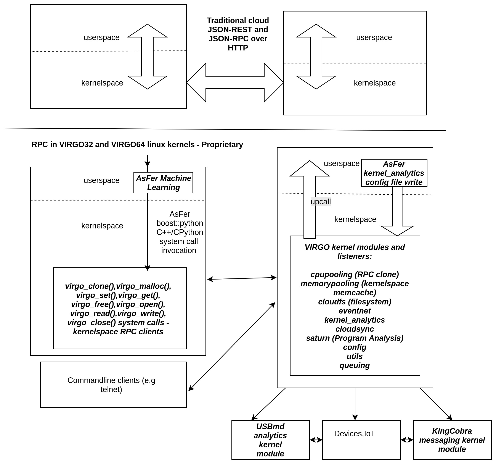

NeuronRain is a new linux kernel fork-off from mainline kernel (presently overlayed on kernel 4.1.5 32 bit and kernel 4.13.3 64 bit) augmented with Machine Learning, Analytics, New system call primitives and Kernel Modules for cloud RPC, Memory and Filesystem. It differs from usual CloudOSes like OpenStack, VMs and containers in following ways:
    (*) Mostly available CloudOSes are application layer deployment/provisioning (YAML etc.,) focussed while NeuronRain is not about deploying applications but to bring the cloud functionality into Linux kernel itself. 
    (*) There are application layer memcache softwares available for bigdata processing.
    (*) There have been some opensource projects for linux kernel on GitHub to provide memcache functionality for kernelspace memory.
    (*) NeuronRain VIRGO32 and VIRGO64 kernels have new system calls and kernel drivers for remote cloning a process, memcache kernel memory and remote file I/O with added advantage of reading analytics variables in kernel.
    (*) Cloud RPCs, Cloud Kernel Memcache and Filesystems are implemented in Linux kernel with kernelspace sockets
    (*) Linux kernel has access to Machine Learnt Analytics(in AsFer) with VIRGO linux kernel_analytics driver
    (*) Assumes already encrypted data for traffic between kernels on different machines.
    (*) Advantages of kernelspace Cloud implementation are: Remote Device Invocation (recently known as Internet of Things), Mobile device clouds, High performance etc.,.
    (*) NeuronRain is not about VM/Containerization but VMs, CloudOSes and Containers can be optionally rewritten by invoking NeuronRain VIRGO systemcalls and drivers - thus NeuronRain Linux kernel is the bottommost layer beneath VMs, Containers, CloudOSes.
    (*) Partially inspired by old Linux Kernel components - Remote Device Invocation and SunRPC
    (*) VIRGO64 kernel based on 4.13.3 mainline kernel, which is 64 bit version of VIRGO32, has lot of stability/panic issues resolved which were random and frequent in VIRGO32 and has Kernel Transport Layer Security (KTLS) integrated into kernel tree.

NeuronRain - Repositories:
--------------------------
NeuronRain repositories are in:

	(*) http://sourceforge.net/users/ka_shrinivaasan - Astronomy and Research version

	(*) https://github.com/shrinivaasanka - Enterprise version
   
NeuronRain - Features:
----------------------
**VIRGO system calls from include/linux/syscalls.h**

asmlinkage long sys_virgo_clone(char* func, void *child_stack, int flags, void *arg);

asmlinkage long sys_virgo_malloc(int size,unsigned long long __user *vuid);

asmlinkage long sys_virgo_set(unsigned long long vuid, const char __user *data_in);

asmlinkage long sys_virgo_get(unsigned long long vuid, char __user *data_out);

asmlinkage long sys_virgo_free(unsigned long long vuid);

asmlinkage long sys_virgo_open(char* filepath);

asmlinkage long sys_virgo_read(long vfsdesc, char __user *data_out, int size, int pos);

asmlinkage long sys_virgo_write(long vfsdesc, const char __user *data_in, int size, int pos);

asmlinkage long sys_virgo_close(long vfsdesc);

**VIRGO Kernel Modules in drivers/virgo**

1. cpupooling virtualization - VIRGO_clone() system call and VIRGO cpupooling driver by which a remote procedure can be invoked in kernelspace.(port: 10000)

2. memorypooling virtualization - VIRGO_malloc(), VIRGO_get(), VIRGO_set(), VIRGO_free() system calls and VIRGO memorypooling driver by which kernel memory can be allocated in remote node, written to, read and freed - A kernelspace memcache-ing.(port: 30000)

3. filesystem virtualization - VIRGO_open(), VIRGO_read(), VIRGO_write(), VIRGO_close() system calls and VIRGO cloud filesystem driver by which file IO in remote node can be done in kernelspace.(port: 50000)

4. config - VIRGO config driver for configuration symbols export.

5. queueing - VIRGO Queuing driver kernel service for queuing incoming requests, handle them with workqueue and invoke KingCobra service routines in kernelspace. (port: 60000)

6. cloudsync - kernel module for synchronization primitives (Bakery algorithm etc.,) with exported symbols that can be used in other VIRGO cloud modules for critical section lock() and unlock()

7. utils - utility driver that exports miscellaneous kernel functions that can be used across VIRGO Linux kernel

8. EventNet - eventnet kernel driver to vfs_read()/vfs_write() text files for EventNet vertex and edge messages (port: 20000)

9. Kernel_Analytics - kernel module that reads machine-learnt config key-value pairs set in /etc/virgo_kernel_analytics.conf (and from a remote cloud as stream of key-value pairs in VIRGO64). Any machine learning software can be used to get the key-value pairs for the config. This merges three facets - Machine Learning, Cloud Modules in VIRGO Linux-KingCobra-USBmd , Mainline Linux Kernel

10. SATURN program analysis wrapper driver.

11. KTLS config driver - for Kernel Transport Layer Security - only in VIRGO_KTLS branch of VIRGO64 repositories

Complete list of Features of NeuronRain (Research and Enterprise) are detailed in:
https://sites.google.com/site/kuja27/CV_of_SrinivasanKannan_alias_KaShrinivaasan_alias_ShrinivasKannan.pdf

Previous system calls and drivers do not have internal mutexes and synchronization is left to the userspace. Quoting Commit Notes from hash https://github.com/shrinivaasanka/virgo64-linux-github-code/commit/ad59cbb0bec23ced72109f8c5a63338d1fd84beb :
"... Note on concurrency: Presently mutexing within system calls have been commented because in past linux versions mutexing within kernel was causing strange panic issues. As a design choice and feature-stability tradeoff (stability is more important than introducing additional code) mutexing has been lifted up to userspace. It is upto the user applications invoking the system calls to synchronize multiple user threads invoking VIRGO64 system calls i.e VIRGO64 system calls are not re-entrant. This would allow just one kernel thread (mapped 1:1 to a user thread) to execute in kernel space. Mostly this is relevant only to kmemcache system calls which have global in-kernel-memory address translation tables and next_id variable. VIRGO clone/filesystem calls do not have global in-kernel-memory datastructures. ...". An example pthread mutex code doing VIRGO64 system calls invocation in 2 parallel concurrent processes within a critical section lock/unlock is at https://github.com/shrinivaasanka/virgo64-linux-github-code/blob/master/linux-kernel-extensions/virgo_malloc/test/test_virgo_malloc.c. Synchronization in userspace for system calls-drivers RPC is easier to analyze and modify user application code if there are concurrency issues than locking within kernelspace in system calls and drivers. This would also remove redundant double locking in userspace and kernelspace. Another advantage of doing synchronization in userspace is the flexibility in granularity of the critical section - User can decide when to lock and unlock access to a resource e.g permutations of malloc/set/get/free kmemcache primitive sequences can be synchronized as desired by an application.

NeuronRain - Architecture Diagrams:
-----------------------------------

https://github.com/shrinivaasanka/Krishna_iResearch_DoxygenDocs/blob/master/Krishna_iResearch_opensourceproducts_archdiagram.pdf
https://github.com/shrinivaasanka/Krishna_iResearch_DoxygenDocs/blob/master/NeuronRain_Architecture_Diagrams_29September2016.pdf

Products in NeuronRain Suite (Research and Enterprise):
------------------------------------------------------
AsFer - AstroInfer was initially intended, as the name suggests, for pattern mining of Astronomical Datasets to predict natural weather disasters. It is focussed on mining patterns in texts and strings. It also has implementations of algorithms for analyzing merit of text, PAC learning, Polynomial reconstruction, List decoding, Factorization etc., which are later expansions of publications by the author (K.Srinivasan - http://dblp.dagstuhl.de/pers/hd/s/Shrinivaasan:Ka=) after 2012. Presently AsFer in both SourceForge and GitHub has implementations for prominently used machine learning algorithms.

USBmd - Wireless data traffic and USB analytics - analyzes internet traffic and USB URB data packets for patterns by AsFer machine learning (e.g USBWWAN and kern.log Spark MapReduce) implementations. It is also a module in VIRGO linux kernel.

VIRGO Linux Kernel - Linux kernel fork-off based on 4.1.5 (32 bit) and 4.13.3 (64 bit) has new system calls and drivers which abstract cloud RPC, kernel memcache and Filesystem. These system calls are kernelspace socket clients to kernelspace listeners modules for RPC,Kernelspace Memory Cacheing and Cloud Filesystems. These new system calls can be invoked by user applications written in languages other than C and C++ also (e.g. Python). Simply put VIRGO is a kernelspace cloud while present cloud OSes concentrate on userspace applications. Applications on VIRGO kernel are transparent to how cloud RPC works in kernel. This pushes down the application layer socket transport to the kernelspace and applications need not invoke any userspace cloud libraries e.g make REST http GET/POST requests by explicitly specifying hosts in URL. Most of the cloud webservice applications use REST for invoking a remote service and response is returned as JSON. This is no longer required in VIRGO linux kernel. Application code is just needed to invoke VIRGO system calls, and kernel internally loadbalances the requests to cloud nodes based on config files. VIRGO system call clients and driver listeners converse in TCP kernelspace sockets. Responses from remote nodes are presently plain texts and can be made as JSON responses optionally. Secure kernel socket families like AF_KTLS are available as separate linux forks. If AF_KTLS is in mainline, all socket families used in VIRGO kernel code can be changed to AF_KTLS from AF_INET and thus security is implicit. VIRGO cloud is defined by config files (virgo_client.conf and virgo_cloud.conf) containing comma separated list of IP addresses in constituent machines of the cloud abstracted from userspace. It also has a kernel_analytics module that reads periodically computed key-value pairs from AsFer and publishes as global symbols within kernel. Any kernel driver including network, I/O, display, paging, scheduler etc., can read these analytics variables and dynamically change kernel behaviour. Good example of userspace cloud library and RPC is gRPC - https://developers.googleblog.com/2015/02/introducing-grpc-new-open-source-http2.html which is a recent cloud RPC standard from Google. There have been debates on RPC versus REST in cloud community. REST is stateless protocol and on a request the server copies its "state" to the remote client. RPC is a remote procedure invocation protocol relying on serialization of objects. Both REST and RPC are implemented on HTTP by industry standard products with some variations in syntaxes of the resource URL endpoints. VIRGO linux kernel does not care about how requests are done i.e REST or RPC but where the requests are done i.e in userspace or kernelspace and prefers kernelspace TCP request-response transport. In this context it differs from traditional REST and RPC based cloud - REST or RPC are userspace wrappers and both internally have to go through TCP, and VIRGO kernel optimizes this TCP bottleneck. Pushing down cloud transport primitives to kernel away from userspace should theoretically be faster because 
	(*) cloud transport is initiated lazy deep into kernel and not in userspace which saves serialization slowdown
	(*) lot of wrapper application layer overheads like HTTP, HTTPS SSL handshakes are replaced by TCP transport layer security (assuming AF_KTLS sockets)
	(*) disk I/O in VIRGO file system system-calls and driver is done in kernelspace closer to disk than userspace - userspace clouds often require file persistence
	(*) repetitive system call invocations in userspace cloud libraries which cause frequent userspace-kernerspace switches are removed.
	(*) best suited for interacting with remote devices than remote servers because direct kernelspace-kernelspace remote device communication is possible with no interleaved switches to userspace. This makes it ideal for IoT.
	(*) VIRGO kernel memcache system-calls and driver facilitate abstraction of kernelspaces of all cloud nodes into single VIRGO kernel addresspace.
	(*) VIRGO clone system-call and driver enable execution of a remote binary or a function in kernelspace i.e kernelspace RPC
An up-to-date description of how RPC ruled the roost, fell out of favour and reincarnated in latest cloud standards like Finagle/Thrift/gRPC is in http://dist-prog-book.com/chapter/1/rpc.html - RPC is Not Dead: Rise, Fall and the Rise of Remote Procedure Calls. All these recent RPC advances are in userspace while VIRGO linux kernel abstracts RPC and loadbalancing within system calls itself requiring no user intervention (it is more than mere Remote Procedure Call - a lightweight Remote Resource System Call - a new paradigm in itself).

KingCobra - This is a VIRGO module and implements message queueing and pub-sub model in kernelspace. This also has a userspace facet for computational economics (Pricing, Electronic money protocol buffer implementation etc.,)

NeuronRain Enterprise Version Design Documents (repositories suffixed 64 are for 64-bit and others are 32-bit on different linux versions)
------------------------------------------------------------------------------------------
AsFer - https://github.com/shrinivaasanka/asfer-github-code/blob/master/asfer-docs/AstroInferDesign.txt

USBmd - https://github.com/shrinivaasanka/usb-md-github-code/blob/master/USBmd_notes.txt

USBmd64 - https://github.com/shrinivaasanka/usb-md64-github-code/blob/master/USBmd_notes.txt

VIRGO Linux - https://github.com/shrinivaasanka/virgo-linux-github-code/blob/master/virgo-docs/VirgoDesign.txt

VIRGO64 Linux - https://github.com/shrinivaasanka/virgo64-linux-github-code/blob/master/virgo-docs/VirgoDesign.txt

KingCobra - https://github.com/shrinivaasanka/kingcobra-github-code/blob/master/KingCobraDesignNotes.txt

KingCobra64 - https://github.com/shrinivaasanka/kingcobra64-github-code/blob/master/KingCobraDesignNotes.txt

NeuronRain Research Version Design Documents (repositories suffixed 64 are for 64-bit and others are 32-bit on different linux versions)
---------------------------------------------------------------------------------------
AsFer - https://sourceforge.net/p/asfer/code/HEAD/tree/asfer-docs/AstroInferDesign.txt

USBmd - https://sourceforge.net/p/usb-md/code-0/HEAD/tree/USBmd_notes.txt

USBmd64 - https://sourceforge.net/p/usb-md64/code/ci/master/tree/USBmd_notes.txt

VIRGO Linux - https://sourceforge.net/p/virgo-linux/code-0/HEAD/tree/trunk/virgo-docs/VirgoDesign.txt

VIRGO64 Linux - https://sourceforge.net/p/virgo64-linux/code/ci/master/tree/virgo-docs/VirgoDesign.txt

KingCobra - https://sourceforge.net/p/kcobra/code-svn/HEAD/tree/KingCobraDesignNotes.txt

KingCobra64 - https://sourceforge.net/p/kcobra64/code/ci/master/tree/KingCobraDesignNotes.txt

Some Implementations in AsFer in GitHub and Sourceforge are related to publications in https://scholar.google.co.in/citations?hl=en&user=eLZY7CIAAAAJ and publication drafts in https://sites.google.com/site/kuja27/ and https://sourceforge.net/projects/acadpdrafts/files/

Free course material in https://github.com/shrinivaasanka/Grafit also refer to implementations in previous NeuronRain GitHub and Sourceforge respositories.

FAQ
---
**What is the meaning of name "NeuronRain"?**

Earlier the repositories in GitHub and SourceForge were named "iCloud" but it was in conflict with an already existing mobile cloud platform. Hence different name had to be chosen. All these codebases are targeted at a machine learning powered cloud. AsFer implements almost all prominent machine learning and deep learning neural network algorithms among others. It was intended to be named "NeuronCloud" but because of astronomical weather forecasting origins (both have clouds - weather and linux), and rain realises cloud, it has been named "NeuronRain".

**How does machine learning help in predicting weather vagaries? How does NeuronRain research version approach this?**

It is an unusual application of machine learning to predict weather from astronomical data. Disclaimer here is this is not astrology but astronomy. It is long known that earth is influenced by gravitational forces of nearby ethereal bodies (e.g high tides associated with lunar activity, ElNino-LaNina pairs correlated to Sun spot cycles and Solar maxima etc.,). NeuronRain research version in SourceForge uses Swiss Ephemeris (based on NASA JPL Ephemeris - http://ssd.jpl.nasa.gov/horizons.cgi) implementation in a third-party opensource code (Maitreya's Dreams) to compute celestial degree locations of planets in Solar system. It mines historic data of weather disasters (Typhoons, Hurricanes, Earthquakes) for patterns in astronomical positions of celestial bodies and their connections to heightened weather disturbances on earth. Prominent algorithm used is sequence mining which finds common patterns in string encoded celestial information. This sequence mining along with other bioinformatics tools extracts class association rules for weather patterns. Preliminary analysis shows this kind of pattern mining of astronomical data coincides reasonably with actual observations. There is a python script in asfer codebase which iterates through sequence mined rules and searches a celestial configuration matching it. Most weather models are fluid dynamics based while this is a non-conventional astronomy based analysis. Gravitational influences amongst celestial bodies and their resultant orbital vicissitudes are formulated by set of differential equations and solutions to them known as N-Body Problem (http://en.wikipedia.org/wiki/N-body_problem). Solar system is a set of celestial bodies with mutual gravitational influences. Sequence mining of string encoded celestial configurations, mines patterns in planetary conjunctions (http://en.wikipedia.org/wiki/Conjunction_(astronomy)) vis-a-vis weather/geological vagaries on earth. Each such pattern is an instance of N-Body problem and its solutions pertain to gravitational influences for such a celestial configuration. Solving N-Body problem for N > 3 is non-trivial and no easy solutions are known. Solar system in this respect is 9-Body problem of 9 known planets and their mutual gravitational influences affecting Earth, ignoring asteroids/comets/KuiperBeltObjects. Thus machine learning helps in solving N-Body problem indirectly by mining patterns in planetary positions and how they correlate to gravity induced events on Earth obviating N-Body differential equations. Disclaimer is this kind of forecast drastically differs from conventions and it does not prove but only correlates astronomical gravity influences and events on Earth. Proof requires solving the differential equations for N-Body and match them with mined celestial patterns which is daunting. As mentioned earlier, preliminary mined correlation analysis shows emergence of similar celestial conjunction patterns for similar genre of terrestrial events. Meaning of celestial bodies named Rahu and Ketu is the imaginary Lunar nodes (http://en.wikipedia.org/wiki/Lunar_node) which are points on zodiac where Ecliptic of the Sun (path of Sun observed from earth) crosses the Path of Moon which happens approximately 2*(12 or 13) times per year.

**Is it possible to do accurate long term weather forecasting? Are there theoretical limitations? How does NeuronRain weather forecast overcome it?**

No and Yes. Both N-Body problem of solar system and failure of long term weather forecast have their basis in Chaos theory e.g Poincare Maps for 3-body problems define chaos in the orbits in system of 3 bodies while Lorenz attractors depict sensitive dependence on initial conditions specifically in weather forecast (Butterfly effect). This presents a natural limitation. All existing weather models suffer due to Chaos. But NeuronRain does not have any Chaos theoretic limitation. It just mines patterns in sky and tries to correlate them with weather events on earth accuracy of which depends on how the pattern-event correlations match solutions to N-Body problem. N-Body problem rests on Newtons's Law of Gravitation. It is not just gravity but electromagnetic fields of other celestial objects also influence earth. So it is not exact astrophysics but computational learning model for astrophysics with failure probability.

**Can you cite an example machine learnt celestial pattern correlated to a terrestrial event?**

Sequence Mined Class Association Rules in http://sourceforge.net/p/asfer/code/HEAD/tree/python-src/MinedClassAssociationRules.txt and http://github.com/shrinivaasanka/asfer-github-code/blob/master/python-src/MinedClassAssociationRules.txt created by SequenceMining of string encoded celestial configuration show prominent celestial conjunctions when large magnitude Earthquakes or Hurricanes occur. One of the mined rule is Sun + Moon also known as New Moon. High probability of earthquakes due to Moon's gravitational effects during New Moon days (especially eclipses when Earth-Sun-Moon are aligned in line) is known (http://www.scientificamerican.com/article/moon-s-gravity-linked-to-big-earthquakes/). Other prominent mined rule is juxtaposition of Mercury-Sun-Venus (intercuspal and intracuspal) which highly correlates to heightened hurricane-typhoon-tropical cyclone events. Sun-Moon factor influencing ocean currents and causing earthquakes is plausible and known but Mercury-Venus, which are distant celestial systems having negligible gravitational effects, affecting tropical monsoons is an intriguing coincidental pattern. Likely explanation is: Mercury-Sun-Venus-Earth is a 4 body system. Mercury is always +/-15 degrees approximately from Sun and Venus is always +/- 60 degrees approximately from Sun on the zodiac. This 4 body system which is close to earth is quite periodic almost annually exerting gravitational influence. Similar explanation holds for Mars-Earth et al system too. 

**What is the historic timeline evolution of NeuronRain repositories?**

Initial design of a cognitive inference model (uncommitted) was during 2003 though original conceptualization occurred during 1998-99 to design a distributed linux. Coincidentally, an engineering team project done by the author was aligned in this direction - a distributed cloud-like execution system - though based on application layer CORBA (https://sourceforge.net/projects/acadpdrafts/files/Excerpts_Of_PSG_BE_FinalProject_COBRA_done_in_1999.pdf/download). Since 1999, author has worked in various IT companies (https://sourceforge.net/projects/acadpdrafts/files/AllRelievingLetters.pdf/download) and studied further (MSc and an incomplete PhD at CMI/IMSc/IIT,Chennai,India - 2008-2011). It was a later thought to merge machine learning analytics and a distributed linux kernel into a new linux fork-off driven by BigData analytics. Commits into Sourceforge and GitHub repositories are chequered with fulltime Work and Study tenures. Thus it is pretty much parallel charity effort from 2003 alongside mainstream official work. Presently author does not work for any and works fulltime on NeuronRain code commits and related independent academic research only with no monetary benefit accrued. Significant commits have been done from 2013 onwards and include implementations for author's publications done till 2011 and significant expansion of them done after 2012 till present. Initially AstroInfer was intended for pattern mining Astronomical Datasets for weather prediction. In 2015, NeuronRain was replicated in SourceForge and GitHub after a SourceForge outage and since then SourceForge NeuronRain repos have been made specialized for academic research and astronomy while GitHub NeuronRain repos are for production cloud deployments.

**Why is NeuronRain code separated into multiple repositories?**

Reason is NeuronRain integrates multiple worlds into one and it was difficult to manage them in single repository - AsFer implements only userspace machine learning, USBmd is only for USB and WLAN debugging, VIRGO kernel is specially for new systemcalls and drivers, KingCobra is for kernelspace messaging/pubsub. Intent was to enable end-user to use any of the repositories independent of the other. But the boundaries among them have vanished as below:
	(*) AsFer invokes VIRGO systemcalls
	(*) AsFer implements publications and drafts in acadpdrafts
	(*) USBmd invokes AsFer machine learning
	(*) VIRGO Queueing forwards to KingCobra
	(*) VIRGO is dependent on AsFer for kernel analytics
	(*) KingCobra is dependent on AsFer MAC Protocol Buffer currency implementation
	(*) Grafit course materials refer to all these repositories
and all NeuronRain repositories are strongly interdependent now. Each repository of NeuronRain can be deployed independent of the other - for example, VIRGO linux kernel and kernel_analytics module in it can learn analytic variables from any other third-party Machine Learning framework not necessarily from AstroInfer - TensorFlow, Weka, RapidMiner etc., Only prerequisite is /etc/kernel_analytics.conf should be periodically updated by set of key-value pairs of machine-learnt analytic variables written to it. But flipside of using third-party machine-learning software in lieu of AsFer is lack of implementations specialized and optimized for NeuronRain.

**NeuronRain repositories have implementations for your publications and drafts. Are they reviewed? Could you explain about them?**

Only arXiv articles and TAC 2010 publications below are reviewed and guided by faculty - Profs.Balaraman Ravindran(IIT,Chennai), Madhavan Mukund(CMI) and Meena Mahajan (IMSc) [Co-Authors in https://scholar.google.co.in/citations?hl=en&user=eLZY7CIAAAAJ] while the author was doing PhD till 2011 in CMI/IMSc/IIT,Chennai:
• Decidability of Complementation - http://arxiv.org/abs/1106.4102
• Algorithms for Intrinsic Merit - http://arxiv.org/abs/1006.4458
• NIST TAC 2010 version of Algorithms for Intrinsic Merit - http://www.nist.gov/tac/publications/2010/participant.papers/CMI_IIT.proceedings.pdf

All other draft write-ups in NeuronRain design documents and http://sites.google.com/site/kuja27 are unreviewed and unguided and were written by the author alone after 2011, significantly expanding previous publications. They are subject to errors. This was because of some administrative and practical hurdles in obtaining faculty guidance from 2013 onwards while trying to resume PhD after a work tenure.

**Is there a central theme connecting the publications, drafts and their implementations mentioned previously?**

Yes. All these drafts revolve around the fundamental philosophical/mathematical question - Which choice is better? Group Social Choice by Majority or Any Choice function other than Majority? Is it possible to determine merit intrinsically unpolluted by mass opinions? This problem has been studied for centuries e.g Condorcet Jury Theorem. Drafts and publications above are efforts in this direction translating this question to problems requiring measurement of merit and ranking of text etc., in World Wide Web and Human Social Networks. These drafts bridge the usual chasm between Theoretical Computer Science and Engineering side of it like Machine Learning by concepts drawn from Boolean social choice, Pseudorandomness, Boolean Satisfiability, Learning theory etc.,. Notion of Complementing a Function has origins in computability theory (Hilbert's tenth problem, Solutions to Diophantine Equations, MRDP theorem etc.,) and closely relates to Ramsey Theory of Coloring sequences of real/integer lines. Complementation of a function is also another facet of social choice e.g Complement of a social choice function - "Who voted in favour" is a complement of a social choice function - "Who did not vote in favour". In complexity parlance, complementation is reminiscent of the definition of C and Co-C complexity classes for some class C. Integer partition and Locality Sensitive Hashing are theoretical gadgets for a multipartisan voting - votes are partitioned among candidates and each candidate has similar voters chained in an LSH bucket together. LSH Hash function of 2 buckets is nothing but the boolean majority function in tabulation and each bucket has a generating function which are mutually complement functions. Integer Factorization is a peripheral requirement for integer partitioning - each number can be partitioned in as many ways as sum of products of frequencies of partition and size of partition - defined by coefficients in partition generating function. Space filling/Circle filling algorithms are packing constraint satisfaction problems which can be social choice functions too (each packing problem is an objective function of a voter maximized by a candidate). These drafts describe a parallel PRG cellular automaton algorithm for space filling. Last but not the least, Complement Function generalizes the well-known patterns in primes problem (which is related to real part of non-trivial zeros of Riemann Zeta Function) - a function complementing integer factorization implies pattern in primes. Prime-Composite complementation is also related to Jones-Sato-Wada-Wiens Theorem - http://www.math.ualberta.ca/~wiens/home%20page/pubs/diophantine.pdf - set of primes is exactly the set of values of a polynomial in 25 degree - 26 variables - because primes are recursively enumerable Diophantine set. Pattern in primes is also a problem related to energy levels of Erbium nuclei - Freeman Dyson and Montgomery statistics - http://seedmagazine.com/content/article/prime_numbers_get_hitched/ . Intrinsic merit versus perceived merit dichotomy has immense complexity theoretic ramifications which are analyzed in the drafts which have to be read with the caveat: equating majority and non-majority social choices subsume all classes of complexity zoo under equal goodness (in the context of Condorcet Jury Theorem Group Decision vis-a-vis a non-conventional social choice) and completeness assumptions. Intrinsic merit is about objectively determining value of an entity (text, academic papers, audio-visuals and humans too) whereas Condorcet Jury Theorem and its later enhancements are about correctness of subjective Majority Voting Decision. Notion of Intrinsic Merit already has been widely studied in the name of Intrinsic Fitness of a vertex in Social Networks (ability to attract links) - e.g Bianconi-Barabasi Network Bose-Einstein Fitness and its later derivative papers. Previous publications till 2010 devote only to intrinsic merit of text documents and later draft expansions after 2011 generalize it to merit of any. Most of the literature assumes a probability distribution of fitness/merit and not finding it. These drafts are efforts in this direction to pinpoint how to quantize intrinsic fitness/merit. Obviously defining intrinsic merit is a difficult problem, but there are precedents to solving it e.g individual social merit is measured by examinations/question-answering/contests etc., not much by voting. Both these problems reduce to satisfying a boolean formula (e.g 3SAT) of arbitrary complexity class because "judging" implies extent of constraints satisfied e.g Voters have varied 3CNFs to rank a candidate making it subjective while Intrinsic merit requires an absolute 3CNF. Finding an absolute CNF is the leitmotif of all Intrinsic Merit algorithms implemented in NeuronRain - this is computational learning theory problem viz.,PAC Learning, MB Learning etc., All Deep Learning algorithms including BackPropagation, Convolution, Recurrent Neural Networks etc., learn from errors and iteratively minimize. Neural networks are theoretically equivalent to threshold AC=NC=TC circuits. Learning theory goes beyond just constructing formulas and places limits on what is efficiently learnable. Merit computed by these can be translated to variables in a CNF. NeuronRain implements a Least Square Approximate MaxSAT solver to rank the targets by the percentage of clauses satisfied.

**Why is Intrinsic Merit necessary? Are there counterexamples to perceptive voting based ranking? Why is voting based merit judgement anachronistic?**

Following counterexamples on merit-fame(prestige) anachronism and Q&A already mentioned in AstroInfer Design Document are quoted herewith as they are pertinent to this question:
*) Performance of an academic personality is measured first by accolades,awards,grades etc., which form the societal opinion - prestige (citations). That is prestige is created from intrinsic merit. But measuring merit from prestige is anachronistic because merit precedes prestige. Ideally prestige and intrinsic merit should coincide when the algorithms are equally error-free. In case of error, prestige and merit are two intersecting worlds where documents without merit might have prestige and vice-versa. Size of the set-difference is measure of error.  *) Soccer player, Cricket player or a Tennis player is measured intrinsically by number of goals scored, number of runs/wickets or number of grandslams won respectively and not subjectively by extent of votes or fan following to them (incoming edges). Here reality and perception coincide often and an intrinsically best player by records is also most revered. Any deviation is because of human prejudice. Here intrinsic merit precedes social prestige.  *) Merits of students are judged by examinations (question-answering) and not by majority voting by faculty. Thus question-answering or interview is an algorithm to measure intrinsic merit objectively. Here again best student in terms of marks or grades is also the most favoured. Any deviation is human prejudice. Interview of a document is how relevant it is to a query measured by graph edit distance between recursive gloss overlap graphs of query and text. Here also intrinsic merit precedes social prestige. Caveat is these examples do not prove voting is redundant but only exemplify that Voting succeeds only when all voters decide merit with high degree of accuracy (Condorcet Jury Theorem). *) Legal System rests on this absoluteness - People frame law, reach consensus on its clauses and Everyone agrees and accepts Law as a standard. *) Most obvious counterexample to perceptive ranking is the pricing in money flow markets. Same Good and Service is differentially priced by different Sellers. Widely studied question in algorithmic economics is how to fix an absolute price for commodity. There are only equilibrium convex program solutions available (Nash,Fisher,Eisenberg-Gale) where buyer-seller may reach an agreement point which is not necessarily intrinsic. This problem is parallel to existence of Intrinsic Merit/Fitness in world wide web and social networks. *) Stock buy-sell decisions are often influenced by Credit Rating agencies which is also an intrinsic merit assessment in financial markets. *) Darwin's Theory of Natural Selection and Survival of the Fittest is one of the oldest scientific example for Intrinsic merit or fitness in anthropology - Nature makes beings to compete with each other for survival, less fit become extinct and the fittest of them emerge victorious and evolve. *) Economic Networks for Shock Propagation(https://economics.mit.edu/files/9790) - Gravity Model of Economic Networks and GDP as intrinsic fitness measure in World Trade Web - https://www.nature.com/articles/srep15758 and https://arxiv.org/pdf/1409.6649.pdf (A GDP-driven model for the binary and weighted structure of the International Trade Network) *) Human Development Index Rankings of Countries which is a geometric mean of Life Expectancy Index, Education Index and Income Index - http://hdr.undp.org/sites/default/files/hdr_2013_en_technotes.pdf - is an intrinsic macroeconomics merit measure. 
 
**Why should intrinsic merit be judged only by mapping a text to a graph?** 

This is not the only possible objective intrinsic merit judgement. There could be other ways too. Disclaimer is intrinsic merit assumes cerebral representation of sensory reception (words, texts, visuals, voices etc.,) and its complexity to be the closest to ideal judgement. Simulating cerebral representation of meaning by a neural network therefore approximates intrinsic merit well (BRAIN initiative - circuit diagram of neurons - http://www.braininitiative.org/achievements/making-the-connection/ - neurons for similar tasks are closely connected). Usually cognition of text or audio-visuals, can be approximated by bottom-up recursive lambda function composition tree evaluation on each random walk of the Definition Graph. Graph representation of a text can be easily made into a Graph Neural Network, a recent advance in Deep Learning, and thus closely resembles internal neural synaptic activation in brain on reading a text. AstroInfer implements this as Graph Neuron Tensor Network (GNTN) on lambda composition tree of random walks on definition graph which is a merger of Graph Neural Networks(GNN) and Neural Tensor Network(NTN). Neural Tensor Networks formalize similarity of two vertices connected by a relation as a Tensor Neuron and are ideally suitable for ontologies like WordNet. Intrinsic Merit can also have errors similar to Perceptive Majority Vote Ranking. But Intrinsic Merit has an inherent cost advantage compared to aggregating votes.

**Wouldn't cerebral representation vary from person to person and thus be subjective?**

There are standardized event related potential (ERP) datasets (N400,LAN,P600 etc., - https://www.ncbi.nlm.nih.gov/pmc/articles/PMC3822000/) and Event Related Functional MRI datasets gathered from multiple neuroscience experiments on human subjects. Such ERP data are similar for most brains. Variation in potential occurs because cerebral cortex and its sulci&gyri vary from person to person. It has been found that cortex and complexity of gray matter determine intelligence and grasping ability. Intrinsic merit should therefore be based on best brain potential data. ERP is non invasive compared to fMRI. An example of how ERP related to "meaningfulness"/"semantic correctness" of two texts - meaningful and meaningless - is plotted in https://brainlang.georgetown.edu/research/erplab. 

**Isn't perception based ranking enough? Why is such an intrusive objective merit required?**

Perception majority voting based ranking is accurate only if  all voters have decision correctness probability > 0.5 from Condorcet Jury Theorem. PageRank works well in most cases because incoming edges vote mostly with >50% correctness. This correctness is accumulated by a Markov Chain Random Walk recursively - vote from a good vertex to another vertex implies voted vertex is good (Bonacich Power Centrality) and so on. Initial goodness is based on weight of an edge. Markov iteration stabilizes the goodness. Probability that goodness of stationary Markov distribution < 0.5 can be obtained by a tail bound and should be exponentially meagre.

**Can Intrinsic Merit for a human social network vertex, a text document or any other entity be precisely defined as opposed to a probability distribution for Intrinsic Fitness defined for Social network vertices?**

Literature on Social network intrinsic fitness does not define but only relates why preferential attachment happens in networks i.e Why certain social people profiles are highly regarded and attract audience. Earlier Scale-Free networks defined degree of vertex exponentially (Power Law) which is Rich-Get-Richer in random graphs (Erdos-Renyi model) i.e if a vertex has huge degree already it would have greater ability to attract future links. Recent advances place more importance on Fit-Get-Richer idiom and express fitness as a function of degree (a posteriori estimation). Defining Exact Fitness is a void in literature still and Intrinsic merit algorithms for texts fit in right there. These algorithms are not probabilistic. For humans, defining merit independent of perception has a long drawn tradition - talk to h(im/er) directly and judge and don't rely on popular opinions. This requires a consensus on who judges merit and how. Previous counterexamples assume that such an Intrinsic, Absolute standard exists e.g Examination/Interviews/Contests/Law are accepted standards to assess human merit - All students are asked same questions, All candidates are asked same questions, All contestants have equal levelled opportunities, All plaintiffs have equal freedom to defend - Thus proving/disproving existence of absolute consensus standard is tantamount to proving/disproving human intrinsic merit. Ultimately, intrinsic merit existence reduces to consensus problem to measure merit - when everyone agrees on how to decide merit, perception gives way to intrinsic.

**Aren't there counterexamples to Intrinsic Merit examples mentioned previously? For example, aren't there brilliant scientists faring poorly in examinations? Aren't there bright candidates rejected by Interviews? And vice-versa? How do you explain it?**

Probably this is the best question of this FAQ. These counterexamples imply the examination/interview system is flawed and violates consensus. Accuracy of Question-Answer based merit judgement depends on how efficiently the system samples merit from past history of the subject. This can be equivalently stated as Merit Summarization Problem (similar to text summarization). If merit features are represented on a metric vector space, sampling should construct an efficient summary subspace of merit metric space. Clustering/Partitioning this space by a computational geometric algorithm e.g Voronoi tessellation, Delaunay triangulation etc., or a Clustering algorithm yields strong regions of merit. Question-Answeing should therefore concentrate on these merit clusters. If points in this merit space are connected as a dependency graph, strongly connected components of the graph are closely related regions of merit and a component graph is the merit summary in which each vertex is a strongly connected component. Theoretically, question answering reduces to a polynomial round QBFSAT and is a PSPACE problem (unbounded QBFSAT is EXP-complete). Traditional question-answering is time-bounded and intrinsic merit need not depend on time restrictions - answering a question depends on how much instantaneous insight or epiphany a person has within limited time in responding. This insight depends on both natural merit and past learning. It is against definition of merit itself because merit is absolute and independent of time while only experiential learning grows over time. Problem therefore is how efficient and time-independent the QBF is and this error in QBF is the failure probability of Intrinsic Merit. Probably above counterexamples could have succeeded in unbounded, better-formed QBF. A nice academic example of unboundedness: Graduate/Doctoral studies give more importance to assignments, quizzes, take-home exams in deciding course credit and merit which are less time-bounded compared to conventional 3 hour tests. Someone failing in a 3 hour test might succeed in (3+x)th hour and time limit shouldn't constrain someone from proving their innate ability. But traditionally intelligence is measured by how fast a person solves a problem e.g puzzles and this is based on assumption that all contestants have similar cerebral activity simultaneously in the duration of contest. This assumption is questionable - if problem solving faculty (periods of peak creativity or insight) of brain is plotted as a curve against time for each individual, it is not necessary that curves of any two individuals should coincide. One person might have peak cerebral activity/insight at time t (during the contest) and another might have peak activity/insight at t+dt (outside the duration of contest) and thus the intelligence quotient test fails to capture the merit of the latter. But the question of if past merit history can be efficiently constructed and sampled is itself non-trivial. Because this implies personalization in deciding merit. For instance, academic and work credentials in a curriculum vitae/resume has to be mapped to a graph or merit vector. Even if merit clusters are conceivable, aforementioned limitation because of peak cerebral activity has to be accounted for accurate definition of intrinsic merit.

**How measurable are Intrinsic merit and Creativity? Is there any perfect metric to quantify these?**

There are metrics but not necessarily perfect. This requires a detailed anecdotal clarification. Consider for example two sentences: "You saved the nation" and "You shaved the nation". Both are grammatically correct but latter is semantically discordant. First sentence is obviously more meaningful because WordNet distance between "save" and "nation" is less than "shave" and "nation". Representing these sentences as a lambda function yields 2 functions: save(nation) and shave(nation) i.e verb acts as a function on the object. Best natural language closer to realising lambda function composition without significant loss of information is Sanskrit which has peculiar grammatical structure and brevity. An example sanskrit sentence below can be arbitrarily shuffled without loss of meaning (Reference: Conversational Sanskrit - Cycle 35 - by N.D.Krishnamurthy, U.P.Upadhyaya, Jayanthi Manohar, N.Shailaja):
	api asmin maargae vaahanam na sthaapayitavyam ? - Are vehicular parkings prohibited in this road?
is equivalent to:
	asmin maargae na sthaapayitavyam vaahanam api ? 
Lambda composition tree of this sentence might look like:
	api(asmin(maargae(na(sthaapayitavyam(vaahanam))))?
where each parenthesis is a lambda function on an object argument and evaluated right-to-left. This lambda tree and wordnet relevance distance combine approximates quantitative complexity of cerebral meaning representation well. Creativity or Genius has contextual interpretations in academics/art/music/linguistics : Creativity in academics is measured by how influential a research paper is on future articles and how it is confirmed by experimental science. For example, Einstein's papers on Special and General relativity grew in influence over the past 100 years because of its experimental validity (Eddington Eclipse Experiment, Gravitational Lensing, Discovery of Black Holes, Precession of Equinox in Mercury's Orbit, Gravitational Waves found by CERN-LIGO etc.,) and citations were the result of these experimental proofs. Thus incoming hyperlinks or Fame is a result of Proved Intrinsic Merit (or) merit in science is defined as experimental establishment of a theory and citations automatically ensue. Creativity/Originality/Merit in art and music is far more complex to define e.g What made Mozart or Van Gogh famous? It is not known if there is an experimental proof for merit of music and art. But art and music are known to stimulate neural activity in humans and cure illness. Only an fMRI or an ERP dataset on these stimuli could quantify merit. Functional MRI datasets for audio and music stimuli of different genres of music collected from human subjects are available in public domain at OpenfMRI - https://openfmri.org/dataset/ds000113b/. These also contain respiratory and heartbeat information on hearing music stimuli. There have been recent fMRI datasets like Human Connectome Project - https://www.humanconnectome.org/ - studying brain connectivity and its relevance to Intelligence Quotient.

**NeuronRain design documents and drafts refer to something called EventNet and ThoughtNet. What are they?**

EventNet is a new protocol envisaged to picturise cause-effect relations in cloud. It is a directed graph of event nodes each of which is an occurrence involving set of actors. This can be contrasted against actors pattern in Akka(http://doc.akka.io/docs/akka/current/scala/guide/actors-intro.html) which has interacting actor objects. EventNet is graph of not just actors but events involving actors. ThoughtNet is another equivalent formalism to connect related concepts than events. This is a theoretically strengthened version of cognitive inference model mentioned as uncommitted earlier in 2003. Basically ThoughtNet is a non-planar Hypergraph of concepts. Each vertex in ThoughtNet is essentially a stack because multiple hyperedges go through a vertex and these edges can be imagined as stacked upon one another. Rough analogy is a source versioning system which maintains versions of code at multiple time points. This model closely matches human evocative cognitive inference because upon sensory perception of a stimulus, brain's associative  evocation finds all possible matching thoughts and disambiguates them. Each set of evocations correspond to hyperedges transiting a stack vertex in ThoughtNet. ThoughtNet inherently has a temporal fingerprint because top most hyperedges of all stack vertices are the newest and deeper down the stack thoughts get older. Each hyperedge has a related potential and disambiguation depends on it. In machine learning jargon, ThoughtNet is a Contextual Multi-Armed Bandit Reinforcement Learning Data Structure - an agent interacts with environment and its actions have rewards - each stack vertex is a multi-armed bandit environment and each element of the stack is an arm. Evocation scans the stack vertex to choose an arm followed by an action and most potent evocative thought fetches highest reward. Choice of a highest rewarding arm is the disambiguation and depends on rewards for past evocation choices. Thus multi-armed bandit iteratively learns from past disambiguation to make future choices(a generalization of hidden markov model where present state depends on previous state). This is a computational psychoanalytic framework and has some similarities to Turing machines/Pushdown automata with stack and tapes - but alphabet and languages are thoughts not just symbols. ThoughtNet can be simulated by a Turing Machine of hypergraph storage and computation state transition defined by evocative actions. Each actor in EventNet has a ThoughtNet. Thus EventNet and ThoughtNet together formalise causation, human evocation and action. New memories in human brain are acquired by Hippocampus and removal of Hippocampus causes difficulty in acquiring new memory though old memories remain (Reference: Limbic System and Hippocampus - Phantoms in Human Brain: Probing the mysteries of human mind - V.S.Ramachandran and Sandra Blakeslee). Broca's Area in brain processes Lexical-Grammatical aspects of sensory reception and forwards to Limbic System for emotional reaction - https://www.ncbi.nlm.nih.gov/pubmed/19833971 by [Sahin NT1, Pinker S, Cash SS, Schomer D, Halgren E.] lists fMRI Local Field Potentials experimental observations for lexical-grammatical-phonological regular and irregular verb inflections (200-320-450ms). ThoughtNet theoretically simulates Broca's Area, Hippocampus and Limbic system and accumulates memories on hypergraph. Word inflections are sourced and normalized from WordNet Synsets. Sensory Stimulus for example is a Galvanic Skin Response. Evocative action based on stimulus by Limbic system is simulated by retrieval of the most potent thought hyperedge bandit arm and respectively defined action for the arm. NeuronRain grows ThoughtNet by creating vertex for each class of a thought hyperedge found by a classifier and storing the hyperedge across these class vertices. Example: Sentences "There is heavy flooding", "Typhoon wrought havoc","Weather is abnormal" are classified into 3 classes "Disaster","Water","Flooding" found by a classifier. An example stimulus "Flooding" evokes all these sentences. Following diagrams explain it:

.. image:: NeuronRain_EventNet.jpg

 
**Why is a new Linux kernel required for cloud? There are Cloud operating systems already.**

Because, most commercial cloud operating systems are deployment oriented and cloud functionality is in application layer outside kernel. User has to write the boilerplate application layer RPC code. NeuronRain VIRGO provides system calls and kernel modules which obfuscate and encapsulate the RPC code and inherent analytics ability within linux kernel itself. For example, virgo_clone() , virgo_malloc(), virgo_open() system calls transparently converse with remote cloud nodes with no user knowledge, configured in virgo conf files - this feature is unique in NeuronRain. Application developer (Python/C/C++) has to just invoke the system call from userspace to embark on cloud. This is not possible in present linux distros. Linux and unix system calls do not mostly use kernel sockets in system call kernelspace code and do not have kernel level support for cloud and analytics a void not compensated by even Cloud operating systems like openstack.

**Fedora and Ubuntu Linux distros have optimized Linux Kernels for Cloud e.g linux-aws for AWS. Is VIRGO Linux kernel similar to them?**

No. Amazon Machine Image (AMI) for virtual machine hypervisors have optimized linux kernel packages available for Fedora and Ubuntu. AWS has a network throughput enhancement named ENA (Elastic Network Adapter) which are device drivers (https://github.com/amzn/amzn-drivers) written to take advantage of Linux kernel Gigabit ethernet drivers. ENA has features for hardware checksums of TCP packets, Multiple packet message queues, Packet Steering to a specific port etc.,. VIRGO Linux kernel does not presently do any ethernet optimization. But message flags for kernel sockets send and receive between system call clients (virgo_xxxxxx() system calls in RPC/KMemCache/FileSystem) and Kernel Module Listeners can be optimized by having MSG_FASTOPEN to piggyback payload on SYN packets in SYN-ACK-SYNACK 3-way handshake. MSG_FASTOPEN was experimented but it had to be reverted because of some random kernel panics in kernel versions before 4.13.3. Presently MSG_FASTOPEN flag has been found to be working in kernel_analytics VIRGO64 module on 4.13.3 64-bit kernel for streaming analytics variables realtime from a remote webservice. Fedora and Ubuntu AMIs leverage ENA for better response time. Ubuntu press release at https://insights.ubuntu.com/2017/04/05/ubuntu-on-aws-gets-serious-performance-boost-with-aws-tuned-kernel/ details the enhancements. Notable among them is the CONFIG_NO_HZ_FULL Kconfig parameter which reduces scheduler clockticks. Clocksource is also a performance parameter - Changing to TSC clocksource improves CPU performance (NetFlix EC2 performance tuning for linux kernel - http://www.brendangregg.com/blog/2015-03-03/performance-tuning-linux-instances-on-ec2.html). These are already available mainline configurables and VIRGO kernel does not have anything new on that front. VIRGO kernel's main goal is to introduce new system calls and drivers for accessing resources/devices on remote cloud nodes and all traffic happens only among kernelspaces of cloud nodes underneath userspace applications - there are no userspace sockets.

**What languages, libraries and third-party packages are used in NeuronRain?**

AsFer machine learning implementations are written in C++/Python/Java(Spark-streaming). USBmd VIRGO kernel module is written in C and Python(Spark). VIRGO linux kernel is forked off from mainline http://www.kernel.org PPA and new systemcalls and drivers are written in C/Python(Some utility scripts, Userspace boost::python invocation of systemcalls). KingCobra VIRGO kernel module is written in C/Java/Python(Pricing)/C++(protocol buffers for MAC electronic currency).

Requirements.txt in:
https://sourceforge.net/p/asfer/code/HEAD/tree/asfer-docs/Requirements.txt
https://github.com/shrinivaasanka/asfer-github-code/blob/master/asfer-docs/Requirements.txt
has continuously updated list of opensource packages/libraries dependencies - this file implicitly attributes copyright/copyleft to respective original contributors.

**How do VIRGO system calls and driver listeners differ from SunRPC?**

SunRPC is one of the oldest ingredient of linux kernel making kernelspace TCP transport. SunRPC is used by lot of distributed protocols e.g NFS. SunRPC kernel sockets code in http://elixir.free-electrons.com/linux/latest/source/net/sunrpc/svcsock.c is an example of how kernelspace request-response happens. SunRPC is like a traditional ORB, requiring compilation of stubs and implementations done in server side. Services register to portmap to get a random port to run. Client discover the services via portmap and invoke remote functions. XML-RPC is a later advancement which uses XML encoded transport between client and server. XML-RPC is the ancestor of SOAP and present industry standard JSON-REST. Comparison of SunRPC and XML-RPC in http://people.redhat.com/rjones/secure_rpc/ shows how performant SunRPC is. SunRPC uses XDR for data representation.VIRGO presently does not have service registry, discovery, stub generation like SunRPC because it delegates all those complexities to kernel and user does not need to do any registration, service discovery or stub implementation. User just needs to know the unique name of the executable or function (and arguments) in the remote cloud node. All cloud nodes must have replicated binaries which is the simplest registration. Ports are hardcoded and hence no discovery is required. Only linux 32-bit (4.1.5) and 64-bit (4.13.3) datatypes are supported. In this respect, VIRGO differs from any traditional RPC protocols. Marshalling/Unmarshalling have been ignored because, goal of VIRGO is not just RPC, but a logically unified kernel address-space and filesystems of all cloud nodes - kernel address spaces of all cloud nodes are stored in a VIRGO address translation table by VIRGO system calls. VIRGO system calls at present have a plain round-robin and a random-number based loadbalancing schemes. Research paper on userspace versus kernelspace remote procedure calls in http://citeseerx.ist.psu.edu/viewdoc/download?doi=10.1.1.32.4304&rep=rep1&type=pdf has experimental results proving kernelspace RPC has a non-trivial speedup compared to userspace RPC in Amoeba OS. Most prominent cloud implementations (JSON-RPC or JSON-REST) do userspace RPCs presently and rarely use SunRPC-NFS style of kernelspace RPCs.Article in http://www.csn.ul.ie/~mark/fyp/fypfinal.html - CORBA in the kernel? - compares two mechanisms for kernelspace RPC - CORBA-kORBit and SunRPC. Quoting from it:"... One application of this is idea is that the user should be able to use a physical device attached to any of the nodes in the cluster as if it were physically attached to the node the user was operating from. ...". VIRGO linux kernel systemcalls/drivers try to achieve exactly this where "physical device" is CPU, Kernel Memory and Filesystem in a remote cloud node. This is a typical feature required for a cloud of embedded systems. In this respect, VIRGO is a hybrid of cloud and cluster for parallelism. VIRGO does not invoke SunRPC code at present and just derives the concept, though original intention was to wrap the system calls and drivers on SunRPC. Reason is the considerable code changes required in existing SunRPC socket code in kernel - thus VIRGO systemcalls and drivers were written from scratch.

**Linux side of NeuronRain does everything in kernelspace transparent to userspace. Wouldn't this prohibit userspace cloud because end consumers are applications in userspace? Why should transport be abstracted and submerged within kernel and re-emerge to userspace? Doesn't it affect response time?**

End consumers are not necessarily only userspace applications. NeuronRain VIRGO systemcalls/driver listeners communicate in kernelspace which is prime necessity for embedded systems cloud e.g cloud of devices like IoT. Thats why it has been reiterated NeuronRain is mainly for kernelspace clouds and not for userspace which already has many frameworks. For example, KingCobra pub-sub depends on linux work-queue for enqueuing a message and servicing it. This kind of kernel space messaging is a requirement for device clouds which receive and queue event interrupts. Another example is the kmemcache system calls/drivers functionality which allocates/sets/gets/frees kernel memory in a remote cloud node. This is most sought after feature in device clouds than application layer clouds. Userspace clouds cannot control remote devices unless some kind of REST/RPC message is sent/received. By implementing RPCs within system calls, every cloud node has direct access to remote cloud's kernel memory. It has to be noted this does not compromise security despite AF_KTLS sockets being still experimental. Because all system calls have processor support for privileged mode execution. Access to remote kernel memory can happen only by invoking system calls because the memory locations are translated to a unique id in a table privy to system calls and stored in kernelspace. Vulnerability of this communication between kernelspaces is as bad as traditional transport and there is no additional performance overhead. Even if AF_KTLS is not available in near future (which is OpenSSL integrated into kernel), messages can be encrypted by userspace and sent and decrypted in the other end though limited in scope relative to Diffie-Hellman SSL handshake. Presently AF_KTLS is available as separate kernel module (https://netdevconf.org/1.2/papers/ktls.pdf, https://github.com/ktls/af_ktls) which exports AF_KTLS socket family symbol kernel-wide. Regarding when transport abstraction to kernel and re-emergence to userspace is required, please refer to GlusterFS architecture documentation and diagrams at: http://docs.gluster.org/en/latest/Quick-Start-Guide/Architecture/. Diagram for simple file listing ls command is pertinent to this question - ls command originates in userspace dives into kernel VFS, is intercepted by FUSE kernel module and is redirected by upcall to userspace. All VIRGO linux kernel driver listeners support upcalls to userspace which have downcall-upcall request flow similar to GlusterFS (NeuronRain RPC is shown in draw.io JGraph architecture diagram: https://github.com/shrinivaasanka/Krishna_iResearch_DoxygenDocs/blob/master/NeuronRainVIRGOArchitecture.jpg). GlusterFS is userspace filesystem meant for cloud storage. It implements FileSystem in Userspace (FUSE) paradigm. Userspace filesystem performs better than kernelspace per GlusterFS documentation. VIRGO kernel_analytics module does in reverse what FUSE kernel module does in GlusterFS, but for analytics - VIRGO kernel_analytics reads in realtime, a periodically updated userspace analytics config file and exports into kernel. [EDIT - 21 September 2017, 23 September 2017]: In a Recent Development, KTLS has been integrated into linux kernel version 4.13 mainline - https://github.com/torvalds/linux/blob/master/Documentation/networking/tls.txt , https://opensourceforu.com/2017/09/linux-4-13-enhanced-security/ ). Because of this important feature required for VIRGO cloud security, all system calls and kernel module listeners of VIRGO64 have been forward ported to 4.13.3 (in separate branch - VIRGO_KTLS - https://github.com/shrinivaasanka/virgo64-linux-github-code/tree/VIRGO_KTLS and https://sourceforge.net/p/virgo64-linux/code/ci/VIRGO_KTLS/tree/) including KTLS setsockopt() related client-server kernel socket code changes in a compile time VIRGO_KTLS #ifdef option. This finally makes all VIRGO64 kernelspace systemcalls-drivers network traffic encrypted. KTLS enabled VIRGO64 is built by including -DVIRGO_KTLS in system calls and driver Makefiles. Cryptographic handshake information is created by Userspace libraries like GNUTLS and written in /etc/virgo_ktls.conf key-value pairs (For GNUTLS get_record_state the tuples are IV,SequenceNumber,Cipher,Salt). Wrapper KTLS module driver/virgo/ktls and system calls read /etc/virgo_ktls.conf and set crypto_info for all kernel sockets by kernel_setsockopt(). By default, VIRGO_KTLS option in Makefiles are commented. Every userspace handshake has to overwrite /etc/virgo_ktls.conf. Presently, GNUTLS is not tested in kernelspace and only example ktls config crypto_info variables have been exported to kernelspace. Master branches of VIRGO64 in both SourceForge and GitHub do not have KTLS because KTLS is a nascent functionality forcing changes to existing non-TLS kernel sockets code flow and does not have public key encryption yet. An alternative to KTLS is to have fully-secure Virtual Private Network Tunnel clients and servers (e.g OpenVPN) across all VIRGO64 cloud nodes. This secures L2 and L3 TCP/IP by assigning Virtual IP addresses to the nodes and all systemcalls-drivers traffic happens across these Virtual IPs within a secure Tunnel without KTLS.

**How does machine learning and analytics help in kernel?**

A lot. NeuronRain analytics can learn key-value pairs which can be read by kernel_analytics kernel module dynamically. Kernel thus is receptive to application layer a feature hitherto unavailable. Earlier OS drove applications - this is reversed by making applications drive kernel behaviour. 

**Are there existing examples of machine learning being used in Linux kernel?**

Yes. There have been some academic research efforts, though not commercial, to write a machine learning scheduler for linux kernel.Linux kernel presently has Completely Fair Scheduler (CFS) which is based on Red-Black Tree insertion and deletion indexed by execution time. It is "fair" in the sense it treats running and sleeping
processes equally. If incoming processes are treated as a streaming dataset, a hypothetical machine learning enabled scheduler could ideally be a "Multilabel Streaming Dataset Classifier" partitioning
the incoming processes in the scheduler queue into "Highest,Higher,High,Normal,Low,Lower,Lowest" priority labels
assigning time slices dynamically according to priority classifier. It is unknown if there is a classifier algorithm for streaming datasets (though there are streaming majority, frequency estimator, distinct elements streaming algorithms). In supervised classification, such algorithm might require some information in the headers of the executables and past history as training data, neural nets for example. Unsupervised classifier for scheduling (i.e scheduler has zero knowledge about the process) requires definition of a distance function between processes - similar processes are clustered around a centroid in Voronoi cells. An example distance function between two processes is defined by representing processes on a feature vector space:
	process1 = <pid1, executabletype1, executablename1, size1, cpu_usage1, memory_usage1, disk_usage1>
	process2 = <pid2, executabletype2, executablename2, size2, cpu_usage2, memory_usage2, disk_usage2>
	distance(process1, process2) = euclidean_distance(process1, process2)
Psutils Dictionary Encoding of a process and Diff edit distance between two processes has been implemented in https://github.com/shrinivaasanka/asfer-github-code/blob/master/python-src/software_analytics/DeepLearning_SchedulerAnalytics.py. Socket Streaming Analytics Server of Process Statistics has been implemented in https://github.com/shrinivaasanka/asfer-github-code/blob/master/python-src/software_analytics/ which analyzes stream of process JSON dictionary data and can write out analytics variables read/exported by VIRGO Linux kernel_analytics driver which in turn are readable by OS Scheduler (requires Scheduler rewrite). This is an ideal solution for self-healing OS kernels which learn from process performance in userspace and change scheduler behaviour dynamically. Analytics variables can be directly written to /etc/sysctl.conf or by sysctl  if alternative to /etc/kernel_analytics.conf is preferred. Sysctl has config variables for VM Paging, Scheduler, Networking among others which are read by kernel live (kernel.sched.*)- if kernel provides comprehensive sysctl variables for Scheduler policy, it removes necessity for Scheduler rewrite. Presently sysctl apparently exports Round Robin timeslicing only. Similarly, USBmd 32 and 64 bit drivers for Wireless LAN traffic analytics can directly write learnt analytic variables to /etc/sysctl.conf (https://www.kernel.org/doc/Documentation/networking/ip-sysctl.txt lists various TCP tuning configs - net.* - e.g Corking consecutive frequent read/writes into one read/write, SYNACK retries, fastopen, receive buffer size)

**Who can deploy NeuronRain?**

Anyone interested in dynamic analytics driven kernel. For example, realtime IoT kernels operating on smart devices, autonomous driverless vehicles, robots, drones, embedded systems etc.,. There are already linux distros for drones and unmanned aerial vehicles (https://www.dronecode.org/) and automotives (Automotive Grade Linux - https://www.automotivelinux.org/). For example autonomous vehicles and drones have linux kernel drivers for LIDAR sensors for navigation which can be analytics driven. Linux kernel tree has support for LIDAR sensors and GARMIN GPS USB drivers (pulsedlight LIDAR driver - https://github.com/torvalds/linux/commits/master/drivers/iio/proximity/pulsedlight-lidar-lite-v2.c, GARMIN GPS USB drivers - http://elixir.free-electrons.com/linux/latest/source/drivers/usb/serial/garmin_gps.c). LIDAR sensor and GPS drivers can import kernel_analytics exported variables - from UAV autopilot, drone navigation for example. Present implementation of kernel_analytics driver in VIRGO32 and VIRGO64 reads /etc/kernel_analytics.conf by VFS kernel functions. In autonomous driving this file has to be overwritten in high frequency by machine learning userspace code. Intense File I/O in kernel modules is strongly advised against. Some realtime alternatives to this have been minimally implemented e.g perpetual reading of analytics variables from a streaming socket in a local or remote cloud node in kernelspace - something similar to Spark Streaming in Kernelspace. This would remove disk latency and necessity for storage of analytics variables - kernel_analytics driver reads the variables from socket and exports them kernelwide in an infinite loop. VIRGO64 kernel_analytics module has an optional function implemented to read stream of config variable-value pairs connecting to an analytics server and stored in a circular buffer exported kernelwide. 

**How does NeuronRain compare against other Cloud IoT platforms?**

Prominent cloud platforms for IoT include Google Cloud IoT (https://cloud.google.com/iot-core/), AWS IoT (https://aws.amazon.com/iot-platform/), Microsoft Azure(https://azure.microsoft.com/en-in/suites/iot-suite/) among others. Almost all of these implement an RPC standard named MQTT (over TCP/IP stack) a pub-sub message broker protocol for device-device communications e.g for processing data from sensors connected to cloud. Data from sensors is ingested in broker and processed by machine learning analytics. There are Eclipse IoT projects (https://iot.eclipse.org/) implementing MQTT protocol for embedded device clouds e.g Mosquitto (https://mosquitto.org/). MQTT pub-sub is in userspace. NeuronRain does not have MQTT and implements a system call-to-kernel module kernelspace socket RPC in VIRGO linux, machine learning analytics in AsFer and USBmd kernel module and device pub-sub in KingCobra kernel module.

**How does MAC electronic money in KingCobra differ from other cryptocurrencies?**

Disclaimer: MAC protocol buffer implementation of a fictitious electronic currency - Neuro - in AsFer/KingCobra is an off-shoot of Equilibrium Pricing implementation in KingCobra and is still evolving (e.g a minimal proof of work, boost UUID globally unique hashes per protocol buffer currency object have been implemented). Intent of this fictitious currency is to create a virtual economic network e.g Stock Market, Money Market Flow Dynamics, Buy-Sell Equilibrium for pricing etc., and draw analytics inferences from them (e.g Graph Mining). It tries to simulate realworld currency transactions in software by C++ idiom of zero-copy Perfect Forwarding - only one instance of an object exists globally at any instant - notion of singleton added to unique timestamp. This is how currency having unique id flows across an economic network in realworld - two copies of a bill create counterfeit - and ideal for obliterating double-spending. Traditional cryptocurrencies like bitcoin use blockchain technology - a chronologically increasing linked list of transaction blocks - to maintain a global ledger of bitcoin transactions which can be lookedup publicly. Mint/Fed in Bitcoin proliferates by process of mining SHA hashes having some specific qualities - certain leading digits must be 0 and a non-trivial computation has to be performed to attain this least probable hashcash - known as Proof-of-Work computation. Bitcoins are awarded based on complexity of proof-of-work. Bitcoin network hashcash proof-of-work is power intensive requiring hundreds of megawatts of electricity. KingCobra MAC currency does not envisage a global transaction ledger. It only relies on singleton-ness of a currency object. Every MAC transaction is a Client-Server Network Perfect Forwarding which "moves" (and not copies) a fictional currency protocol buffer object over network from sender to receiver (code for this is in cpp-src/cloud_move/ directory of AsFer and invoked in a shell script and python transaction code in KingCobra. Compile time option -DOPENSSL enables SSL client-server socket transport). This global object uniqueness is sufficient for unique spending. Ledgering can be optionally implemented by tracking the trail of transactions as a linked list in Currency Protocol Buffer. EventNet described in this documentation and implemented in AsFer fits in as global MAC transaction hyperledger graph where each vertex in EventNet has actors (Buyers and Sellers) in transaction and direction of edge indicates flow of MAC. Platform neutrality of Protocol Buffer was the reason for its choice as Currency format.

**Is NeuronRain production deployment ready? Is it scalable?**

Presently complete GitHub and SourceForge repositories for NeuronRain are contributed (committed, designed and quality assured) by a single person without any funding (K.Srinivasan - http://sites.google.com/site/kuja27) with no team or commercial entity involved in it. This requires considerable time and effort to write a bug-free code. Though functionalities are tested sufficiently there could be untested code paths. Automated unit testing framework has not been integrated yet. Note of caution: though significant code has gone in both GitHub and Sourceforge repositories there is still a lot to be done in terms of cleaning, documentation, standards, QA etc., So it is upto the end-user to decide. There are no scalability benchmarks as of now though some AsFer Spark Cloud implementations - Recursive Gloss Overlap Intrinsic Merit, Computational Geometric Factorization - and Approximate Least Squares SAT Solver have been benchmarked on single node cluster. VIRGO system calls-kernel modules transport has been tested on a 2 node cluster. Presently, NeuronRain is almost like a beta version, though source codes in GitHub and SourceForge are release tagged periodically for checkpoint snapshot. Deployments on large clouds for academic research are encouraged (e.g VIRGO system calls/drivers and kernel analytics for IoT, Spark Recursive Gloss Overlap Interview Intrinsic Merit, Graph Tensor Neuron Network Recursive Lambda Function Growth Intrinsic Merit, Spark Computational Geometric Factorization on large clusters-specifically Bitonic Sort and Local Segment Binary Search, Approximate least squares CNF SAT solver for millions of variables and clauses). Production/Commercial deployments are subject to caveats and licensing terms mentioned in this FAQ.

**Are there any demonstrative tutorial usecases/examples on how NeuronRain VIRGO system calls and drivers work?**

Some reference screen and kernel logs have been committed to:
	- https://github.com/shrinivaasanka/virgo64-linux-github-code/tree/master/virgo-docs/systemcalls_drivers
	- https://sourceforge.net/p/virgo64-linux/code/ci/master/tree/virgo-docs/systemcalls_drivers/

which demonstrate the system call testcases for VIRGO clone, kmemcache and filesystem listener drivers.
virgo-docs/ in URLs above have detailed description of System Calls and Drivers in commit notes. VIRGO64 is the 64-bit version of VIRGO repositories but overlay-ed on top of 4.13.3 mainline kernel. 64-bit VIRGO kernel has lot of bug fixes and is stabler than 32-bit VIRGO kernel. This anomaly between 32 bit 4.1.5 and 64 bit 4.13.3 linux kernels was a frustrating, deplorable issue to debug. Mainly, 32 bit kernels were frequently crashing in DRM GEM i915 intel graphics drivers. Quite a few i915 bug fixes went in 4.9 and 4.10 kernels which could have been the reason for stabler 64-bit VIRGO kernel. Apart from these testlogs/ or test_logs/ folders in all NeuronRain repositories contain manually captured testcase logs appended with historic date/time stamp suffix. Course material in https://github.com/shrinivaasanka/Grafit/tree/master/course_material/NeuronRain have complementary information on NeuronRain meant for academic classroom teaching.

**How is NeuronRain code licensed? Can it be used commercially? Is technical support available?**

All repositories of NeuronRain Sourceforge and GitHub excluding Grafit course materials (https://github.com/shrinivaasanka/Grafit/ which is Creative Commons 4.0 licensed) are GPLv3 copyleft licensed. As per license terms, NeuronRain code has no warranty. Any commercial derivative is subject to clauses of GPLv3 copyleft licensing. Please refer to https://www.gnu.org/licenses/gpl-faq.html#GPLCommercially for licensing terms for commercial derivatives ("Free means freedom, not price"). GPLv3 copyleft license mandates any derived source code to be open sourced (Sections on Conveying Verbatim Copies, Conveying Modified Source and Non-Source versions - https://www.gnu.org/licenses/gpl-3.0.en.html). Present model followed is as below
	(*) NeuronRain repositories also have implementations of author's publications and drafts - respective GPLv3 clauses apply
	(*) NeuronRain has a closesource version in development - dual licensing - but it is not commercially available
	(*) Premium Technical support for NeuronRain codebases is provided on direct request based on feasibility and time constraints.
	(*) GPLv3 license terms do not prohibit pricing.
	(*) Commercial derivatives if any have to be GPLv3 compliant.

**Who owns NeuronRain repositories?**

NeuronRain GitHub and SourceForge repositories licenses are owned by:

P.R.S.Kannan,
172, Gandhi Adigal Salai,
Kumbakonam - 612001.
Tamil Nadu, India.

Creative Commons 4.0 No Derivatives Non Commercial for NeuronRain GitHub Grafit Open Learning Course Notes: https://github.com/shrinivaasanka/Krishna_iResearch_DoxygenDocs/blob/master/Creative%20Commons%20%E2%80%94%20Attribution-NonCommercial-NoDerivatives%204.0%20International%20%E2%80%94%20CC%20BY-NC-ND%204.0.html

GPL v3.0 for other NeuronRain GitHub and SourceForge repositories: https://github.com/shrinivaasanka/Krishna_iResearch_DoxygenDocs/blob/master/The%20GNU%20General%20Public%20License%20v3.0%20-%20GNU%20Project%20-%20Free%20Software%20Foundation%20(FSF).html

Previous license ownership attribution supersedes all other copyleft notice headers within NeuronRain GitHub and SourceForge source code files.

and contributed by:

K.Srinivasan
S/O.P.R.S.Kannan,
(also known as: Shrinivaasan Kannan, Shrinivas Kannan)
172, Gandhi Adigal Salai,
Kumbakonam - 612001.
Tamil Nadu, India.

Krishna iResearch Open Source Products Profiles:
http://sourceforge.net/users/ka_shrinivaasan,
https://github.com/shrinivaasanka,
https://www.openhub.net/accounts/ka_shrinivaasan
Personal website(research): https://sites.google.com/site/kuja27/

emails: ka.shrinivaasan@gmail.com, shrinivas.kannan@gmail.com, kashrinivaasan@live.com

Name "Krishna iResearch" is not commercially registered but only a profile name registered in SourceForge and later in GitHub. Because of certain cybercrimes, mistaken identity and copyleft violation problems in the past (and possibility of a signature forgery too which I neither confirm nor deny), sumptuous id proofs of the author have been uploaded to https://sourceforge.net/projects/acadpdrafts/files/ and https://github.com/shrinivaasanka/Krishna_iResearch_DoxygenDocs/blob/master/ProductOwnerProfile_With_FunctionalityDescription.pdf.
 
**Can NeuronRain be deployed on Mobile processors?**

Presently mobile OSes are not supported. But that should not be difficult. Similar to Android which is a linux variant, NeuronRain can be cross-compiled for a mobile architecture.

**Are there any realworld usecases for applicability of machine learning in linux kernel?**

Yes. Some usecases are described in  https://github.com/shrinivaasanka/Grafit/blob/master/EnterpriseAnalytics_with_NeuronRain.pdf. Apart from these, Pagefault data and on-demand paging reference pattern for each application can be analyzed for unusual behaviour and malware infection. Malware have abnormal address reference patterns than usual applications.
